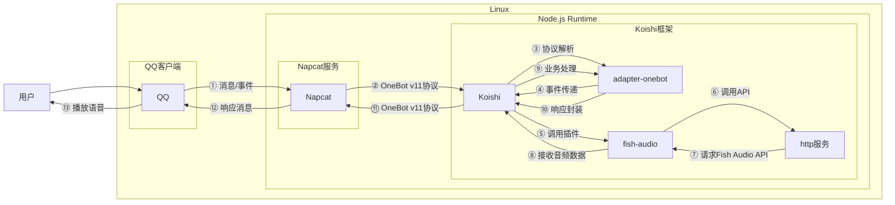

# fish-audio

## 概述
[](https://koishi.chat) [](https://www.npmjs.com/package/koishi-plugin-fish-audio)  [](https://github.com/idranme/koishi-plugin-fish-audio)
**指令名称**: 根据配置的角色名称

**功能描述**: 通过 Fish Audio API 进行文本转语音，支持多种语音模型

**插件名称**: fish-audio

## 架构图



## 使用方法

### 基本语法

```
tts <角色名称> <文本内容>
```

### 参数说明

| 参数 | 类型 | 必填 | 说明 | 示例 |
|------|------|------|------|------|
| 角色名称 | 文本 | 是 | 配置中定义的角色名称 | 流萤 |
| 文本内容 | 文本 | 是 | 要转换为语音的文本 | 你好，我是流萤 |

### 可用角色

根据配置文件，当前支持以下角色：

| 角色名称  | 参考ID |
|----------|--------|
| 流萤  | bcbb6d60721c44a489bc33dd59ce7cfc |
| 银狼 |   5f75344c4bfa47318d7252496bd1d308 |
| 雷军 |   738d0cc1a3e9430a9de2b544a466a7fc |
| 丁真 |   54a5170264694bfc8e9ad98df7bd89c3 |
| 奶龙 |  3d1cb00d75184099992ddbaf0fdd7387 |
| 诗歌剧   | 0eb38bc974e1459facca38b359e13511 |
| 东雪莲   | 7af4d620be1c4c6686132f21940d51c5 |
| 永雏塔菲   | e1cfccf59a1c4492b5f51c7c62a8abd2 |
| 孙笑川  | e80ea225770f42f79d50aa98be3cedfc |
| 七海娜娜米   | a7725771e0974eb5a9b044ba357f6e13 |
| 刘伟 |   5b191ce8add743f0a62a55364e2866b0 |
| 蔡徐坤   | e4642e5edccd4d9ab61a69e82d4f8a14 |
| 黑手   | f7561ff309bd4040a59f1e600f4f4338 |
| 郭德纲   | 7c66db6e457c4d53b1fe428a8c547953 |
| 多托雷   | 1ff4ea5624884731a65a0dcd58cbcb61 |
| 潘塔罗涅   | 98dd87194f3c4cd096881cd61336ab62 |
| 王同志   | 753a35fa4b7b407dafa1277f22f99697 |
| 林德   | 28ec5b92ac984d058ae07d716b56240c |
| 沙威马   | 54a2b55df13e42c0a09bf18b0a5e04d1 |
| 贝利亚   | 356623728b844a1a95c1a5125e340467 |
| 少羽   | 1218287072ff42e6b2e1373958742529 |
| 孙悟空   | 2f7857f695f141e0b88c865e12d231b3 |
| 女法式中   | 3a0d20c9223a438bbeae1e46fb08794a |
| 夯大力   | 84ed22e0ec8746969adf08bef0407494 |
| 银枝  | ae4d87fc4b0944beaa06b16bb7458552 |
| 胖猫   | 665e031efe27435780ebfa56cc7e0e0d |
| 科比   | 0bb80f15ff69492ea36f67174250cdb1 |
| 明前奶绿   | e0cefc0c31674611862242d79f1075cc |
| 小老师   | 434bb3a59f8b459e8d4fd2326cecd800 |
| 麦麦   | 53a749722edb4b7fb514054b3d31cd89 |
| 风堇   | 5eb6a4de76c649049dd136dd9f53b0d2 |
| 威龙   | 4d09c6726bac4464bb17b3a9aa148ee4 |
| 德穆兰   | 96c8c5d15f1240688abbada7394d6537 |
| 烧麦   | d32ac201055f4567ab8435e1943e1830 |
| 快麦   | 300d2c22405f421f93551ae109 |
| 慢麦   | 296978aabdea4d0db46dd432424ff7c0 |
| 月樱   | f68a6692376345988756428a6fc3b04f |
| 今汐  | 1fa6a46da8484d72a4c4809dbb944943 |
| 菲比   | 3c4ca0e69c65482f9fbb01cec7bc0678 |
| 珂莱塔   | 1b968f22bd244f199a21c5ae1b759932 |
| 东海帝王   | ec263983ed464bbca97017eab40fa767 |
| 波旁   | 47f0b282985d4d958daed73509e75e12 |
| 米浴   | f820798ba9b74510bd5e46cb73b361d8 |
| 福来   | e2abe323ffb3492e850f0a9f7e3d2132 |
| 电棍   | 703b0f7a5b7848f3bdfb7698ddb1899b |
| 酵母   | 0bd063af3d6e43418808d50febeac5de |
| 迪拉熊  | b8cdad77ddd64783b4ee26ab9a2b053e |
| 高松灯  | a24ad94ea73449558c3c8fe9e0f0a41f |
| 油库里   | 1f25aac343ff4613bb62015d964125e7 |
| 户晨风   | be8c4e50b41f4eb0b1badce141c2b0a8 |
| 拉伸   | 84e138ec381947de8420fb96a750f68a |
| 079   | 1ac0f409f4264f1ba86b4bc88d474ed1 |
| SL广播   | f95e2cdf975642618b9dc3f380375c1f |

## 使用示例

### 使用流萤生成语音

<chat-panel>
<chat-message nickname="用户" type="user">tts 流萤 夜色渐深，我的光芒为迷途者指引方向。如同群星闪烁，每个生命都有属于自己的光辉时刻。让我们一同穿越黑暗，寻找黎明的希望。这便是我存在的意义。</chat-message>
<chat-message nickname="bot" type="bot">
  <voice-message 
    :duration="13" 
    :is-listened="true"
    audio-url="./流萤.mp3"
  />
</chat-message>
</chat-panel>

### 使用银狼生成语音

<chat-panel>
<chat-message nickname="用户" type="user">tts 银狼 防火墙漏洞已经找到了，给我三分钟就能突破。这种老旧系统的加密方式太好玩了，简直就是在给我送礼物。不过还是要小心行事，毕竟我可不想打草惊蛇。</chat-message>
<chat-message nickname="bot" type="bot">
  <voice-message 
    :duration="13" 
    :is-listened="true"
    audio-url="./银狼.mp3"
  />
</chat-message>
</chat-panel>

## 技术特性

### 支持的API
- **Fish Audio API**: 使用官方API进行文本转语音
- **VITS服务**: 支持VITS服务接口，可与其他插件集成

### 自动处理
- **文本验证**: 自动检测输入是否为纯文本，拒绝包含HTML标签的内容
- **错误处理**: 当API调用失败时提供友好的错误提示
- **音频格式**: 生成WAV格式的音频文件，兼容性良好

### 配置灵活
- **多角色支持**: 可配置多个语音角色，每个角色有独立的指令
- **代理支持**: 支持通过代理访问Fish Audio API
- **自定义API地址**: 可配置自定义API地址

## 注意事项

1. **API密钥**: 需要有效的Fish Audio API密钥，可从[Fish Audio官网](https://fish.audio/zh-CN/go-api/)获取
2. **网络要求**: 需要稳定的网络连接来访问Fish Audio API
3. **文本限制**: 输入文本应为纯文本，不支持HTML或其他标记语言
4. **语音质量**: 语音质量取决于Fish Audio API的模型质量
5. **响应时间**: 语音生成需要调用外部API，响应时间受网络影响

## 配置参数

插件支持以下配置选项：

| 配置项 | 类型 | 默认值 | 说明 |
|--------|------|--------|------|
| api_key | string | 无 | Fish Audio API密钥，必填项 |
| api_url | string | https://api.fish.audio/v1/tts | Fish Audio API地址 |
| command_name | string | 空 | 指令前缀名称，如果设置则指令格式为`<前缀>.<角色>` |
| command | array | 见默认配置 | 指令列表，包含角色名称、描述和参考ID |
| vits_service_speaker | string | bcbb6d60721c44a489bc33dd59ce7cfc | 用于VITS服务的默认语音角色 |
| proxy_agent | string | 无 | 用于访问API的代理设置 |

### 默认配置示例
```yaml
fish-audio:
  api_key: 'your-api-key-here'
  command:
    - name: 流萤
      description: 语音生成（流萤）
      reference_id: bcbb6d60721c44a489bc33dd59ce7cfc
```

::: tip
fish-audio插件基于Fish Audio API实现，能够生成高质量的语音内容。支持多种语音模型，可根据需要配置不同的角色。插件还实现了VITS服务接口，可与其他需要语音合成的插件集成使用。
:::