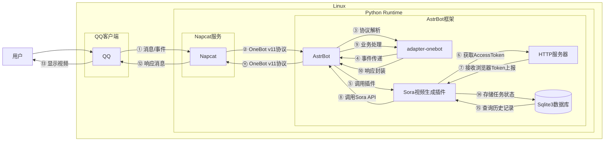

# Sora视频生成

## 概述
[](https://github.com/AstrBotDevs/AstrBot) [](https://www.python.org) [](https://github.com/maimai993/astrbot_plugin_video_sora2)
**指令名称**: sora, 生成视频, 视频生成

**功能描述**: 通过调用 OpenAI Sora 的视频生成接口，实现机器人免费生成高质量视频并在聊天平台中发送的功能

**插件名称**: astrbot_plugin_video_sora2

## 架构图



## 使用方法

### 基本语法

```
sora [横屏|竖屏] <提示词>
生成视频 [横屏|竖屏] <提示词>
视频生成 [横屏|竖屏] <提示词>
```

### 参数说明

| 参数 | 类型 | 必填 | 说明 | 示例 |
|------|------|------|------|------|
| 横屏\|竖屏 | 文本 | 否 | 视频方向，可选"横屏"或"竖屏" | 横屏 |
| 提示词 | 文本 | 是 | 视频生成的描述文本 | 一只小猫在草地上玩耍 |

### 其他命令

| 命令 | 说明 | 示例 |
|------|------|------|
| sora查询 <task_id> | 查询视频生成状态或重放已生成的视频 | sora查询 task_123 |
| sora强制查询 <task_id> | 强制从官方接口重新查询任务状态 | sora强制查询 task_123 |
| sora鉴权检测 | 检测所有Token的有效性（仅管理员） | sora鉴权检测 |
| sora自动token状态 | 查看自动获取的Token状态 | sora自动token状态 |
| sora自动token刷新 | 手动刷新自动获取的Token列表 | sora自动token刷新 |

## 使用示例

### 基本视频生成

#### 生成竖屏视频
<chat-panel>
<chat-message nickname="用户" type="user">/sora 一只可爱的小猫在草地上追逐蝴蝶</chat-message>
<chat-message nickname="bot" type="bot">

正在生成视频，请稍候~
ID: task_abc123
</chat-message>
<chat-message nickname="bot" type="bot">

<video src="https://cdn.tangbot.xyz/AstrBot/sora2.mp4" controls width="25%"></video>
</chat-message>
</chat-panel>

#### 生成横屏视频
<chat-panel>
<chat-message nickname="用户" type="user">/sora 横屏 壮丽的日落时分，金色的阳光洒在海面上，海浪轻轻拍打着沙滩</chat-message>
<chat-message nickname="bot" type="bot">

正在生成视频，请稍候~
ID: task_def456
</chat-message>
<chat-message nickname="bot" type="bot">
<video src="https://cdn.tangbot.xyz/AstrBot/sora.mp4" controls width="45%"></video>
</chat-message>
</chat-panel>

### 查询视频状态
<chat-panel>
<chat-message nickname="用户" type="user">sora查询 task_abc123</chat-message>
<chat-message nickname="bot" type="bot">

任务还在队列中，请稍后再看~
状态：queued 进度: 0.00%
</chat-message>
</chat-panel>

## 技术特性

### 支持的Token获取方式
- **手动填写**: 传统方式，手动获取并填写AccessToken
- **自动获取**: 通过Tampermonkey脚本自动获取并上报Token到本地HTTP服务器

### 自动处理
- **Token轮询**: 支持多个Token轮询使用，避免单个Token并发限制
- **并发控制**: 每个账号有独立的并发限制，默认3个任务
- **任务状态跟踪**: 所有任务状态同步更新到Sqlite3数据库
- **错误重试**: 支持查询和重试未完成的任务
- **图片处理**: 自动处理GIF图片，转换为PNG格式

### 网络支持
- **正向代理**: 支持HTTP正向代理访问Sora API
- **反向代理**: 支持反向代理绕过地域限制
- **代理类型**: 支持拼接和替换两种反向代理方式

### 视频处理
- **水印控制**: 可选择是否在生成的视频中添加Sora2水印
- **视频保存**: 可选择是否持久化保存下载的视频文件
- **方向检测**: 自动检测图片方向，确定视频横屏或竖屏

## 注意事项

1. **账号权限**: 需要有效的ChatGPT账号且有Sora模型的使用权限
2. **网络要求**: 需要稳定的网络连接访问OpenAI Sora API
3. **Token安全**: Token存在封号风险，请谨慎使用
4. **并发限制**: 每个账号有并发任务限制，超出限制会提示
5. **视频生成时间**: 视频生成需要一定时间，复杂提示可能需要更长时间
6. **文件大小**: 生成的视频文件可能较大，注意存储空间
7. **反向代理**: 使用反向代理时请确保代理来源可信

## 配置参数

插件支持以下配置选项：

| 配置项 | 类型 | 默认值 | 说明 |
|--------|------|--------|------|
| token_source | string | 手动填写 | Token获取方式：手动填写或自动获取 |
| authorization_list | list | [] | 手动填写的authorization列表，仅在token_source为"手动填写"时生效 |
| websocket_enabled | bool | false | 是否启用HTTP服务器接收自动上报的Token，仅在token_source为"自动获取"时生效 |
| websocket_port | int | 5103 | HTTP服务器监听的端口号 |
| auto_token_list | list | [] | 自动获取的Token列表，只读 |
| task_limit | int | 3 | 每个账号的并发限制 |
| model_config | object | {} | 模型配置参数 |
| model_config.model | string | sy_8 | 模型代码，目前已知可用的只有sy_8 |
| model_config.size | string | small | 清晰度，目前只有small可用 |
| model_config.n_frames | int | 450 | 视频的总帧数，视频时长为帧数/30秒 |
| default_prompt | string | 生成一个多镜头视频 | 默认提示词 |
| watermark_enabled | bool | false | 是否在生成的视频中添加Sora2水印 |
| screen_mode | string | 自动 | 默认视频方向：自动、竖屏、横屏 |
| sora_base_url | string | https://sora.chatgpt.com | 用于发起任务请求的Sora API地址 |
| chatgpt_base_url | string | https://chatgpt.com | 用于获取Sentinel token的ChatGPT API地址 |
| speed_down_url_type | string | 拼接 | 下载视频的反代类型：拼接或替换 |
| speed_down_url | string | "" | 下载视频的反向代理地址 |
| save_video_enabled | bool | false | 是否持久化保存下载的视频文件 |
| group_whitelist_enabled | bool | false | 是否启用群组白名单 |
| group_whitelist | list | [] | 白名单群组sid列表 |
| proxy | string | "" | HTTP正向代理地址 |
| token_expiry_notification_enabled | bool | false | 是否启用Token过期通知 |
| token_expiry_notification_interval | int | 30 | Token过期检查间隔（分钟） |

### 配置示例

```yaml
astrbot_plugin_video_sora2:
  token_source: "自动获取"
  websocket_enabled: true
  websocket_port: 5103
  task_limit: 3
  model_config:
    model: "sy_8"
    size: "small"
    n_frames: 450
  default_prompt: "生成一个多镜头视频"
  watermark_enabled: false
  screen_mode: "自动"
  sora_base_url: "https://sora.chatgpt.com"
  chatgpt_base_url: "https://chatgpt.com"
  speed_down_url_type: "拼接"
  save_video_enabled: false
  group_whitelist_enabled: false
  proxy: ""
```

::: tip
Sora视频生成插件基于OpenAI Sora API实现，能够生成高质量的视频内容。插件支持两种Token获取方式，可根据需要选择手动填写或自动获取。自动获取方式通过Tampermonkey脚本和本地HTTP服务器实现，解决了CSP限制问题，使用更加便捷。
:::

::: warning
本插件基于逆向工程技术调用官方接口，存在封号风险，请谨慎使用。如果使用反向代理，请确保反向代理的来源可信，以保证账号安全。
:::
