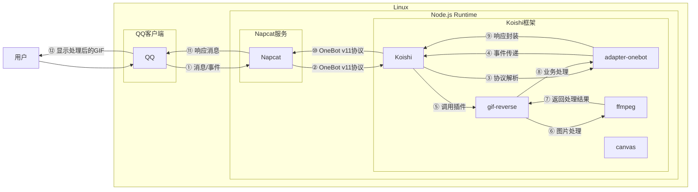

# GIF图片处理

## 概述
[](https://koishi.chat) [](https://www.npmjs.com/package/koishi-plugin-gif-reverse) [](https://github.com/koishi-shangxue-plugins/koishi-shangxue-apps/tree/main/plugins/gif-reverse)
**指令名称**: gif-reverse

**功能描述**: 提供多种GIF图片处理功能，包括倒放、回弹、滑动、旋转、转向等效果

**插件名称**: gif-reverse

## 架构图



## 使用方法

### 基本语法

```
gif-reverse [选项] [图片]
```

### 选项说明

| 选项 | 简写 | 参数 | 说明 |
|------|------|------|------|
| `--rebound` | `-b` | 无 | 回弹效果（正放+倒放） |
| `--reverse` | `-r` | 无 | 倒放 GIF |
| `--frame` | `-f` | number | 指定处理gif的帧间隔 |
| `--slide` | `-l` | string | 滑动方向 (上/下/左/右) |
| `--rotate` | `-o` | string | 旋转方向 (顺/逆) |
| `--turn` | `-t` | string | 转向角度 (上/下/左/右/左上/左下/右上/右下/0-360) |
| `--shake` | `-s` | 无 | 上下震动效果 |
| `--information` | `-i` | 无 | 显示 GIF 信息 |

## 支持的图片格式

- **GIF 图片**: 支持所有效果
- **静态图片**: 支持滑动、旋转、转向效果，可将静态图转换为动态GIF
  - 支持格式：JPEG、PNG、WebP
  - 不支持：倒放、回弹效果

## 使用示例

### 回弹效果
<chat-panel>
<chat-message nickname="用户" type="user">gif-reverse -b</chat-message>
<recall-message nickname="bot" type="bot">在 50 秒内发送想要处理的图片</recall-message>
<chat-message nickname="用户" type="user">


</chat-message>
<chat-message nickname="bot" type="bot">


图片信息：
文件大小：4636.02 KB
图片尺寸：400x679
帧数：58
帧间隔：66.72 毫秒
帧率：14.99 FPS
总时长：3.87 秒
</chat-message>
</chat-panel>

### 倒放GIF
<chat-panel>
<chat-message nickname="用户" type="user">gif-reverse -r</chat-message>
<recall-message nickname="bot" type="bot">在 50 秒内发送想要处理的图片</recall-message>
<chat-message nickname="用户" type="user">


</chat-message>
<chat-message nickname="bot" type="bot">


图片信息：
文件大小：1892.95 KB
图片尺寸：240x240
帧数：200
帧间隔：30.00 毫秒
帧率：33.33 FPS
总时长：6.00 秒
</chat-message>
</chat-panel>

### 右滑效果
<chat-panel>
<chat-message nickname="用户" type="user">gif-reverse -l 右</chat-message>
<recall-message nickname="bot" type="bot">在 50 秒内发送想要处理的图片</recall-message>
<chat-message nickname="用户" type="user">


</chat-message>
<chat-message nickname="bot" type="bot">


图片信息：
文件大小：1732.19 KB
图片尺寸：400x400
帧数：17
帧间隔：50.00 毫秒
帧率：20.00 FPS
总时长：0.85 秒
</chat-message>
</chat-panel>

### 顺时针旋转
<chat-panel>
<chat-message nickname="用户" type="user">gif-reverse -o 顺</chat-message>
<recall-message nickname="bot" type="bot">在 50 秒内发送想要处理的图片</recall-message>
<chat-message nickname="用户" type="user">


</chat-message>
<chat-message nickname="bot" type="bot">


图片信息：
文件大小：1667.81 KB
图片尺寸：400x400
帧数：17
帧间隔：50.00 毫秒
帧率：20.00 FPS
总时长：0.85 秒
</chat-message>
</chat-panel>

### 转向30度
<chat-panel>
<chat-message nickname="用户" type="user">gif-reverse -t 30</chat-message>
<recall-message nickname="bot" type="bot">在 50 秒内发送想要处理的图片</recall-message>
<chat-message nickname="用户" type="user">


</chat-message>
<chat-message nickname="bot" type="bot">


</chat-message>
</chat-panel>

### 加速gif
<chat-panel>
<chat-message nickname="用户" type="user">gif-reverse -f 20</chat-message>
<recall-message nickname="bot" type="bot">在 50 秒内发送想要处理的图片</recall-message>
<chat-message nickname="用户" type="user">


</chat-message>
<chat-message nickname="bot" type="bot">


</chat-message>
</chat-panel>

## 技术特性

### 处理原理

- **FFmpeg处理**: 使用FFmpeg进行GIF处理
- **Canvas支持**: 使用Canvas进行图片解析和操作
- **动态效果**: 支持将静态图片转为动态GIF

### 性能优化

- **帧率限制**: 限制输出GIF的最大帧率(默认50FPS)
- **图片压缩**: 自动优化处理后的GIF大小
- **内存管理**: 使用临时文件处理大文件

## 注意事项

1. **依赖要求**: 
   - 需要安装ffmpeg服务
   - 需要安装canvas服务
   - 需要http和logger服务

2. **处理限制**:
   - 静态图片不支持倒放和回弹效果
   - 大尺寸GIF处理可能需要更长时间
   - 复杂效果组合可能影响处理性能

3. **输入要求**:
   - 需要在指令后直接发送图片或引用包含图片的消息
   - 支持GIF、JPEG、PNG和WebP格式
