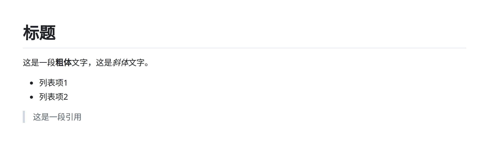
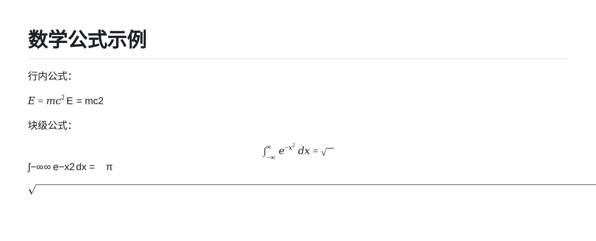
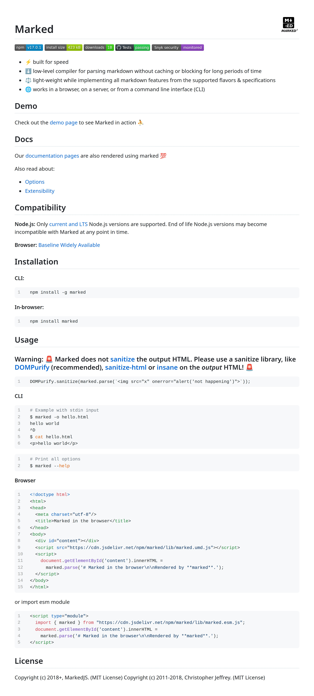

# Markdown渲染

## 概述
[](https://github.com/KarinJS/Karin) [](https://www.npmjs.com/package/@karinjs/plugin-markdown)  [](https://github.com/KarinJS/plugin-markdown)
**指令名称**: md, markdown

**功能描述**: 将Markdown文本渲染为图片并发送

**插件名称**: @karinjs/plugin-markdown

## 架构图

```mermaid
flowchart LR
    U[用户]
    
    subgraph Linux
        subgraph A [QQ客户端]
            QQ[QQ]
        end

        subgraph Nodejs [Node.js Runtime]
            subgraph B [Napcat服务]
                N[Napcat]
            end

            subgraph C [Karin框架]
                K[Karin]
                AO[adapter-onebot]
                MD[markdown]
                MH[@karinjs/md-html]
                PP[puppeteer]
            end
        end
    end

    U --> QQ
    QQ -- "① 消息/事件" --> N
    N -- "② OneBot v11协议" --> K
    
    K -- "③ 协议解析" --> AO
    AO -- "④ 事件传递" --> K
    K -- "⑤ 调用插件" --> MD
    MD -- "⑥ 权限检查" --> MD
    MD -- "⑦ 解析Markdown" --> MH
    MH -- "⑧ 生成HTML" --> MD
    MD -- "⑨ 使用puppeteer渲染" --> PP
    PP -- "⑩ 浏览器操作" --> MD
    MD -- "⑪ 返回图片" --> K
    K -- "⑫ 业务处理" --> AO
    AO -- "⑬ 响应封装" --> K
    K -- "⑭ OneBot v11协议" --> N
    
    N -- "⑮ 响应消息" --> QQ
    QQ -- "⑯ 显示Markdown图片" --> U
```

## 使用方法

### 基本语法

```
#md <markdown文本>
#markdown <markdown文本>
md <markdown文本>
markdown <markdown文本>
```

### 参数说明

| 参数 | 类型 | 必填 | 说明 | 示例 |
|------|------|------|------|------|
| markdown文本 | 文本 | 是 | 要渲染的Markdown内容或文件路径/URL | `# 标题\n这是一段**粗体**文字` |
| 文件路径 | 文本 | 否 | 本地Markdown文件路径 | `./README.md` |
| URL | 文本 | 否 | 网络Markdown文件URL | `https://raw.githubusercontent.com/markedjs/marked/master/README.md` |

### 选项说明

| 选项 | 简写 | 参数 | 说明 |
|------|------|------|------|
| 前缀 | - | 无 | 使用`#md`或`#markdown`作为命令前缀 |
| 无前缀 | - | 无 | 使用`md`或`markdown`作为命令（需配置） |

## 使用示例

### 基本渲染

#### 渲染简单Markdown文本
<chat-panel>
<chat-message nickname="用户" type="user">#md # 标题
这是一段**粗体**文字，这是*斜体*文字。

- 列表项1
- 列表项2

> 这是一段引用
</chat-message>
<chat-message nickname="bot" type="bot">


</chat-message>
</chat-panel>

### 数学公式渲染

#### 渲染KaTeX数学公式
<chat-panel>
<chat-message nickname="用户" type="user">#md # 数学公式示例

行内公式：

$E = mc^2$

块级公式：

$$
\int_{-\infty}^{\infty} e^{-x^2} dx = \sqrt{\pi}
$$
</chat-message>
<chat-message nickname="bot" type="bot">


</chat-message>
</chat-panel>

### 文件渲染

#### 渲染网络Markdown文件
<chat-panel>
<chat-message nickname="用户" type="user">#md https://raw.githubusercontent.com/markedjs/marked/master/README.md</chat-message>
<chat-message nickname="bot" type="bot">


</chat-message>
</chat-panel>

## 技术特性

### 支持的Markdown语法
- **标题**: 1-6级标题
- **文本样式**: 粗体、斜体、删除线、下划线
- **列表**: 有序列表、无序列表
- **引用**: 块级引用
- **代码**: 行内代码、代码块（支持语法高亮）
- **表格**: Markdown表格
- **链接**: 内联链接、引用链接
- **图片**: 图片嵌入
- **分割线**: 水平分割线
- **数学公式**: KaTeX数学公式支持

### 自动处理
- **文件检测**: 自动识别URL和本地文件路径
- **权限验证**: 根据配置检查用户权限
- **HTML转换**: 使用@karinjs/md-html库将Markdown转换为HTML
- **图片渲染**: 使用puppeteer将HTML渲染为图片
- **缓存优化**: 相同内容缓存处理

### 错误处理
- **权限不足**: 当用户没有相应权限时提示
- **文件不存在**: 当本地文件不存在时提示
- **网络错误**: 当网络文件无法访问时提示
- **渲染失败**: 当Markdown渲染过程中出现错误时提示
- **语法错误**: 当Markdown语法错误时提示

## 注意事项

1. **权限要求**: 根据配置可能需要特定权限才能使用
2. **文件大小**: 大文件可能需要较长时间渲染
3. **网络依赖**: 渲染网络文件需要稳定的网络连接
4. **数学公式**: 需要正确安装KaTeX依赖
5. **本地文件**: 需要正确配置文件路径权限
6. **性能考虑**: 复杂Markdown文档可能需要更多渲染时间

## 配置参数

插件支持以下配置选项：

| 配置项 | 类型 | 默认值 | 说明 |
|--------|------|--------|------|
| prefix | boolean | true | 是否使用`#`前缀 |
| render.local | boolean | true | 是否允许渲染本地文件 |
| render.network | boolean | true | 是否允许渲染网络文件 |
| render.localPermission | boolean | true | 本地文件渲染是否需要权限检查 |
| render.networkPermission | boolean | true | 网络文件渲染是否需要权限检查 |
| permission | Permission | 'all' | 权限控制模式：'all'、'master'、'admin'、'group.owner'、'whitelist'、'blacklist' |
| deviceScaleFactor | number | 2 | 设备像素比，影响图片清晰度 |
| waitUntil | string | 'networkidle0' | 页面加载等待条件：'load'、'domcontentloaded'、'networkidle0'、'networkidle2' |
| markedKatex.output | string | 'htmlAndMathml' | KaTeX输出格式：'html'、'mathml'、'htmlAndMathml' |
| markedKatex.throwOnError | boolean | false | KaTeX错误时是否抛出异常 |

::: tip
Markdown渲染功能基于@karinjs/md-html和puppeteer实现，能够准确渲染现代Markdown内容，包括KaTeX数学公式和代码语法高亮。

插件支持热重载配置，修改配置后无需重启即可生效。
:::
