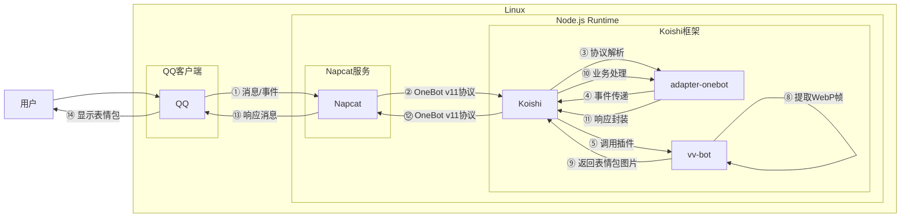

# VV表情包搜索

## 概述
[](https://koishi.chat) [](https://www.npmjs.com/package/koishi-plugin-vv-bot) [](https://github.com/738NGX/vv-bot)
**指令名称**: vv

**功能描述**: 搜索并返回VV表情包图片

**插件名称**: vv-bot

## 架构图



## 使用方法

### 基本语法

```
vv <搜索关键词> [数量]
```

### 参数说明

| 参数 | 类型 | 必填 | 说明 | 示例 |
|------|------|------|------|------|
| 搜索关键词 | 文本 | 是 | 要搜索的表情包关键词 | 开心 |
| 数量 | 数字 | 否 | 返回的表情包数量，默认1，最大5 | 3 |

## 使用示例

### 搜索单个表情包

#### 搜索"开心"表情包
<chat-panel>
<chat-message nickname="用户" type="user">vv 开心</chat-message>
<chat-message nickname="bot" type="bot">


</chat-message>
</chat-panel>

### 搜索多个表情包

#### 搜索3个"惊讶"表情包
<chat-panel>
<chat-message nickname="用户" type="user">vv 惊讶 3</chat-message>
<chat-message nickname="bot" type="bot">


</chat-message>
</chat-panel>

#### 搜索5个"生气"表情包
<chat-panel>
<chat-message nickname="用户" type="user">vv 生气 5</chat-message>
<chat-message nickname="bot" type="bot">


</chat-message>
</chat-panel>

## 技术特性

### 搜索原理

- **API调用**: 调用VV表情包搜索API获取匹配结果
- **索引解析**: 解析二进制索引文件定位表情包位置
- **帧提取**: 从WebP图片中提取特定帧
- **格式转换**: 将WebP帧转换为Base64数据URL

### 搜索参数

- **最小相似度**: 50%
- **最小比例**: 0.5
- **最大结果数**: 可配置，默认1，最大5

### 数据处理流程

1. **搜索阶段**: 
   - 调用VV API搜索表情包
   - 解析API返回的JSON数据
   - 提取文件夹ID和时间戳信息

2. **索引解析阶段**:
   - 根据文件夹ID计算组索引
   - 下载对应的索引文件(.index)
   - 使用二分查找定位表情包帧位置

3. **图片提取阶段**:
   - 使用Range请求下载WebP图片片段
   - 将二进制数据转换为Blob对象
   - 转换为Base64数据URL格式

4. **返回阶段**:
   - 将数据URL封装为图片消息
   - 返回给用户

### 支持的格式

- **输入格式**: 任意文本关键词
- **输出格式**: WebP图片数据URL
- **索引格式**: 自定义二进制索引文件
- **图片格式**: WebP动画帧

## 注意事项

1. **网络要求**: 需要稳定的网络连接访问VV API和图片服务器
2. **搜索限制**: 每次最多返回5个表情包
3. **相似度阈值**: 搜索结果需要满足50%相似度和0.5比例要求
4. **处理时间**: 复杂搜索可能需要较长时间处理
5. **服务器状态**: 依赖VV API和图片服务器的可用性

## 配置参数

本插件为轻量级工具，无需额外配置参数。

::: tip
VV表情包搜索功能基于VV表情包数据库实现，能够快速搜索和提取匹配的表情包图片。该功能适合日常聊天和表情包分享需求。
:::
