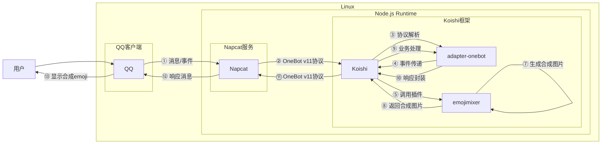

# Emoji合成

## 概述
[](https://koishi.chat) [](https://www.npmjs.com/package/koishi-plugin-emojimixer)
**指令名称**: emix

**功能描述**: 混合两个emoji表情，生成合成图片

**插件名称**: emojimixer

## 架构图



## 使用方法

### 基本语法

```
emix <emoji1><emoji2>
```

### 参数说明

| 参数 | 类型 | 必填 | 说明 | 示例 |
|------|------|------|------|------|
| emoji1 | emoji | 是 | 第一个emoji表情 | 😊 |
| emoji2 | emoji | 是 | 第二个emoji表情 | 😢 |

### 配置选项

插件支持以下配置选项：

| 配置项 | 类型 | 默认值 | 说明 |
|--------|------|--------|------|
| no_command | boolean | false | 启用无指令模式，直接发送两个emoji即可合成 |

## 使用示例

### 基本合成

#### 合成笑脸和哭脸
<chat-panel>
<chat-message nickname="用户" type="user">emix 😊😢</chat-message>
<chat-message nickname="bot" type="bot">


</chat-message>
</chat-panel>

### 无指令模式（需配置）

当启用 `no_command: true` 配置时，可以直接发送两个emoji进行合成：

<chat-panel>
<chat-message nickname="用户" type="user">😊😢</chat-message>
<chat-message nickname="bot" type="bot">


</chat-message>
</chat-panel>

## 技术特性

### 合成原理

- 基于Google的Emoji Kitchen API
- 自动将emoji转换为Unicode编码
- 检查emoji组合是否支持合成
- 生成合成图片并返回

### 错误处理

- **参数过多**: 当输入超过2个emoji时提示"太多了"
- **参数过少**: 当输入少于2个emoji时提示"太少了"
- **无法合成**: 当emoji组合不支持合成时提示"无法合成emoji1+emoji2"

## 注意事项

1. **网络要求**: 需要网络连接访问Google Emoji Kitchen服务
2. **兼容性**: 某些emoji可能不支持合成，会返回错误提示
3. **图片大小**: 合成图片为标准emoji尺寸，适合在聊天中使用

## 配置示例

```yaml
plugins:
  emojimixer:
    no_command: false  # 是否启用无指令模式
```

::: tip
Emoji合成功能基于Google Emoji Kitchen实现，能够将两个不同的emoji表情混合成一个有趣的合成图片，为聊天增添更多趣味性。
:::
