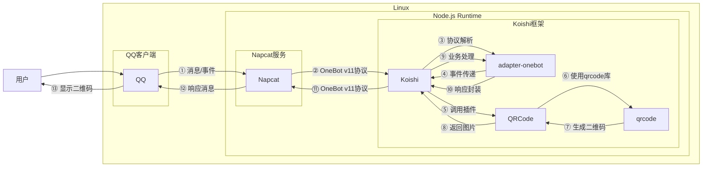

# 二维码生成

## 概述
[](https://koishi.chat) [](https://www.npmjs.com/package/koishi-plugin-qrcode) [](https://github.com/koishi-shangxue-plugins/koishi-shangxue-apps/tree/main/plugins/qrcode)
**指令名称**: qrcode

**功能描述**: 生成并发送二维码图片

**插件名称**: QRCode

## 架构图



## 使用方法

### 基本语法

```
qrcode <text>
```

### 参数说明

| 参数 | 类型 | 必填 | 说明 | 示例 |
|------|------|------|------|------|
| text | 文本 | 是 | 要编码为二维码的文本内容 | Hello World |

### 选项说明

| 选项 | 简写 | 参数 | 说明 | 默认值 |
|------|------|------|------|--------|
| margin | -m | number | 二维码边界尺寸 | 4 |
| scale | -s | number | 二维码缩放比例 | 4 |
| width | -w | number | 二维码图片大小 | - |
| dark | -d | color | 暗部颜色（二维码点颜色） | - |
| light | -l | color | 亮部颜色（背景颜色） | - |

## 使用示例

### 基本二维码生成

#### 生成文本二维码
<chat-panel>
<chat-message nickname="用户" type="user">qrcode Hello World</chat-message>
<chat-message nickname="bot" type="bot">


</chat-message>
</chat-panel>

### 使用选项

#### 自定义边界和缩放
<chat-panel>
<chat-message nickname="用户" type="user">qrcode -m 8 -s 6 https://tangbot.xyz</chat-message>
<chat-message nickname="bot" type="bot">


</chat-message>
</chat-panel>

#### 自定义颜色
<chat-panel>
<chat-message nickname="用户" type="user">qrcode -d #FF0000 -l #FFFF00 联系方式</chat-message>
<chat-message nickname="bot" type="bot">


</chat-message>
</chat-panel>

#### 指定图片大小
<chat-panel>
<chat-message nickname="用户" type="user">qrcode -w 300 重要信息</chat-message>
<chat-message nickname="bot" type="bot">


</chat-message>
</chat-panel>

#### WiFi信息
<chat-panel>
<chat-message nickname="用户" type="user">qrcode WIFI:S:iQOO Neo11;T:WPA2;P:114514;H:false;;</chat-message>
<chat-message nickname="bot" type="bot">


</chat-message>
</chat-panel>

## 技术特性

### 支持的编码内容
- **纯文本**: 任意文本内容
- **URL链接**: 网页地址
- **联系方式**: 电话号码、邮箱地址
- **WiFi信息**: SSID和密码
- **地理位置**: 坐标信息
- **事件信息**: 日历事件

### 自动处理
- **格式验证**: 自动验证输入文本的有效性
- **大小优化**: 根据内容自动调整二维码复杂度
- **颜色处理**: 支持自定义颜色配置
- **图片格式**: 生成PNG格式的二维码图片

### 错误处理
- **空文本**: 当未提供文本内容时提示
- **无效内容**: 当输入包含特殊格式时提示
- **生成失败**: 当二维码生成过程中出现错误时提示

## 注意事项

1. **内容长度**: 二维码可容纳的数据量有限，过长的文本可能导致二维码过于复杂
2. **扫描兼容性**: 确保生成的二维码能被常见扫码工具识别
3. **颜色对比**: 自定义颜色时确保暗部和亮部颜色有足够的对比度
4. **图片大小**: 大尺寸二维码可能影响消息发送速度

::: tip
二维码生成功能基于qrcode库实现，支持生成标准QR码，能够被大多数扫码工具识别。可以用于分享链接、联系方式、文本信息等多种场景。
:::
