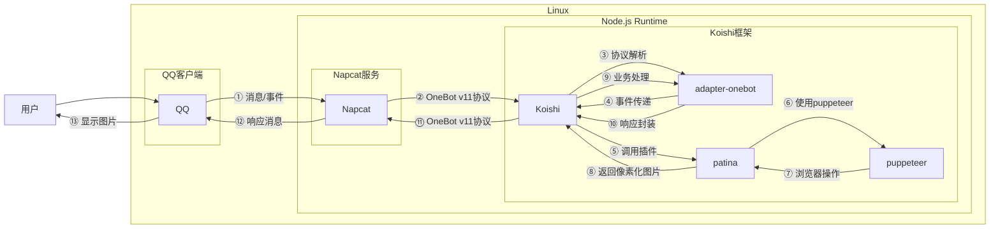

# 像素化

## 概述

**指令名称**: 像素化

**功能描述**: 将图片转换为像素化艺术效果

**插件名称**: patina

## 架构图



## 使用方法

### 基本语法

```
像素化 [图片] [-p <百分比>]
```

### 参数说明

| 参数 | 类型 | 必填 | 说明 | 示例 |
|------|------|------|------|------|
| 图片 | 图片/QQ号/@用户 | 是 | 要像素化的图片 | [图片] |

### 选项说明

| 选项 | 简写 | 参数 | 说明 | 默认值 |
|------|------|------|------|--------|
| pixelate | -p | number | 像素化百分比，值越高像素化效果越强 | 80 |

## 使用示例

### 基本像素化

<chat-panel>
<chat-message nickname="用户" type="user">像素化 [图片]</chat-message>
<chat-message nickname="bot" type="bot">


</chat-message>
</chat-panel>

### 指定像素化百分比

<chat-panel>
<chat-message nickname="用户" type="user">像素化 [图片] -p 50</chat-message>
<chat-message nickname="bot" type="bot">


</chat-message>
</chat-panel>

### 使用QQ头像像素化

<chat-panel>
<chat-message nickname="用户" type="user">像素化 123456789</chat-message>
<chat-message nickname="bot" type="bot">


</chat-message>
</chat-panel>

### 使用@用户头像像素化

<chat-panel>
<chat-message nickname="用户" type="user">像素化 @用户</chat-message>
<chat-message nickname="bot" type="bot">


</chat-message>
</chat-panel>

## 技术特性

### 支持的输入格式
- **图片文件**: 支持常见图片格式
- **QQ号**: 使用指定QQ号的头像
- **@用户**: 使用被@用户的头像

### 像素化算法
- **基于Pixelate.js**: 使用先进的像素化算法
- **实时预览**: 支持实时调整像素化程度
- **高质量输出**: 保持图像质量的同时实现像素化效果

### 像素化效果
- **百分比控制**: 0-100%可调像素化程度
- **智能处理**: 自动适应不同尺寸的图片
- **艺术效果**: 产生类似8位像素艺术的视觉效果

## 配置参数

插件支持以下配置选项：

| 配置项 | 类型 | 默认值 | 说明 |
|--------|------|--------|------|
| enablecommand2 | boolean | true | 是否启用像素化功能 |
| enablecommand2Name | string | '像素化' | 指令名称 |
| pixelate | number | 80 | 默认像素化百分比（0-100） |

::: tip
像素化功能基于Pixelate.js算法实现，能够将普通图片转换为具有艺术感的像素化效果。该算法通过降低图像分辨率并重新采样来创建像素艺术风格，适合制作复古游戏风格的头像或艺术创作。

**原项目地址**: https://lab.miguelmota.com/pixelate/example/
:::
