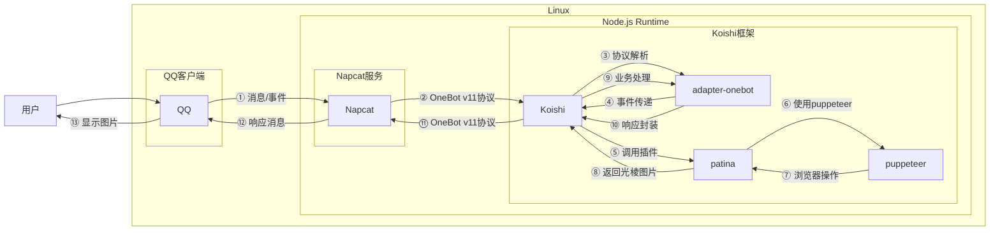

# 光棱生成

## 概述
[](https://koishi.chat) [](https://www.npmjs.com/package/koishi-plugin-patina) [](https://github.com/koishi-shangxue-plugins/koishi-shangxue-apps/tree/main/plugins/patina)
**指令名称**: 光棱 / 光棱取图

**功能描述**: 制作光棱坦克图片（高级图片隐写技术）和从光棱坦克图片中取出隐藏的里图

**插件名称**: patina

## 架构图



## 使用方法

### 基本语法

#### 制作光棱坦克
```
光棱 <里图> <表图> [选项]
```

#### 从光棱坦克取图
```
光棱取图 <光棱坦克图片> [选项]
```

### 参数说明

| 参数 | 类型 | 必填 | 说明 | 示例 |
|------|------|------|------|------|
| 里图 | 图片/QQ号/@用户 | 是 | 要隐藏的图片（光棱制作） | [图片] |
| 表图 | 图片/QQ号/@用户 | 是 | 表面显示的图片（光棱制作） | [图片] |
| 光棱坦克图片 | 图片/QQ号/@用户 | 是 | 光棱坦克图片（光棱取图） | [图片] |

### 选项说明

#### 光棱制作选项

| 选项 | 简写 | 参数 | 说明 | 默认值 |
|------|------|------|------|--------|
| grayscale | -g | 无 | 黑白输出 | false |
| innerThreshold | -it | number | 里图色阶端点（越小隐写效果越好） | 32 |
| coverThreshold | -ct | number | 表图色阶端点（越大显形效果越好） | 96 |
| innerContrast | -ic | number | 里图对比度（降低可提高隐写效果） | 50 |
| coverContrast | -cc | number | 表图对比度 | 50 |
| size | -s | number | 输出尺寸（长和宽中的较大值） | 1200 |
| reverse | -r | 无 | 反向隐写 | false |
| method | -m | string | 像素混合方式：chess/gap_2/gap_3/gap_5/col_1/row_1 | chess |

#### 光棱取图选项

| 选项 | 简写 | 参数 | 说明 | 默认值 |
|------|------|------|------|--------|
| threshold | -t | number | 取图阈值 | 128 |
| option | -o | string | 像素处理方式：black/white/trans/lcopy/ucopy/luavg | white |
| reverse | -r | 无 | 反向隐写 | false |
| contrast | --contrast | number | 对比度调整 | - |

## 使用示例

### 制作光棱坦克

<chat-panel>
<chat-message nickname="用户" type="user">光棱 [里图] [表图]</chat-message>
<chat-message nickname="bot" type="bot">


</chat-message>
</chat-panel>

### 使用自定义参数制作光棱坦克

<chat-panel>
<chat-message nickname="用户" type="user">光棱 [里图] [表图] -it 20 -ct 100 -s 800</chat-message>
<chat-message nickname="bot" type="bot">


</chat-message>
</chat-panel>

### 从光棱坦克取图

<chat-panel>
<chat-message nickname="用户" type="user">光棱取图 [光棱坦克图片]</chat-message>
<chat-message nickname="bot" type="bot">


</chat-message>
</chat-panel>

### 使用QQ头像制作光棱坦克

<chat-panel>
<chat-message nickname="用户" type="user">光棱 123456789 987654321</chat-message>
<chat-message nickname="bot" type="bot">


</chat-message>
</chat-panel>

## 技术特性

### 支持的输入格式
- **图片文件**: 支持常见图片格式
- **QQ号**: 使用指定QQ号的头像
- **@用户**: 使用被@用户的头像

### 隐写技术
- **高级像素混合**: 使用多种像素混合算法
- **色阶控制**: 精确控制里图和表图的色阶端点
- **对比度调节**: 独立调节里图和表图的对比度
- **多模式支持**: 支持6种不同的像素混合方式

### 像素混合方式
- **棋盘布局 (chess)**: 棋盘格状像素混合
- **2像素间隔斜线 (gap_2)**: 2像素间隔的斜线混合
- **3像素间隔斜线 (gap_3)**: 3像素间隔的斜线混合
- **5像素间隔斜线 (gap_5)**: 5像素间隔的斜线混合
- **1像素间隔竖线 (col_1)**: 1像素间隔的竖线混合
- **1像素间隔横线 (row_1)**: 1像素间隔的横线混合

### 取图处理方式
- **置为黑色 (black)**: 将超出阈值的像素置为黑色
- **置为白色 (white)**: 将超出阈值的像素置为白色
- **置为透明 (trans)**: 将超出阈值的像素置为透明
- **左侧复制 (lcopy)**: 使用左侧像素值填充
- **上方复制 (ucopy)**: 使用上方像素值填充
- **左上平均 (luavg)**: 使用左上角像素平均值填充

## 配置参数

插件支持以下配置选项：

| 配置项 | 类型 | 默认值 | 说明 |
|--------|------|--------|------|
| enablecommand4 | boolean | true | 是否启用光棱功能 |
| enablecommand4Name | string | '光棱' | 制作光棱坦克指令名称 |
| enablecommand4Name2 | string | '光棱取图' | 光棱取图指令名称 |
| Full_color_output | boolean | true | 全彩输出，关闭后变成黑白图 |
| Inner_Threshold | number | 32 | 里图色阶端点（越小隐写效果越好） |
| Cover_Threshold | number | 96 | 表图色阶端点（越大显形效果越好） |
| Inner_Contrast | number | 50 | 里图对比度（降低可提高隐写效果） |
| Cover_Contrast | number | 50 | 表图对比度 |
| Output_Size | number | 1200 | 输出尺寸（长和宽中的较大值） |
| Is_Reverse | boolean | false | 是否反向隐写 |
| Encode_Method | string | 'chess' | 像素混合方式 |
| Decode_Threshold | number | 128 | 取图阈值（用于光棱取图功能） |
| Decode_Option | string | 'white' | 取图像素处理方式（用于光棱取图功能） |

::: tip
光棱坦克是一种高级的图片隐写技术，能够在一张图片中隐藏另一张图片。在正常观看时显示表图，但在特定条件下（如调整亮度、对比度或使用专门的解码工具）可以显示出隐藏的里图。这种技术常用于制作有趣的图片谜题或保护隐私内容。
:::
