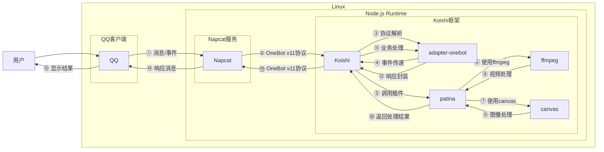

# 原图坦克

## 概述

**指令名称**: 原图坦克

**功能描述**: 将两张图片合成为两帧GIF图片，实现图片切换效果

**插件名称**: patina

## 架构图



## 使用方法

### 基本语法

```
原图坦克 [图片1] [图片2]
```

### 参数说明

| 参数 | 类型 | 必填 | 说明 | 示例 |
|------|------|------|------|------|
| 图片1 | 图片/QQ号/@用户 | 否 | 第一帧图片（表图） | [图片] / 123456 / @用户 |
| 图片2 | 图片/QQ号/@用户 | 否 | 第二帧图片（里图） | [图片] / 123456 / @用户 |

### 选项说明

| 选项 | 简写 | 参数 | 说明 | 默认值 |
|------|------|------|------|------|
| width | -w | number | 设置输出宽度 | 400 |
| height | -h | number | 设置输出高度 | 400 |
| delay | -d | number | 设置帧延迟（毫秒） | 1000 |
| quality | -q | number | 设置图片质量（1-100） | 90 |

## 使用示例

### 基本使用

#### 交互式输入图片
<chat-panel>
<chat-message nickname="用户" type="user">原图坦克</chat-message>
<chat-message nickname="bot" type="bot">
请发送第一张图片（表图）
</chat-message>
<chat-message nickname="用户" type="user">[图片]</chat-message>
<chat-message nickname="bot" type="bot">
请发送第二张图片（里图）
</chat-message>
<chat-message nickname="用户" type="user">[图片]</chat-message>
<chat-message nickname="bot" type="bot">
<FileMessage
  fileName="output.JPG"
  :fileSize="9014454"
  downloadUrl="./output.JPG"
  fileType="image"
/>
</chat-message>
</chat-panel>

#### 直接上传两张图片
<chat-panel>
<chat-message nickname="用户" type="user">原图坦克 [图片] [图片]</chat-message>
<chat-message nickname="bot" type="bot">
<FileMessage
  fileName="output.JPG"
  :fileSize="9014454"
  downloadUrl="./output.JPG"
  fileType="image"
/>
</chat-message>
</chat-panel>

### 使用QQ头像

#### 使用QQ号
<chat-panel>
<chat-message nickname="用户" type="user">原图坦克 123456 654321</chat-message>
<chat-message nickname="bot" type="bot">
[使用两个QQ号头像生成的GIF图片]
</chat-message>
</chat-panel>

#### 使用@用户
<chat-panel>
<chat-message nickname="用户" type="user">原图坦克 @用户1 @用户2</chat-message>
<chat-message nickname="bot" type="bot">
[使用两个用户头像生成的GIF图片]
</chat-message>
</chat-panel>

### 使用选项参数

#### 自定义尺寸
<chat-panel>
<chat-message nickname="用户" type="user">原图坦克 [图片] [图片] -w 500 -h 500</chat-message>
<chat-message nickname="bot" type="bot">
[500x500尺寸的GIF图片]
</chat-message>
</chat-panel>

#### 调整延迟时间
<chat-panel>
<chat-message nickname="用户" type="user">原图坦克 [图片] [图片] -d 2000</chat-message>
<chat-message nickname="bot" type="bot">
[2秒延迟的GIF图片]
</chat-message>
</chat-panel>

#### 调整图片质量
<chat-panel>
<chat-message nickname="用户" type="user">原图坦克 [图片] [图片] -q 95</chat-message>
<chat-message nickname="bot" type="bot">
[高质量95的GIF图片]
</chat-message>
</chat-panel>

#### 完整参数示例
<chat-panel>
<chat-message nickname="用户" type="user">原图坦克 [图片] [图片] -w 600 -h 600 -d 1500 -q 85</chat-message>
<chat-message nickname="bot" type="bot">
[600x600尺寸、1.5秒延迟、质量85的GIF图片]
</chat-message>
</chat-panel>

## 技术特性

### 支持的图片格式
- JPEG
- PNG
- GIF
- WebP
- BMP
- TIFF
- SVG

### 图片来源
- **直接上传**: 通过消息发送图片
- **QQ头像**: 使用QQ号或@用户获取头像
- **网络图片**: 支持图片URL

### 处理流程
1. **图片获取**: 从用户输入或交互中获取两张图片
2. **尺寸分析**: 使用canvas分析图片尺寸
3. **尺寸统一**: 自动调整两张图片到相同尺寸
4. **GIF合成**: 使用ffmpeg合成两帧GIF
5. **结果返回**: 返回生成的GIF图片

## 注意事项

1. **平台限制**: 仅支持onebot平台使用此功能
2. **显示效果**: GIF不会自动连续播放，需要手动切换
3. **文件发送**: 建议以群文件形式发送以获得最佳效果
4. **服务依赖**: 需要ffmpeg和canvas服务支持
5. **处理时间**: 大尺寸图片可能需要较长时间处理

## 配置参数

插件支持以下配置选项：

| 配置项 | 类型 | 默认值 | 说明 |
|--------|------|--------|------|
| sendAsFile | boolean | true | 是否以群文件形式发送GIF |
| loopCount | number | 1 | GIF循环次数 |
| finalDelay | number | 50000 | 最后一帧延迟（毫秒） |

::: tip
原图坦克功能基于ffmpeg和canvas实现，能够处理各种图片格式并生成高质量的两帧GIF图片。建议在手机QQ中查看效果以获得最佳体验。
:::
