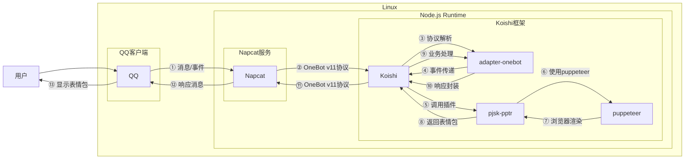
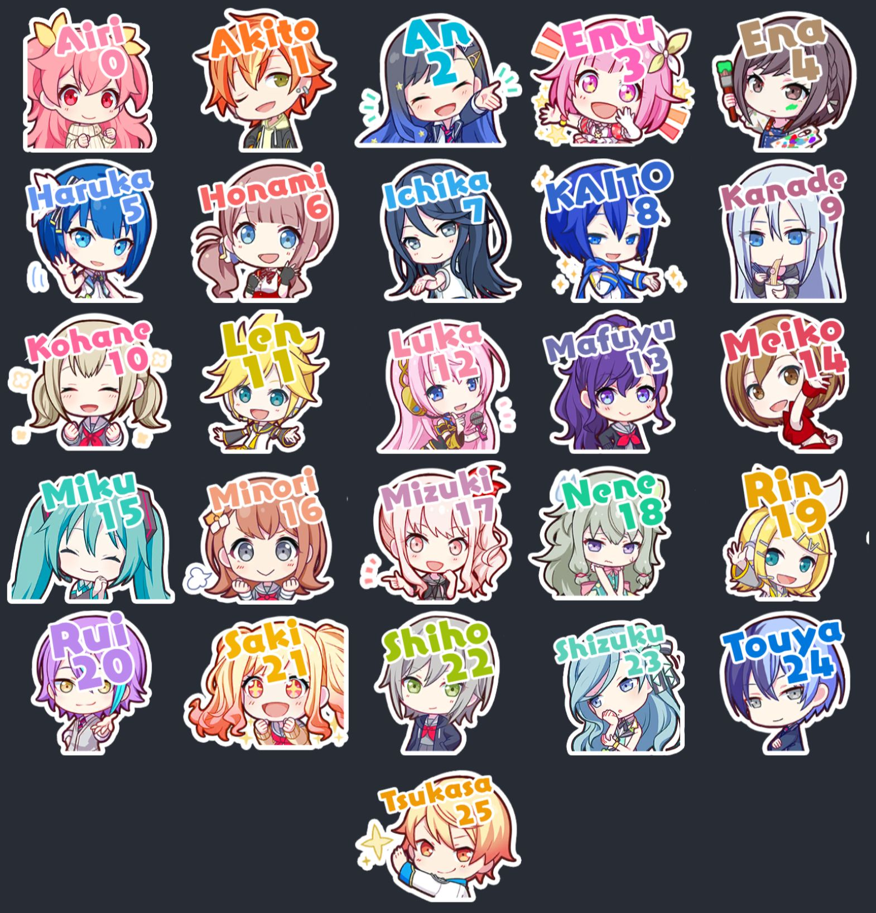

# 啤酒烧烤表情包生成

## 概述

**指令名称**: pjsk

**功能描述**: 基于初音未来Project Sekai角色的表情包生成器，支持自定义文字和多种调整选项

**插件名称**: pjsk-pptr

## 架构图



## 使用方法

### 基本语法

```
pjsk.绘制 [文本内容]
```

### 高级选项

```
pjsk.绘制 [文本内容] -n [表情包ID] -x [水平位置] -y [垂直位置] -r [旋转角度] -s [字体大小] -c [启用文本曲线] -l [行间距]
```

### 参数说明

| 参数 | 简写 | 类型 | 必填 | 说明 | 示例 |
|------|------|------|------|------|------|
| 文本内容 | - | 文本 | 是 | 要添加到表情包中的文本，使用 / 可以换行 | 你好/世界 |
| 表情包ID | -n | 数字 | 否 | 指定表情包ID，范围0-358 | -n 6 |
| 水平位置 | -x | 数字 | 否 | 文本的水平位置，范围0-296 | -x 50 |
| 垂直位置 | -y | 数字 | 否 | 文本的垂直位置，范围0-256 | -y 100 |
| 旋转角度 | -r | 数字 | 否 | 文本的旋转角度，范围-10到10 | -r 2 |
| 字体大小 | -s | 数字 | 否 | 文本字体大小，范围10-100 | -s 30 |
| 文本曲线 | -c | 布尔 | 否 | 启用文本曲线效果 | -c |
| 行间距 | -l | 数字 | 否 | 文本上下行间距，范围18-100 | -l 25 |

## 使用示例

### 基本绘制

#### 随机表情包绘制
<chat-panel>
<chat-message nickname="用户" type="user">pjsk.绘制 你好世界</chat-message>
<chat-message nickname="bot" type="bot">


</chat-message>
<chat-message nickname="bot" type="bot">

~
🎉 表情包绘制完成！

🔍 输入"pjsk.调整"获取调整指令
或直接输入"pjsk.列表.角色分类"开始新的绘制

✨ 期待您的下一个创作！
</chat-message>
</chat-panel>

#### 指定表情包绘制
<chat-panel>
<chat-message nickname="用户" type="user">pjsk.绘制 -n 10 今天天气真好</chat-message>
<chat-message nickname="bot" type="bot">


</chat-message>
<chat-message nickname="bot" type="bot">

~
🎉 表情包绘制完成！

🔍 输入"pjsk.调整"获取调整指令
或直接输入"pjsk.列表.角色分类"开始新的绘制

✨ 期待您的下一个创作！
</chat-message>
</chat-panel>

### 多行文本绘制

#### 使用换行符
<chat-panel>
<chat-message nickname="用户" type="user">pjsk.绘制 第一行/第二行/第三行</chat-message>
<chat-message nickname="bot" type="bot">


</chat-message>
<chat-message nickname="bot" type="bot">

~
🎉 表情包绘制完成！

🔍 输入"pjsk.调整"获取调整指令
或直接输入"pjsk.列表.角色分类"开始新的绘制

✨ 期待您的下一个创作！
</chat-message>
</chat-panel>

### 高级效果绘制

#### 启用文本曲线
<chat-panel>
<chat-message nickname="用户" type="user">pjsk.绘制 -c 弧形文字效果</chat-message>
<chat-message nickname="bot" type="bot">


</chat-message>
<chat-message nickname="bot" type="bot">

~
🎉 表情包绘制完成！

🔍 输入"pjsk.调整"获取调整指令
或直接输入"pjsk.列表.角色分类"开始新的绘制

✨ 期待您的下一个创作！
</chat-message>
</chat-panel>

#### 自定义位置和大小
<chat-panel>
<chat-message nickname="用户" type="user">pjsk.绘制 -x 100 -y 150 -s 25 -r 1 自定义位置</chat-message>
<chat-message nickname="bot" type="bot">


</chat-message>
<chat-message nickname="bot" type="bot">

~
🎉 表情包绘制完成！

🔍 输入"pjsk.调整"获取调整指令
或直接输入"pjsk.列表.角色分类"开始新的绘制

✨ 期待您的下一个创作！
</chat-message>
</chat-panel>

## 角色列表管理

### 查看全部表情包列表
```
pjsk.列表.全部
```

### 查看角色分类列表
```
pjsk.列表.角色分类
```

### 查看指定角色列表
```
pjsk.列表.展开指定角色 [角色序号或角色名]
```

### 角色列表示例
<chat-panel>
<chat-message nickname="用户" type="user">pjsk.列表.角色分类</chat-message>
<chat-message nickname="bot" type="bot">


</chat-message>
<chat-message nickname="bot" type="bot">

 ~ 
查看指定角色的表情，请输入：
> 角色序号，例如：10
> 角色名，例如：Emu
</chat-message>
</chat-panel>

## 表情包调整功能

### 文本内容调整
```
pjsk.调整.文本 [新文本内容]
```

### 字体大小调整
```
pjsk.调整.字体.大
pjsk.调整.字体.小
```

### 行间距调整
```
pjsk.调整.行间距.大
pjsk.调整.行间距.小
```

### 文本曲线调整
```
pjsk.调整.文本曲线.开启
pjsk.调整.文本曲线.关闭
```

### 文本位置调整
```
pjsk.调整.位置.上
pjsk.调整.位置.下
pjsk.调整.位置.左
pjsk.调整.位置.右
```

### 角色调整
```
pjsk.调整.角色 [角色ID]
pjsk.调整.角色 -r  # 随机角色
```

## 技术特性

### 渲染引擎
- **基于Puppeteer**: 使用Headless Chrome进行高质量渲染
- **Canvas绘制**: 基于HTML5 Canvas实现精确的文本渲染
- **字体支持**: 支持YurukaStd和SSFangTangTi字体

### 自适应功能
- **文本大小自适应**: 根据文本长度自动调整字体大小
- **位置自适应**: 智能调整文本位置以适应不同表情包
- **多语言支持**: 支持中英文混合文本处理

### 图像处理
- **高质量输出**: 296x256像素标准尺寸
- **透明背景**: 支持透明PNG格式输出
- **颜色管理**: 支持自定义文本颜色

## 支持的字符

### 角色列表
- Airi, Akito, An, Emu, Ena, Haruka, Honami, Ichika
- KAITO, Kanade, Kohane, Len, Luka, Mafuyu, Meiko
- Miku, Minori, Mizuki, Nene, Rin, Rui, Saki
- Shiho, Shizuku, Touya, Tsukasa

### 文本特性
- **中文字符**: 完整支持简体中文
- **英文字符**: 支持大小写英文字母
- **特殊符号**: 支持常用标点符号
- **换行支持**: 使用 `/` 或 `\n` 进行换行

## 配置参数

插件支持以下配置选项：

| 配置项 | 类型 | 默认值 | 说明 |
|--------|------|--------|------|
| isTextSizeAdaptationEnabled | boolean | true | 是否启用文本大小自适应 |
| shouldSendDrawingGuideText | boolean | true | 是否发送绘制引导文本 |
| shouldSendSuccessMessageAfterDrawingEmoji | boolean | true | 是否发送绘制成功提示 |
| shouldMentionUserInMessage | boolean | false | 是否在消息中@用户 |
| retractDelay | number | 0 | 自动撤回等待时间（秒） |

## 注意事项

1. **表情包ID范围**: 有效表情包ID范围为0-358
2. **文本长度限制**: 单行建议不超过15个字符
3. **换行限制**: 建议不超过3行文本
4. **性能考虑**: 复杂渲染可能需要较长时间
5. **字体兼容性**: 确保字体文件正确安装

::: tip
啤酒烧烤表情包生成功能基于初音未来Project Sekai角色库，提供高质量的表情包生成体验。该功能支持丰富的自定义选项，适合制作个性化的社交表情包。
:::
