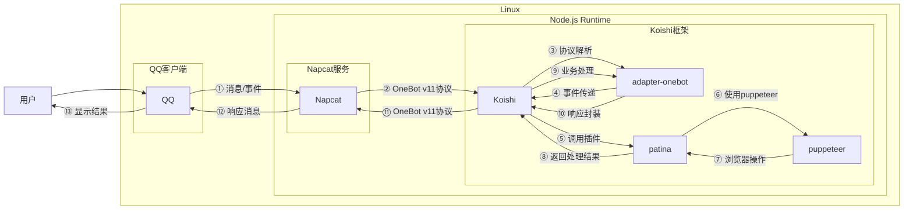

# 幻影坦克生成

## 概述
[](https://koishi.chat) [](https://www.npmjs.com/package/koishi-plugin-patina) [](https://github.com/koishi-shangxue-plugins/koishi-shangxue-apps/tree/main/plugins/patina)
**指令名称**: 幻影、幻影坦克

**功能描述**: 制作幻影坦克图片，通过两张图片的混合实现在不同亮度下显示不同图片的效果

**插件名称**: patina

## 架构图



## 使用方法

### 基本语法

```
幻影 [图片1] [图片2]
幻影坦克 [图片1] [图片2]
```

### 参数说明

| 参数 | 类型 | 必填 | 说明 | 示例 |
|------|------|------|------|------|
| 图片1 | 图片/QQ号/@用户 | 否 | 表图（正常显示） | [图片] / 123456 / @用户 |
| 图片2 | 图片/QQ号/@用户 | 否 | 里图（暗处显示） | [图片] / 123456 / @用户 |

### 选项说明

| 选项 | 简写 | 参数 | 说明 | 默认值 |
|------|------|------|------|------|
| fullColor | -f | 无 | 开启全彩输出，关闭则为黑白图 | false |
| size | -s | number | 指定输出图像尺寸（长宽中的较大值） | 1200 |
| weight | -w | number | 设置里图混合权重，范围为0到1 | 0.7 |

## 使用示例

### 基本使用
:::warning
效果在网页文档显示可能较差，请在QQ中查看效果更佳
在QQ发送时请勾选原图
不支持动图生成

:::
#### 交互式输入图片
<chat-panel>
<chat-message nickname="用户" type="user">幻影</chat-message>
<chat-message nickname="bot" type="bot">
请发送一张图片作为【表图】：
</chat-message>
<chat-message nickname="用户" type="user">


</chat-message>
<chat-message nickname="bot" type="bot">
请发送一张图片作为【里图】：
</chat-message>
<chat-message nickname="用户" type="user">


</chat-message>
<chat-message nickname="bot" type="bot">


</chat-message>
</chat-panel>

#### 直接上传两张图片
<chat-panel>
<chat-message nickname="用户" type="user">幻影 


</chat-message>
<chat-message nickname="bot" type="bot">


</chat-message>
</chat-panel>

### 使用QQ头像

#### 使用QQ号
<chat-panel>
<chat-message nickname="用户" type="user">幻影 123456 654321</chat-message>
<chat-message nickname="bot" type="bot">


</chat-message>
</chat-panel>

#### 使用@用户
<chat-panel>
<chat-message nickname="马化腾" type="user">大家好，我是马化腾</chat-message>
<chat-message nickname="腾讯视频" type="user">大家好，我是腾讯视频</chat-message>
<chat-message nickname="用户" type="user">幻影 <span style="color: #3175de;">@腾讯视频 @马化腾</span></chat-message>
<chat-message nickname="bot" type="bot">


</chat-message>
</chat-panel>

### 使用选项参数

#### 全彩输出
<chat-panel>
<chat-message nickname="用户" type="user">幻影 -f


</chat-message>
<chat-message nickname="bot" type="bot">

</chat-message>
</chat-panel>

#### 自定义尺寸和权重
<chat-panel>
<chat-message nickname="用户" type="user">幻影 [图片] [图片] -s 800 -w 0.5</chat-message>
<chat-message nickname="bot" type="bot">
[尺寸800、权重0.5的幻影坦克图片]
</chat-message>
</chat-panel>

#### 完整参数示例
<chat-panel>
<chat-message nickname="用户" type="user">幻影坦克 [图片] [图片] -f -s 1000 -w 0.8</chat-message>
<chat-message nickname="bot" type="bot">
[全彩输出、尺寸1000、权重0.8的幻影坦克图片]
</chat-message>
</chat-panel>

## 技术特性

### 支持的图片格式
- JPEG
- PNG
- GIF
- WebP
- BMP

### 图片来源
- **直接上传**: 通过消息发送图片
- **QQ头像**: 使用QQ号或@用户获取头像
- **网络图片**: 支持图片URL

### 处理流程
1. **图片获取**: 从用户输入或交互中获取两张图片
2. **参数配置**: 应用用户指定的选项参数
3. **图像处理**: 使用puppeteer在浏览器中处理图片
4. **结果返回**: 返回处理后的幻影坦克图片

## 注意事项

1. **网络要求**: 需要稳定的网络连接来处理图片
2. **处理时间**: 复杂图片可能需要较长时间处理
3. **图片大小**: 大尺寸图片会自动调整以适应处理需求
4. **效果预览**: 建议先在网页版工具中预览效果：https://uyanide.github.io/Mirage_Colored/

## 配置参数

插件支持以下配置选项：

| 配置项 | 类型 | 默认值 | 说明 |
|--------|------|--------|------|
| Full_color_output | boolean | false | 全彩输出，关闭后变成黑白图 |
| Output_Size | number | 1200 | 输出尺寸（长宽中的较大值） |
| Mixed_Weight | number | 0.7 | 里图混合权重，数值越大里图越隐约可见 |

::: tip
幻影坦克功能基于puppeteer实现，能够准确处理各种图片格式，生成高质量的隐写图片。
:::
