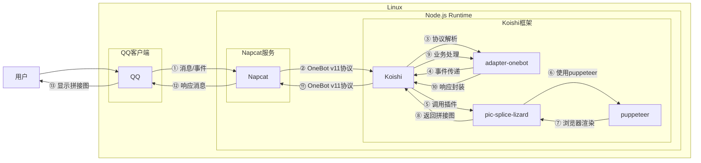

# 拼接图片

## 概述
[](https://koishi.chat) [](https://www.npmjs.com/package/koishi-plugin-pic-splice-lizard) [](https://github.com/lizard0126/pic-splice-lizard)
**指令名称**: 拼图

**功能描述**: 将多张图片拼接成一张长图，支持横向或纵向拼接

**插件名称**: pic-splice-lizard

## 架构图



## 使用方法

### 基本语法

```
拼图 [方向]
```

### 参数说明

| 参数 | 类型 | 必填 | 说明 | 示例 |
|------|------|------|------|------|
| 方向 | 文本 | 否 | 拼接方向：横向/纵向，默认纵向 | 横向 |

### 操作流程

1. 输入 `拼图 [方向]` 开始拼接任务
2. 发送多张图片（支持一次性发送多张）
3. 输入 `完成` 或等待10秒自动开始拼接

## 使用示例

### 横向拼接图片

<chat-panel>
<chat-message nickname="用户" type="user">拼图 横向</chat-message>
<chat-message nickname="bot" type="bot">请发送图片，输入 "完成" 开始拼接。</chat-message>
<chat-message nickname="用户" type="user">


</chat-message>
<chat-message nickname="bot" type="bot">已获取 1 张图片。</chat-message>
<chat-message nickname="用户" type="user">


</chat-message>
<chat-message nickname="bot" type="bot">已获取 2 张图片。</chat-message>
<chat-message nickname="用户" type="user">


</chat-message>
<chat-message nickname="bot" type="bot">已获取 3 张图片。</chat-message>
<chat-message nickname="用户" type="user">完成</chat-message>
<chat-message nickname="bot" type="bot">


</chat-message>

<chat-message nickname="用户" type="user">拼图 横向</chat-message>
<chat-message nickname="bot" type="bot">请发送图片，输入 "完成" 开始拼接。</chat-message>
<chat-message nickname="用户" type="user">


</chat-message>
<chat-message nickname="bot" type="bot">已获取 1 张图片。</chat-message>
<chat-message nickname="用户" type="user">


</chat-message>
<chat-message nickname="bot" type="bot">已获取 2 张图片。</chat-message>
<chat-message nickname="用户" type="user">


</chat-message>
<chat-message nickname="bot" type="bot">已获取 3 张图片。</chat-message>
<chat-message nickname="用户" type="user">完成</chat-message>
<chat-message nickname="bot" type="bot">


</chat-message>

<chat-message nickname="用户" type="user">拼图 横向</chat-message>
<chat-message nickname="bot" type="bot">请发送图片，输入 "完成" 开始拼接。</chat-message>
<chat-message nickname="用户" type="user">


</chat-message>
<chat-message nickname="bot" type="bot">已获取 1 张图片。</chat-message>
<chat-message nickname="用户" type="user">


</chat-message>
<chat-message nickname="bot" type="bot">已获取 2 张图片。</chat-message>
<chat-message nickname="用户" type="user">


</chat-message>
<chat-message nickname="bot" type="bot">已获取 3 张图片。</chat-message>
<chat-message nickname="用户" type="user">完成</chat-message>
<chat-message nickname="bot" type="bot">


</chat-message>
</chat-panel>

### 纵向拼接图片

<chat-panel>
<chat-message nickname="用户" type="user">拼图 纵向</chat-message>
<chat-message nickname="bot" type="bot">请发送图片，输入 "完成" 开始拼接。</chat-message>
<chat-message nickname="用户" type="user">


</chat-message>
<chat-message nickname="bot" type="bot">已获取 1 张图片。</chat-message>
<chat-message nickname="用户" type="user">


</chat-message>
<chat-message nickname="bot" type="bot">已获取 2 张图片。</chat-message>
<chat-message nickname="用户" type="user">


</chat-message>
<chat-message nickname="bot" type="bot">已获取 3 张图片。</chat-message>
<chat-message nickname="用户" type="user">完成</chat-message>
<chat-message nickname="bot" type="bot">


</chat-message>
</chat-panel>

## 技术特性

### 支持的图片格式
- 所有浏览器支持的图片格式（JPG、PNG、GIF、WebP等）

### 自动处理
- **方向选择**: 支持横向和纵向两种拼接方式
- **自动超时**: 10秒无操作自动开始拼接
- **图片收集**: 支持一次性发送多张图片
- **智能布局**: 根据方向自动调整图片排列方式

### 错误处理
- **图片数量不足**: 当图片少于2张时提示
- **拼接失败**: 当拼接过程中出现错误时提示
- **方向错误**: 当方向参数不正确时提示

## 注意事项

1. **图片数量**: 至少需要2张图片才能进行拼接
2. **图片大小**: 建议不要超过10张图片，以免拼接时间过长
3. **操作超时**: 发送图片后10秒内未输入"完成"将自动开始拼接
4. **网络要求**: 需要稳定的网络连接来处理图片
5. **内存使用**: 处理大量图片时可能需要较多内存

## 配置参数

插件支持以下配置选项：

| 配置项 | 类型 | 默认值 | 说明 |
|--------|------|--------|------|
| 超时时间 | number | 10秒 | 自动拼接的超时时间 |
| 最大图片数 | number | 10张 | 单次拼接的最大图片数量 |

::: tip
拼接图片功能基于puppeteer实现，能够准确渲染图片并生成高质量的拼接图，支持各种尺寸和比例的图片。
:::
