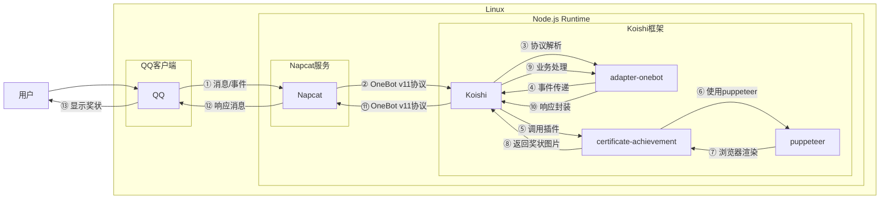

# 生成奖状

## 概述

**指令名称**: 生成奖状

**功能描述**: 生成一张自定义的奖状图片，可指定获奖者、奖项名称和授权单位

**插件名称**: certificate-achievement

## 架构图



## 使用方法

### 基本语法

```
生成奖状 <姓名> <奖项> [单位]
```

### 参数说明

| 参数 | 类型 | 必填 | 说明 | 示例 |
|------|------|------|------|------|
| 姓名 | 文本 | 是 | 获奖者姓名 | 张三 |
| 奖项 | 文本 | 是 | 奖项名称 | galgame糕手 |
| 单位 | 文本 | 否 | 授权单位，如不指定则使用默认值 | 本群授奖处 |

### 配置选项

插件支持以下配置选项：

| 配置项 | 类型 | 默认值 | 说明 |
|--------|------|--------|------|
| commandname | string | '生成奖状' | 指令名称 |
| customText | string | '在本学年第一学期中表现优秀，被本群决定\n评为' | 奖状中间的自定义文字 |
| defaultClassname | string | '本群指定授奖处' | 默认的授奖单位 |

## 使用示例

### 基本奖状生成

#### 生成简单奖状
<chat-panel>
<chat-message nickname="用户" type="user">生成奖状 张三 galgame糕手</chat-message>
<chat-message nickname="bot" type="bot">
[奖状图片]
</chat-message>
</chat-panel>

#### 指定授奖单位
<chat-panel>
<chat-message nickname="用户" type="user">生成奖状 李四 游戏苦手 本群授奖处</chat-message>
<chat-message nickname="bot" type="bot">
[奖状图片]
</chat-message>
</chat-panel>

### 高级用法

#### 自定义奖状文字
通过插件配置可以修改奖状中间的自定义文字，例如：
- "在本次活动中表现突出，荣获"
- "因在技术分享中贡献卓越，特授予"

## 技术特性

### 渲染技术
- **基于Puppeteer**: 使用无头浏览器进行HTML渲染
- **本地渲染**: 所有处理在本地完成，无需外部服务
- **高质量输出**: 生成PNG格式的高质量图片

### 自动处理
- **模板加载**: 自动加载预设的奖状模板图片
- **文字定位**: 智能定位姓名、奖项和单位的位置
- **格式保持**: 保持奖状原有的美观格式

### 错误处理
- **参数验证**: 当缺少必要参数时提示用户
- **渲染失败**: 当图片生成过程中出现错误时提示
- **超时处理**: 设置合理的渲染超时时间

## 注意事项

1. **姓名长度**: 建议使用2~3个汉字或适当长度的英文，过长可能影响显示效果
2. **依赖要求**: 需要安装puppeteer服务才能正常使用
3. **渲染时间**: 首次使用可能需要较长时间加载浏览器实例
4. **图片大小**: 生成的奖状图片尺寸为1214x902像素

## 配置参数

插件支持以下配置选项：

| 配置项 | 类型 | 默认值 | 说明 |
|--------|------|--------|------|
| commandname | string | '生成奖状' | 指令名称，可自定义 |
| customText | string | '在本学年第一学期中表现优秀，被本群决定\n评为' | 奖状中间的自定义文字，支持换行 |
| defaultClassname | string | '本群指定授奖处' | 默认的授奖单位名称 |

::: tip
奖状生成功能基于puppeteer实现，能够准确渲染自定义文字到奖状模板上，生成美观的奖状图片。支持自定义奖状文字内容和授奖单位，满足不同场景的使用需求。
:::
