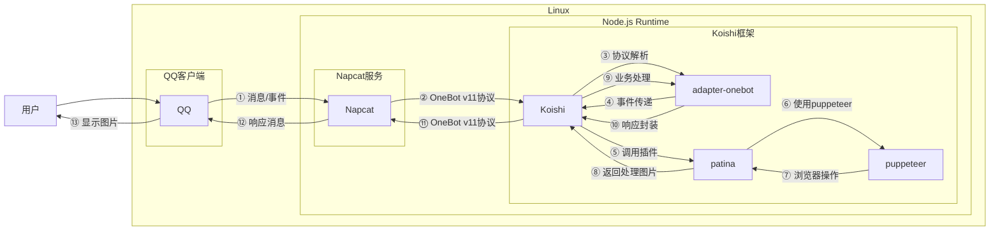

# 相机镜框

## 概述

**指令名称**: 相机镜框

**功能描述**: 为图片添加相机取景器镜框效果

**插件名称**: patina

## 架构图



## 使用方法

### 基本语法

```
相机镜框 [图片]
```

### 参数说明

| 参数 | 类型 | 必填 | 说明 | 示例 |
|------|------|------|------|------|
| 图片 | 图片/QQ号/@用户 | 是 | 要添加相机镜框的图片 | [图片] |

### 选项说明

此功能目前没有可配置的指令参数，但可以通过插件配置调整图片对齐方式和压缩质量。

## 使用示例

### 为图片添加相机镜框

<chat-panel>
<chat-message nickname="用户" type="user">相机镜框 [图片]</chat-message>
<chat-message nickname="bot" type="bot">


</chat-message>
</chat-panel>

### 使用QQ头像添加相机镜框

<chat-panel>
<chat-message nickname="用户" type="user">相机镜框 123456789</chat-message>
<chat-message nickname="bot" type="bot">


</chat-message>
</chat-panel>

### 使用@用户头像添加相机镜框

<chat-panel>
<chat-message nickname="用户" type="user">相机镜框 @用户</chat-message>
<chat-message nickname="bot" type="bot">


</chat-message>
</chat-panel>

## 技术特性

### 支持的输入格式
- **图片文件**: 支持常见图片格式
- **QQ号**: 使用指定QQ号的头像
- **@用户**: 使用被@用户的头像

### 图片处理逻辑
- **居中填充**: 图片居中显示，保持比例，超出部分裁剪
- **拉伸**: 图片拉伸填满整个镜框区域
- **适应**: 图片适应镜框区域，保持比例，可能有留白

### 输出规格
- **分辨率**: 1080x2400像素
- **格式**: JPEG
- **质量**: 可配置压缩质量（0-100%）

## 配置参数

插件支持以下配置选项：

| 配置项 | 类型 | 默认值 | 说明 |
|--------|------|--------|------|
| enablecommand3 | boolean | true | 是否启用相机镜框功能 |
| enablecommand3Name | string | '相机镜框' | 指令名称 |
| cameraAlignmentLogic | string | '居中填充' | 输入图片的对齐逻辑（居中填充/拉伸/适应） |
| camerascreenshotquality | number | 50 | 设置图片压缩质量（0-100%） |

::: tip
相机镜框功能基于puppeteer实现，能够准确处理各种尺寸的图片，并自动适配相机取景器镜框效果。镜框效果模拟真实的相机取景器界面，为用户图片增添专业感。
:::
