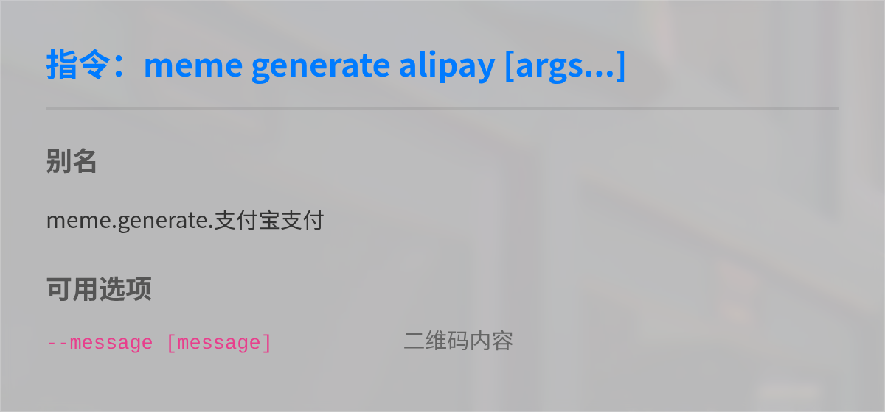

# 表情包生成

## 概述
[](https://koishi.chat) [](https://www.npmjs.com/package/koishi-plugin-memes-api) [](https://github.com/lgc-KoiDev/koishi-plugin-memes-api)
**指令名称**: meme

**功能描述**: 提供多种模板的表情包生成功能，支持自定义文字和图片

**插件名称**: memes-api

## 主要功能指令

### 生成表情包
```
meme generate <表情关键词> [参数]
```

### 查看表情详情
```
meme info <表情关键词>
```

### 查看表情列表
```
meme list
```

### 随机生成表情
```
meme random
```

## 快捷使用方式
```
<表情关键词> [参数]
```

## 使用示例

### 生成 `5000兆` 表情
<chat-panel>
<chat-message nickname="用户" type="user">5000兆 我去 洛天依</chat-message>
<chat-message nickname="bot" type="bot">


</chat-message>
</chat-panel>

### 生成 `rua` 表情
<chat-panel>
<chat-message nickname="用户" type="user">rua -圆 @自己</chat-message>
<chat-message nickname="bot" type="bot">


</chat-message>
</chat-panel>

### 生成 `微信支付` 表情 [`特定参数`](#表情特定参数示例) `自定义二维码链接`
<chat-panel>
<chat-message nickname="用户" type="user">微信支付 --message https://tangbot.xyz/</chat-message>
<chat-message nickname="bot" type="bot">


</chat-message>
</chat-panel>

:::tip
具体参数用法请查看[表情特定参数示例](#表情特定参数示例)
:::

## 完整表情包列表

### 文字表情包
<details>
  <summary>点击展开列表</summary>
  
- 5000兆 (5000choyen)
- 戒导 (abstinence) 
- 逆转裁判气泡 (ace_attorney_dialog)
- 二次元入口 (acg_entrance)
- 添乱/给社会添乱 (add_chaos)
- 上瘾/毒瘾发作 (addiction)
- 一样 (alike)
- 支付宝支付 (alipay)
- 一直 (always)
- 我永远喜欢 (always_like)
- 防诱拐 (anti_kidnap)
- 阿尼亚喜欢 (anya_suki)
- 鼓掌 (applaud)
- 阿罗娜扔 (arona_throw)
- 升天 (ascension)
- 问问 (ask)
- 亚托莉枕头 (atri_pillow)
- 宁宁举牌 (ayachi_holdsign)
- ba说 (ba_say)
- 继续干活/打工人 (back_to_work)
- 后空翻 (backflip)
- 悲报 (bad_news)
- 拍头 (beat_head)
- 揍 (beat_up)
- 啃 (bite)
- 真寻挨骂 (blamed_mahiro)
- 高血压 (blood_pressure)
- 蔚蓝档案标题/batitle (bluearchive)
- 波奇手稿 (bocchi_draft)
- 布洛妮娅举牌/大鸭鸭举牌 (bronya_holdsign)
- 奶茶 (bubble_tea)
- 遇到困难请拨打 (call_110)
- 咖波画 (capoo_draw)
- 咖波指 (capoo_point)
- 咖波撕 (capoo_rip)
- 咖波蹭/咖波贴 (capoo_rub)
- 咖波说 (capoo_say)
- 咖波炖 (capoo_stew)
- 咖波撞/咖波头槌 (capoo_strike)
- 舰长 (captain)
- 这个引起的 (caused_by_this)
- 奖状/证书 (certificate)
- 馋身子 (chanshenzi)
- 字符画 (charpic)
- 追列车/追火车 (chase_train)
- 国旗 (china_flag)
- 智乃扔/智乃抛 (chino_throw)
- 鼠鼠搓 (clauvio_twist)
- 小丑 (clown)
- 小丑面具 (clown_mask)
- 迷惑 (confuse)
- 兑换券 (coupon)
- 捂脸 (cover_face)
- 爬 (crawl)
- 群青 (cyan)
- 白天黑夜/白天晚上 (daynight)
- 像样的亲亲 (decent_kiss)
- 入典/典中典/黑白草图 (dianzhongdian)
- 恐龙/小恐龙 (dinosaur)
- 注意力涣散 (distracted)
- 离婚协议/离婚申请 (divorce)
- 狗都不玩 (dog_dislike)
- 管人痴 (dog_of_vtb)
- 不要靠近 (dont_go_near)
- 不要按 (dont_press)
- 别碰 (dont_touch)
- douyin (douyin)
- 吃 (eat)
- 皇帝龙图 (emperor_dragon)
- 意若思镜 (erised_mirror)
- 灰飞烟灭 (fade_away)
- 狂爱/狂粉 (fanatic)
- 闭嘴/我爸爸 (father_work)
- 击剑/🤺 (fencing)
- 我打宿傩/我打宿傩吗 (fight_with_sunuo)
- 满脑子 (fill_head)
- 整点薯条 (find_chips)
- 流萤举牌 (firefly_holdsign)
- 闪瞎 (flash_blind)
- 弹/脑瓜崩 (flick)
- 红温 (flush)
- 回南天/水雾 (fogging)
- 关注 (follow)
- 芙莉莲拿 (frieren_take)
- 哈哈镜 (funny_mirror)
- 垃圾/垃圾桶 (garbage)
- 原神吃 (genshin_eat)
- 原神启动 (genshin_start)
- 喜报 (good_news)
- google (google)
- 谷歌验证码 (google_captcha)
- 猩猩扔 (gorilla_throw)
- 鬼畜 (guichu)
- 手枪 (gun)
- 锤 (hammer)
- 凉宫春日举 (haruhi_raise)
- 高低情商/低高情商 (high_EQ)
- 打穿/打穿屏幕 (hit_screen)
- 记仇 (hold_grudge)
- 抱紧 (hold_tight)
- 抱/抱抱 (hug)
- 抱大腿 (hug_leg)
- 胡桃啃 (hutao_bite)
- 坐牢 (imprison)
- 不文明 (incivilization)
- inside (intel_inside)
- 采访 (interview)
- 杰瑞盯 (jerry_stare)
- 假面骑士 (jiamianqishi)
- 急急国王 (jiji_king)
- 汐汐/今汐 (jinhsi)
- 旧病复发 (jiubingfufa)
- 啾啾 (jiujiu)
- 跳 (jump)
- 万花筒/万花镜 (kaleidoscope)
- 凯露指 (karyl_point)
- 远离 (keep_away)
- 压岁钱不要交给 (keep_your_money)
- 踢球 (kick_ball)
- 卡比锤/卡比重锤 (kirby_hammer)
- 亲/亲亲 (kiss)
- 可莉吃 (klee_eat)
- 敲 (knock)
- 心奈印章 (kokona_seal)
- 泉此方看 (konata_watch)
- 偷学 (learn)
- 左右横跳 (left_right_jump)
- 让我进去 (let_me_in)
- 舔糖/舔棒棒糖 (lick_candy)
- 等价无穷小 (lim_x_0)
- 听音乐 (listen_music)
- 小天使 (little_angel)
- 加载中 (loading)
- 看扁 (look_flat)
- 看图标 (look_this_icon)
- 循环 (loop)
- 寻狗启事 (lost_dog)
- 永远爱你 (love_you)
- 洛天依要/天依要 (luotianyi_need)
- 洛天依说/天依说 (luotianyi_say)
- 罗永浩说 (luoyonghao_say)
- 鲁迅说/鲁迅说过 (luxun_say)
- 真寻看书 (mahiro_readbook)
- 麦克阿瑟说 (maikease)
- 旅行伙伴觉醒 (maimai_awaken)
- 旅行伙伴加入 (maimai_join)
- 交个朋友 (make_friend)
- 结婚申请/结婚登记 (marriage)
- 流星 (meteor)
- 米哈游 (mihoyo)
- 上香 (mourning)
- 低语 (murmur)
- 我朋友说 (my_friend)
- 我的意见如下/我的意见是 (my_opinion)
- 我老婆/这是我老婆 (my_wife)
- 纳西妲啃/草神啃 (nahida_bite)
- 亚文化取名机/亚名 (name_generator)
- 需要/你可能需要 (need)
- 猫羽雫举牌/猫猫举牌 (nekoha_holdsign)
- 你好骚啊 (nihaosaoa)
- 伊地知虹夏举牌/虹夏举牌 (nijika_holdsign)
- 无响应 (no_response)
- 诺基亚/有内鬼 (nokia)
- 不喊我 (not_call_me)
- 请假条 (note_for_leave)
- 我推的网友 (oshi_no_ko)
- osu (osu)
- out (out)
- 加班 (overtime)
- 女神异闻录5预告信/P5预告信 (p5letter)
- 这像画吗 (paint)
- 小画家 (painter)
- 熊猫龙图 (panda_dragon_figure)
- 推锅/甩锅 (pass_the_buck)
- 拍 (pat)
- 佩佩举 (pepe_raise)
- 完美 (perfect)
- 摸/摸摸/摸头/rua (petpet)
- 捏/捏脸 (pinch)
- 像素化 (pixelate)
- pjsk/世界计划 (pjsk)
- 普拉娜吃/普拉娜舔 (plana_eat)
- 顶/玩 (play)
- 打棒球 (play_baseball)
- 打篮球/火柴人打篮球 (play_basketball)
- 玩游戏 (play_game)
- 一起玩 (play_together)
- 出警 (police)
- 警察 (police1)
- ph/pornhub (pornhub)
- 土豆 (potato)
- 捣 (pound)
- 打印 (printing)
- 舔/舔屏/prpr (prpr)
- 可达鸭 (psyduck)
- 打拳 (punch)
- 四棱锥/金字塔 (pyramid)
- 切格瓦拉 (qiegewala)
- 举 (raise_image)
- 举牌 (raise_sign)
- 看书 (read_book)
- 遥控/控制 (remote_control)
- 复读 (repeat)
- 撕 (rip)
- 怒撕 (rip_angrily)
- 撕衣服 (rip_clothes)
- 诈尸/秽土转生 (rise_dead)
- 滚 (roll)
- 三维旋转 (rotate_3d)
- 贴/贴贴/蹭/蹭蹭 (rub)
- 快跑 (run)
- 快逃 (run_away)
- 安全感 (safe_sense)
- 催眠app (saimin_app)
- 挠头 (scratch_head)
- 刮刮乐 (scratchcard)
- 滚屏 (scroll)
- 源石封印 (seal)
- 世界第一可爱 (sekaiichi_kawaii)
- 晃脑 (shake_head)
- 白子舔 (shiroko_pero)
- 食屎啦你 (shishilani)
- 震惊 (shock)
- 谁反对 (shuifandui)
- 别说了 (shutup)
- 坐得住/坐的住 (sit_still)
- 一巴掌 (slap)
- 口号 (slogan)
- 砸 (smash)
- 卖掉了 (sold_out)
- 无语 (speechless)
- 球面旋转 (sphere_rotate)
- 蜘蛛/蜘蛛爬 (spider)
- 盯着你 (stare_at_you)
- steam消息 (steam_message)
- 踩 (step_on)
- 炖 (stew)
- 跳舞/火柴人跳舞 (stickman_dancing)
- 科目三 (subject3)
- 吸/嗦 (suck)
- 精神支柱 (support)
- 回旋转/旋风转 (swirl_turn)
- 对称 (symmetric)
- 唐可可举牌 (tankuku_raisesign)
- 嘲讽 (taunt)
- 讲课/敲黑板 (teach)
- 拿捏/戏弄 (tease)
- 望远镜 (telescope)
- 体温枪 (thermometer_gun)
- 想什么 (think_what)
- 这是鸡/🐔 (this_chicken)
- 丢/扔 (throw)
- 抛/掷 (throw_gif)
- 捶 (thump)
- 捶爆/爆捶 (thump_wildly)
- 紧贴/紧紧贴着 (tightly)
- 该走了 (time_to_go)
- 一起 (together)
- 汤姆嘲笑 (tom_tease)
- 上坟/坟前比耶 (tomb_yeah)
- 顶尖 (top_notch)
- 恍惚 (trance)
- 推车 (trolley)
- 转 (turn)
- 搓 (twist)
- 万能表情/空白表情 (universal)
- 反了 (upside_down)
- 震动 (vibrate)
- 好起来了 (wakeup)
- 墙纸 (wallpaper)
- 胡桃平板 (walnut_pad)
- 胡桃放大 (walnut_zoom)
- 王境泽 (wangjingze)
- 洗衣机 (washer)
- 波纹 (wave)
- 微信支付 (wechat_pay)
- 为所欲为 (weisuoyuwei)
- 我想上的 (what_I_want_to_do)
- 最想要的东西 (what_he_wants)
- 为什么@我 (why_at_me)
- 为什么要有手 (why_have_hands)
- 风车转 (windmill_turn)
- 许愿失败 (wish_fail)
- 木鱼 (wooden_fish)
- 膜/膜拜 (worship)
- 吴京中国 (wujing)
- 五年怎么过的 (wunian)
- 乌鸦哥 (wuyage)
- 压力大爷 (yalidaye)
- 椰树椰汁 (yeshu)
- 你不懂啦 (you_dont_get)
- 致电/你应该致电 (you_should_call)
- 你的跨年 (your_new_years_eve)
- yt/youtube (youtube)
- 曾小贤 (zengxiaoxian)
- 雷军举牌 (mi_leijun_holdsign)
- 刘伟说大伟说大伟哥说 (mihoyo_liuwei_say)
- 和泉纱雾画画 (izumi_sagiri_painting)
- 今汐坐 (kurogames_jinhsi_sit)
- 扔史 (throwing_poop)
- 弗洛洛吃 (kurogames_phrolova_eat)
- 漂泊者舔 (kurogames_rover_lick)
- 舰载激光武器 (shipborne_laser_weapons)
- okOKOk (ok)
- 薇尔莉特 (violet_evergarden)
- 玉足 (mihoyo_columbina_jade_feet)
- 没救了希格雯指 (mihoyo_sigewinne_fingered)
- 骑士doro骑士Doro骑士DORO骑士 (doro_knight)
- 国庆快乐国庆节快乐 (happy_national_day)
- 骑马 (horse_riding)
- 周边写真 (doro_surrounding_photos)
- 猫舔猫猫舔 (cat_lick)
- 开灯桃乐丝开灯doro开灯Doro开灯DORO开灯 (doro_openlight)
- 摸鱼 (slacking_off)
- 被窝 (quilt)
- 比心 (sending_love)
- 放屁 (fart)
- 家人们谁懂啊 (family_know)
- 燃起来了 (ignite)
- 看看腿 (look_leg)
- 符咒 (rune)
- 新年好 (happy_new_year)
- 心跳 (heartbeat)
- 咖波砸蛋 (capoo_smash_egg)
- Ciallo～(∠・ω< )⌒★CiallocialloCiallo~ciallo~Ciallo～(∠・ω< )⌒☆ (yuzu_soft_ciallo)
- 猫抓猫猫抓 (cat_scratch)
- 咖波掏 (capoo_fished_out)
- ly01ly-1LY-1 (ly01)
- 坤坤想要 (ikun_need_tv)
- 土豆地雷 (potato_mines)
- 松伦晚餐松伦哥晚餐 (kurogames_songlun_dinner)
- 刘伟晚餐共进晚餐大伟哥晚餐 (mihoyo_liuwei_dinner)
</details>

::: warning
该列表仅包含部分表情，请以 `meme list` 为准确
:::

## 表情详情示例

### 5000兆
**关键词**: 5000兆  
**需要图片数目**: 0  
**需要文字数目**: 2  
**默认文字**: [我去, 洛天依]  
**预览**: [图片]  

### 戒导
**关键词**: 戒导  
**需要图片数目**: 1  
**需要文字数目**: 0  
**参数**:  
- `-t/--time <time: str>` 指定时间  
- `-n/--name <name: str>` 指定名字  
**预览**: [图片]  

### 阿尼亚喜欢
**关键词**: 阿尼亚喜欢  
**标签**: "间谍过家家"、"阿尼亚·福杰"  
**需要图片数目**: 1  
**需要文字数目**: 0 ~ 1  
**默认文字**: [阿尼亚喜欢这个]  
**预览**: [图片]  

## 表情特定参数示例
- 戒导:  
  `-t/--time <time>` 指定时间  
  `-n/--name <name>` 指定名字  
- 支付宝支付/微信支付:  
  `-m/--message <message>` 指定二维码内容  
- 原神吃:  
  `-c/--character <character>` 指定角色编号  
- 咖波系列:  
  `-p/--position <position>` 指定位置(right/left/both)  

::: tip
该参数列表仅包含部分表情
您可以使用 `[关键词] -h` 查看支持的参数详情
:::

<chat-panel>
<chat-message nickname="用户" type="user">支付宝支付 -h</chat-message>
<chat-message nickname="bot" type="bot">


</chat-message>

::: tip
此帮助图里显示有可用参数 `--message` [二维码内容]
:::

<chat-message nickname="用户" type="user">原来这个二维码可以<span style="color: #31de8dff;">自定义内容啊</span></chat-message>

::: tip
当内容是标准链接时
扫描二维码会自动跳转到该链接
:::

<chat-message nickname="用户" type="user">支付宝支付 --message https://tangbot.xyz/</chat-message>
<chat-message nickname="bot" type="bot">


</chat-message>
</chat-panel>

### 参数格式说明
1. 参数可以单独使用或组合使用  
2. 多个参数用空格分隔  
3. 带值的参数格式为 `-参数名 值` 或 `--参数名=值`  
4. 布尔参数只需指定参数名即可启用  

## 技术特性

- **模板系统**: 基于预定义的表情包模板
- **文字渲染**: 自动调整文字大小和位置以适应模板
- **图片处理**: 智能裁剪和调整上传图片以适应模板
- **缓存机制**: 缓存常用模板和生成结果
- **并发处理**: 支持同时处理多个生成请求
- **图片压缩**: 自动优化生成的表情包大小

## 注意事项

1. 部分模板可能涉及版权问题，请谨慎使用
2. 建议使用清晰度高、背景简单的图片
3. 单行文字建议不超过15个字符
4. 多行文字建议不超过3行
5. 复杂模板可能需要更长的生成时间

::: tip
表情包生成功能基于meme-generator-api实现，能够快速生成各种流行的表情包模板。该功能简单实用，适合日常娱乐和社交分享。
:::
