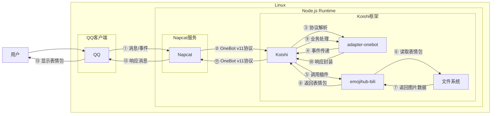

# 随机表情包

## 概述
[](https://koishi.chat) [](https://www.npmjs.com/package/koishi-plugin-emojihub-bili) [](https://github.com/koishi-shangxue-plugins/koishi-shangxue-apps/tree/main/plugins/emojihub-bili)
**指令名称**: 随机表情包、再来一张、表情包列表

**功能描述**: 从43套表情包中随机选择并发送表情图片

**插件名称**: emojihub-bili

## 架构图



## 使用方法

### 基本语法

```
随机表情包
再来一张
表情包列表
```

## 使用示例

### 随机表情包

#### 获取随机表情包
<chat-panel>
<chat-message nickname="用户" type="user">随机表情包</chat-message>
<chat-message nickname="bot" type="bot">


</chat-message>
</chat-panel>

### 再来一张

#### 继续获取同类型表情包
<chat-panel>
<chat-message nickname="用户" type="user">再来一张</chat-message>
<chat-message nickname="bot" type="bot">


</chat-message>
</chat-panel>

### 表情包列表

#### 查看可用表情包
<chat-panel>
<chat-message nickname="用户" type="user">表情包</chat-message>
<chat-message nickname="bot" type="bot">

可用的表情包指令：
随机emojihub表情包
acomu414表情包
ba表情包
capoo表情包
chiikawa表情包
downvote表情包
doro表情包
eveonecat表情包
fufu表情包
girlsbandcry
kemomimi表情包
koishi-meme表情包
mygo表情包
seseren表情包
阿夸表情包
阿尼亚表情包
白圣女表情包
白圣女漫画表情包
败犬女主表情包
柴郡表情包
初音Q版表情包
甘城猫猫表情包
孤独摇滚表情包
狗妈表情包
滑稽表情包
疾旋鼬表情包
卡拉彼丘表情包
流萤表情包
龙图表情包
鹿乃子表情包
玛丽猫表情包
小c表情包
男娘武器库表情包
千恋万花表情包
赛马娘表情包
瑟莉亚表情包
藤田琴音表情包
小黑子表情包
心海表情包
绪山真寻表情包
亚托莉表情包
永雏小菲表情包
宇佐紀表情包
</chat-message>
</chat-panel>

## 技术特性

### 支持的图片源
- **本地文件夹**: 从本地文件系统读取表情包图片
- **TXT文件**: 通过TXT文件配置表情包路径
- **网络URL**: 支持从网络URL获取表情包图片

### 自动触发机制
- **定量消息发送**: 当群聊消息达到一定数量时自动发送表情包
- **定时发送**: 支持定时自动发送表情包功能

### 显示模式
- **Markdown模式**: 使用Markdown格式显示表情包
- **按钮模式**: 提供交互式按钮界面

## 表情包管理

### 表情包配置
插件支持多种表情包配置方式：

1. **本地文件夹**: 将表情包图片放置在指定文件夹中
2. **TXT文件**: 在TXT文件中列出表情包图片路径
3. **网络URL**: 配置网络图片URL作为表情包源

### 图片缓存
- **本地缓存**: 自动缓存网络表情包到本地
- **下载机制**: 支持自动下载网络表情包

## 注意事项

1. **图片格式**: 支持常见图片格式（JPG、PNG、GIF等）
2. **文件大小**: 表情包图片大小应符合消息传输限制
3. **网络连接**: 使用网络URL时需要稳定的网络连接
4. **存储空间**: 本地表情包需要足够的存储空间

## 配置参数

插件支持以下配置选项：

| 配置项 | 类型 | 默认值 | 说明 |
|--------|------|--------|------|
| emojiPaths | string[] | [] | 表情包路径列表 |
| autoSendCount | number | 50 | 自动发送的消息数量阈值 |
| autoSendInterval | number | 3600 | 自动发送的时间间隔（秒） |
| enableMarkdown | boolean | true | 是否启用Markdown模式 |
| enableButtons | boolean | true | 是否启用按钮模式 |

::: tip
随机表情包功能基于emojihub-bili插件实现，提供43套丰富的表情包资源，支持多种触发方式和显示模式，为群聊增添趣味性。
:::
