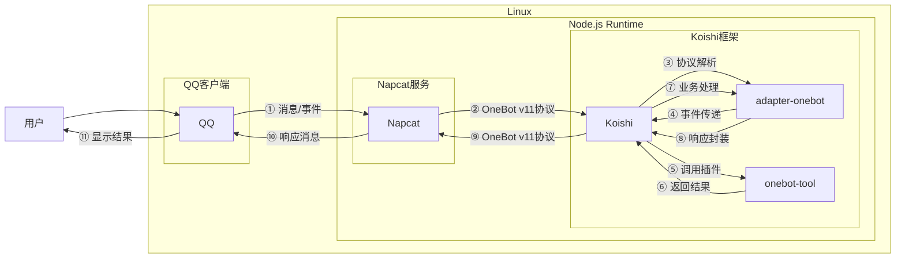

# 戳一戳

## 概述

**指令名称**: poke

**功能描述**: 戳一戳

## 架构图



## 使用方法

### 基本语法

```
poke [次数] [用户]
```

### 参数说明

| 参数 | 类型 | 必填 | 说明 | 示例 |
|------|------|------|------|------|
| 次数 | 文本 | 否 | 戳一戳的次数 | 1 |
| 用户 | @ | 否 | 用户id | @马化腾 |
| 用户 | ID | 否 | 用户id | 10001 |

### 使用示例

#### 戳自己

<chat-panel>
<chat-message nickname="用户" type="user">poke</chat-message>
<div style="display: flex; justify-content: center; align-items: center; flex-wrap: nowrap; width: 100%; margin: 2px 0;">
<ChatMessage nickname="系统" type="system"><span style="color: #3175de;">bot</span>戳了戳<span style="color: #3175de;">用户</span></ChatMessage>
</div>
<chat-message nickname="bot" type="bot">success！</chat-message>
</chat-panel>

#### 基本用法 戳自己 `5` 下

<chat-panel>
<chat-message nickname="用户" type="user">poke 5</chat-message>
<div style="display: flex; justify-content: center; align-items: center; flex-wrap: nowrap; width: 100%; margin: 2px 0;">
<ChatMessage nickname="系统" type="system"><span style="color: #3175de;">bot</span>戳了戳<span style="color: #3175de;">用户</span></ChatMessage>
</div>
<div style="display: flex; justify-content: center; align-items: center; flex-wrap: nowrap; width: 100%; margin: 2px 0;">
<ChatMessage nickname="系统" type="system"><span style="color: #3175de;">bot</span>戳了戳<span style="color: #3175de;">用户</span></ChatMessage>
</div>
<div style="display: flex; justify-content: center; align-items: center; flex-wrap: nowrap; width: 100%; margin: 2px 0;">
<ChatMessage nickname="系统" type="system"><span style="color: #3175de;">bot</span>戳了戳<span style="color: #3175de;">用户</span></ChatMessage>
</div>
<div style="display: flex; justify-content: center; align-items: center; flex-wrap: nowrap; width: 100%; margin: 2px 0;">
<ChatMessage nickname="系统" type="system"><span style="color: #3175de;">bot</span>戳了戳<span style="color: #3175de;">用户</span></ChatMessage>
</div>
<div style="display: flex; justify-content: center; align-items: center; flex-wrap: nowrap; width: 100%; margin: 2px 0;">
<ChatMessage nickname="系统" type="system"><span style="color: #3175de;">bot</span>戳了戳<span style="color: #3175de;">用户</span></ChatMessage>
</div>
<chat-message nickname="bot" type="bot">success！</chat-message>
</chat-panel>


#### 戳 `马化腾`

<chat-panel>
<chat-message nickname="马化腾" type="user">大家好，我是马化腾</chat-message>
<chat-message nickname="用户" type="user">poke 1 <span style="color: #3175de;">@马化腾</span></chat-message>
<div style="display: flex; justify-content: center; align-items: center; flex-wrap: nowrap; width: 100%; margin: 2px 0;">
<ChatMessage nickname="系统" type="system"><span style="color: #3175de;">bot</span>戳了戳<span style="color: #3175de;">马化腾</span></ChatMessage>
</div>
<chat-message nickname="bot" type="bot">success！</chat-message>
</chat-panel>


#### 用 `QQ号` 戳 `马化腾`

<chat-panel>
<chat-message nickname="马化腾" type="user">大家好，我是马化腾</chat-message>
<chat-message nickname="用户" type="user">poke 1 <span style="color: #3175de;">10001</span></chat-message>
<div style="display: flex; justify-content: center; align-items: center; flex-wrap: nowrap; width: 100%; margin: 2px 0;">
<ChatMessage nickname="系统" type="system"><span style="color: #3175de;">bot</span>戳了戳<span style="color: #3175de;">马化腾</span></ChatMessage>
</div>
<chat-message nickname="bot" type="bot">success！</chat-message>
</chat-panel>

#### 戳 `马化腾` `5` 下

<chat-panel>
<chat-message nickname="马化腾" type="user">大家好，我是马化腾</chat-message>
<chat-message nickname="用户" type="user">poke 5 <span style="color: #3175de;">@马化腾</span></chat-message>
<div style="display: flex; justify-content: center; align-items: center; flex-wrap: nowrap; width: 100%; margin: 2px 0;">
<ChatMessage nickname="系统" type="system"><span style="color: #3175de;">bot</span>戳了戳<span style="color: #3175de;">马化腾</span></ChatMessage>
</div>
<div style="display: flex; justify-content: center; align-items: center; flex-wrap: nowrap; width: 100%; margin: 2px 0;">
<ChatMessage nickname="系统" type="system"><span style="color: #3175de;">bot</span>戳了戳<span style="color: #3175de;">马化腾</span></ChatMessage>
</div>
<div style="display: flex; justify-content: center; align-items: center; flex-wrap: nowrap; width: 100%; margin: 2px 0;">
<ChatMessage nickname="系统" type="system"><span style="color: #3175de;">bot</span>戳了戳<span style="color: #3175de;">马化腾</span></ChatMessage>
</div>
<div style="display: flex; justify-content: center; align-items: center; flex-wrap: nowrap; width: 100%; margin: 2px 0;">
<ChatMessage nickname="系统" type="system"><span style="color: #3175de;">bot</span>戳了戳<span style="color: #3175de;">马化腾</span></ChatMessage>
</div>
<div style="display: flex; justify-content: center; align-items: center; flex-wrap: nowrap; width: 100%; margin: 2px 0;">
<ChatMessage nickname="系统" type="system"><span style="color: #3175de;">bot</span>戳了戳<span style="color: #3175de;">马化腾</span></ChatMessage>
</div>
<chat-message nickname="bot" type="bot">success！</chat-message>
</chat-panel>


#### 用 `QQ号` 戳 `马化腾` `5` 下

<chat-panel>
<chat-message nickname="马化腾" type="user">大家好，我是马化腾</chat-message>
<chat-message nickname="用户" type="user">poke 5 <span style="color: #3175de;">10001</span></chat-message>
<div style="display: flex; justify-content: center; align-items: center; flex-wrap: nowrap; width: 100%; margin: 2px 0;">
<ChatMessage nickname="系统" type="system"><span style="color: #3175de;">bot</span>戳了戳<span style="color: #3175de;">马化腾</span></ChatMessage>
</div>
<div style="display: flex; justify-content: center; align-items: center; flex-wrap: nowrap; width: 100%; margin: 2px 0;">
<ChatMessage nickname="系统" type="system"><span style="color: #3175de;">bot</span>戳了戳<span style="color: #3175de;">马化腾</span></ChatMessage>
</div>
<div style="display: flex; justify-content: center; align-items: center; flex-wrap: nowrap; width: 100%; margin: 2px 0;">
<ChatMessage nickname="系统" type="system"><span style="color: #3175de;">bot</span>戳了戳<span style="color: #3175de;">马化腾</span></ChatMessage>
</div>
<div style="display: flex; justify-content: center; align-items: center; flex-wrap: nowrap; width: 100%; margin: 2px 0;">
<ChatMessage nickname="系统" type="system"><span style="color: #3175de;">bot</span>戳了戳<span style="color: #3175de;">马化腾</span></ChatMessage>
</div>
<div style="display: flex; justify-content: center; align-items: center; flex-wrap: nowrap; width: 100%; margin: 2px 0;">
<ChatMessage nickname="系统" type="system"><span style="color: #3175de;">bot</span>戳了戳<span style="color: #3175de;">马化腾</span></ChatMessage>
</div>
<chat-message nickname="bot" type="bot">success！</chat-message>
</chat-panel>
