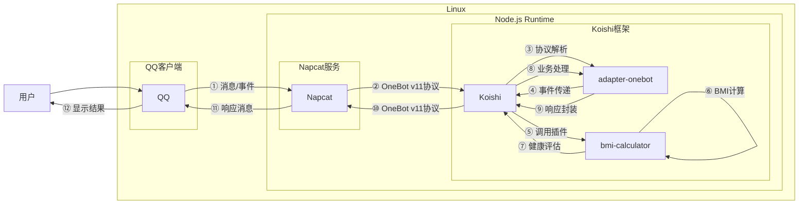

# BMI查询

## 概述
[](https://koishi.chat) [](https://www.npmjs.com/package/koishi-plugin-bmi-calculator) [](https://github.com/koishi-shangxue-plugins/koishi-shangxue-apps/tree/main/plugins/bmi-calculator)
**指令名称**: bmi-calculator

**功能描述**: 根据身高和体重计算BMI指数，评估体重对健康的影响，并提供相应的健康建议

**插件名称**: bmi-calculator

## 架构图



## 使用方法

### 基本语法

```
bmi-calculator <身高> <体重>
```

### 参数说明

| 参数 | 类型 | 必填 | 说明 | 示例 |
|------|------|------|------|------|
| 身高 | 数字 | 是 | 身高（厘米） | 175 |
| 体重 | 数字 | 是 | 体重（斤） | 145 |

## 使用示例

### 正常体重计算

<chat-panel>
<chat-message nickname="用户" type="user">bmi-calculator 175 130</chat-message>
<chat-message nickname="bot" type="bot">

您的BMI指数为21.2。
正常体重是身体健康的一项标志，继续保持良好的生活习惯。
</chat-message>
</chat-panel>

### 超重计算

<chat-panel>
<chat-message nickname="用户" type="user">bmi-calculator 170 160</chat-message>
<chat-message nickname="bot" type="bot">

您的BMI指数为27.7。
注意啦，您的体重是健康的，但身体已经不苗条了唔，适当锻炼很重要哦~
</chat-message>
</chat-panel>

### 低体重计算

<chat-panel>
<chat-message nickname="用户" type="user">bmi-calculator 180 120</chat-message>
<chat-message nickname="bot" type="bot">

您的BMI指数为18.5。
您的体重稍轻，请适度增加营养摄入。
</chat-message>
</chat-panel>

## BMI标准范围

| BMI范围 | 分类 | 说明 |
|---------|------|------|
| < 18.5 | 低体重 | 体重过轻，需要适当增加营养 |
| 18.5 - 24.9 | 正常体重 | 理想体重范围，继续保持 |
| 25 - 29.9 | 超重 | 体重偏重，建议适当控制 |
| 30 - 34.9 | 肥胖（一级） | 需要调整饮食和锻炼计划 |
| 35 - 39.9 | 肥胖（二级） | 建议咨询医生制定减重计划 |
| ≥ 40 | 肥胖（三级） | 强烈建议寻求专业医疗帮助 |

## 技术特性

### 计算算法
- **BMI公式**: BMI = 体重(kg) / 身高(m)²
- **单位转换**: 自动将体重从斤转换为千克，身高从厘米转换为米
- **精度控制**: BMI结果保留1位小数

### 输入验证
- **数字检查**: 确保身高和体重都是有效数字
- **范围检查**: 
  - 身高范围: 1-300厘米
  - 体重范围: 1-1200斤
- **零值检查**: 防止除零错误
- **异常值检查**: 过滤不合理的BMI计算结果

### 随机建议
- **多样化提示**: 每个BMI分类都有多个随机提示语
- **个性化反馈**: 根据BMI值提供针对性的健康建议

## 错误处理

### 输入错误
- **缺少参数**: 当未提供身高或体重时提示
- **非数字输入**: 当输入包含非数字字符时提示
- **零值输入**: 当身高或体重为0时提示
- **超出范围**: 当输入值超出合理范围时提示

### 计算错误
- **异常结果**: 当BMI计算结果异常时提示重新输入

## 配置参数

插件支持以下配置选项：

| 配置项 | 类型 | 默认值 | 说明 |
|--------|------|--------|------|
| underweight | string[] | 多条提示语 | 低体重的健康建议 |
| normal | string[] | 多条提示语 | 正常体重的健康建议 |
| overweight | string[] | 多条提示语 | 超重的健康建议 |
| moderately_obese | string[] | 多条提示语 | 肥胖（一级）的健康建议 |
| severely_obese | string[] | 多条提示语 | 肥胖（二级）的健康建议 |
| very_severely_obese | string[] | 多条提示语 | 肥胖（三级）的健康建议 |

## 注意事项

1. **单位说明**: 体重单位为斤（1斤=0.5千克），身高单位为厘米
2. **适用范围**: 主要适用于成年人BMI评估
3. **个体差异**: BMI仅为参考指标，实际健康状况需结合其他因素
4. **专业建议**: 对于极端BMI值，建议咨询专业医生

::: tip
BMI（Body Mass Index）是国际上常用的衡量人体胖瘦程度以及是否健康的一个标准。通过简单的身高体重计算，可以快速了解自己的体重状况。
:::
