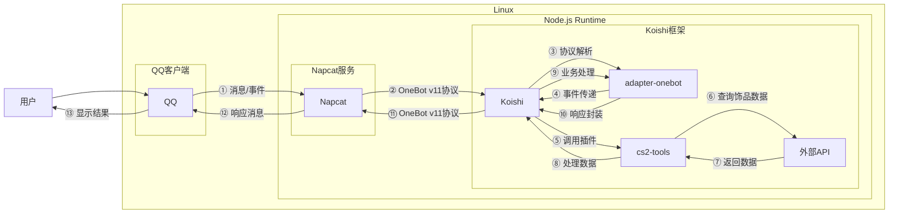

# CS2工具

## 概述

**指令名称**: cs2

**功能描述**: 提供Counter-Strike 2游戏相关的实用工具，包括饰品查询、价格监控、游戏数据统计等功能

**插件名称**: cs2-tools

## 架构图



## 使用方法

### 基本语法

```
cs2 <功能> [参数]
```

### 功能列表

| 功能 | 说明 | 示例 |
|------|------|------|
| price | 查询饰品价格 | cs2 price 咆哮 |
| search | 搜索饰品 | cs2 search 刀 |
| stats | 查询游戏数据 | cs2 stats 玩家ID |
| inspect | 检视链接解析 | cs2 inspect <链接> |
| float | 查询磨损值 | cs2 float <链接> |

## 使用示例

### 查询饰品价格

<chat-panel>
<chat-message nickname="用户" type="user">cs2 price 咆哮</chat-message>
<chat-message nickname="bot" type="bot">
🔫 咆哮 (纪念品) - Howl
💰 价格范围: ¥15,000 - ¥25,000
📊 最近成交: ¥18,500
🔄 24小时交易量: 12件
📈 价格趋势: ↗️ 上涨 3.2%
</chat-message>
</chat-panel>

### 搜索饰品

<chat-panel>
<chat-message nickname="用户" type="user">cs2 search 蝴蝶刀</chat-message>
<chat-message nickname="bot" type="bot">
🔪 蝴蝶刀搜索结果：
1. 蝴蝶刀 | 多普勒 (Phase 2) - ¥8,500
2. 蝴蝶刀 | 大理石渐变 - ¥12,000
3. 蝴蝶刀 | 表面淬火 - ¥6,800
4. 蝴蝶刀 | 自动化 - ¥4,200
5. 蝴蝶刀 | 森林 DDPAT - ¥3,500
</chat-message>
</chat-panel>

### 查询游戏数据

<chat-panel>
<chat-message nickname="用户" type="user">cs2 stats 76561198326378547</chat-message>
<chat-message nickname="bot" type="bot">
🎮 玩家数据 - [CS2]
🏆 段位: 全球精英
🎯 K/D: 1.45
🎪 胜率: 58.3%
🎲 总场次: 1,247
🔥 最近战绩: 5连胜
</chat-message>
</chat-panel>

### 检视链接解析

<chat-panel>
<chat-message nickname="用户" type="user">cs2 inspect steam://rungame/730/76561202255233023/+csgo_econ_action_preview%20S76561198326378547A32894765432D16987654321</chat-message>
<chat-message nickname="bot" type="bot">
🔍 检视结果：
🔫 AK-47 | 火蛇 (StatTrak™)
🎨 皮肤: Fire Serpent
⭐ 品质: 隐秘
🎯 磨损值: 0.0345 (久经沙场)
🎨 贴纸: 4x Katowice 2014 Holo
💰 估价: ¥25,000 - ¥35,000
</chat-message>
</chat-panel>

## 饰品品质等级

| 品质 | 颜色 | 说明 |
|------|------|------|
| 消费级 | 白色 | 最常见的品质 |
| 工业级 | 浅蓝 | 较为常见的品质 |
| 军规级 | 深蓝 | 中等稀有度 |
| 受限 | 紫色 | 较为稀有 |
| 保密 | 粉色 | 稀有 |
| 隐秘 | 红色 | 非常稀有 |
| 违禁 | 金色 | 极其稀有 |

## 磨损等级

| 磨损范围 | 等级 | 说明 |
|----------|------|------|
| 0.00 - 0.07 | 崭新出厂 | 几乎无磨损 |
| 0.07 - 0.15 | 略有磨损 | 轻微磨损痕迹 |
| 0.15 - 0.38 | 久经沙场 | 明显磨损 |
| 0.38 - 0.45 | 破损不堪 | 严重磨损 |
| 0.45 - 1.00 | 战痕累累 | 极度磨损 |

## 技术特性

### 数据来源
- **价格数据**: 实时获取各大交易平台价格
- **游戏数据**: 通过Steam API获取玩家数据
- **饰品信息**: 完整的CS2饰品数据库

### 缓存机制
- **价格缓存**: 5分钟更新一次价格数据
- **玩家数据缓存**: 30分钟更新一次
- **搜索缓存**: 10分钟有效期

### 错误处理
- **网络错误**: 当无法连接API时提示
- **数据错误**: 当数据格式异常时提示
- **玩家不存在**: 当玩家ID无效时提示
- **饰品未找到**: 当搜索无结果时提示

## 配置参数

插件支持以下配置选项：

| 配置项 | 类型 | 默认值 | 说明 |
|--------|------|--------|------|
| api_key | string | - | Steam API密钥 |
| cache_time | number | 300 | 缓存时间（秒） |
| max_results | number | 10 | 最大搜索结果数 |
| price_source | string | buff | 价格数据源 |
| enable_stats | boolean | true | 启用游戏数据查询 |
| enable_inspect | boolean | true | 启用检视链接解析 |
| enable_float | boolean | true | 启用磨损值查询 |
| language | string | zh-CN | 显示语言 |

## 注意事项

1. **API限制**: Steam API有请求频率限制，请合理使用
2. **数据延迟**: 价格数据可能存在5-10分钟的延迟
3. **网络要求**: 需要稳定的网络连接来访问外部API
4. **玩家隐私**: 只能查询公开游戏数据的玩家
5. **饰品价格**: 价格仅供参考，实际交易价格可能有所不同

::: tip
CS2工具集成了多种实用功能，可以帮助玩家快速查询饰品信息、监控价格变化、查看游戏数据等，是CS2玩家的好帮手。
:::
