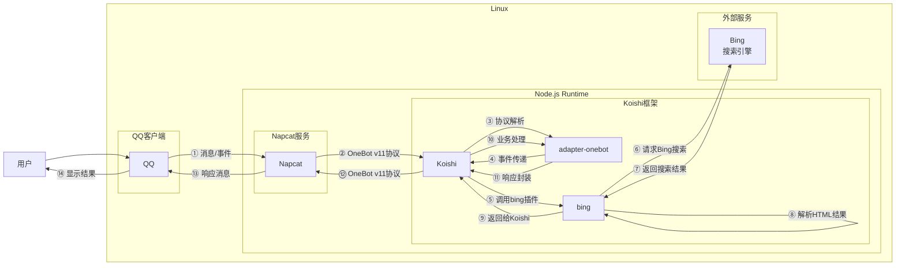

# bing搜索

## 概述

**指令名称**: bing

**功能描述**: 使用Bing搜索引擎进行网页搜索，返回前10个搜索结果

**插件名称**: bing

## 架构图



## 使用方法

### 基本语法

```
bing <keyword:text>
```

### 参数说明

| 参数 | 类型 | 必填 | 说明 | 示例 |
|------|------|------|------|------|
| keyword | 文本 | 是 | 要搜索的关键词 | 麦芽糖 |

## 使用示例

### 基本搜索

#### 搜索 `麦芽糖`
<chat-panel>
<chat-message nickname="用户" type="user">bing 麦芽糖</chat-message>
<chat-message nickname="bot" type="bot">

1. 麦芽糖有什么优点和缺点？吃多了会怎样？ - 知乎
   https://www.zhihu.com/question/38210812
2. 怎么判断二糖的糖苷键是α型还是β型，还有怎么判断二糖本身 ...
   https://www.zhihu.com/question/381854212
3. 麦芽糖有醛基因此有还原性，为什么在麦芽糖结构式中找不到 ...
   https://www.zhihu.com/question/436654663
4. 葡萄糖，果糖，蔗糖相比较哪个会使血糖升高？ - 知乎
   https://www.zhihu.com/question/427483316
5. 麦芽糖是二糖还是单糖？是还原糖么？_百度知道
   https://zhidao.baidu.com/question/403694961.html
6. 周杰伦《麦芽糖》这首歌的歌词._百度知道
   https://zhidao.baidu.com/question/280507155.html
7. 葡萄糖，麦芽糖，果糖和蔗糖还原性的高低排行是怎么样的？
   https://www.zhihu.com/question/10313603503
8. 单糖怎么脱水缩合成多糖，就拿葡萄糖举例，最好画个图。
   https://zhidao.baidu.com/question/2269737442427711628.html
9. 麦芽糖是单糖还是二糖_百度知道
   https://zhidao.baidu.com/question/635674000813349404.html
10. 麦芽糖的正确吃法大全-百度经验
   https://jingyan.baidu.com/article/86f4a73e44b80d76d65269f8.html
</chat-message>
</chat-panel>

#### 搜索 `人工智能`
<chat-panel>
<chat-message nickname="用户" type="user">bing 人工智能</chat-message>
<chat-message nickname="bot" type="bot">

1. 人工智能（智能科学与技术专业术语）_百度百科
   https://baike.baidu.com/item/%E4%BA%BA%E5%B7%A5%E6%99%BA%E8%83%BD/9180
2. 国务院关于深入实施“人工智能+”行动的意见_科技_中国政府网
   https://www.gov.cn/zhengce/content/202508/content_7037861.htm
3. 国家定调“人工智能+”：中国AI十年三步走，战略解读来了
   https://news.qq.com/rain/a/20250827A04XTV00
4. 第一节：人工智能的定义和基本概念 - 知乎
   https://zhuanlan.zhihu.com/p/698162111
5. 人工智能是什么？全面解析AI的定义、技术与应用
   https://www.sohu.com/a/860368477_121956424
6. 【我国正式全面启动“人工智能+”新时代】-国家发展和改革委员会
   https://www.ndrc.gov.cn/wsdwhfz/202509/t20250901_1400201.html
7. 从实验室到千行百业：我国“人工智能+”六大行动全景图出炉 ...
   https://news.cctv.com/2025/08/27/ARTIj8A653Df44jjD41hdRqP250827.shtml
8. 人工智能实验室AiLab-人工智能网-中国人工智能领域的专业 ...
   https://www.ailab.cn/
9. 人工智能，从深度学习到全面赋能_人民日报
   https://www.peopleapp.com/column/30048352431-500006111786
10. 工业和信息化部办公厅关于开展2025年人工智能产业及赋能 ...
   https://www.miit.gov.cn/jgsj/kjs/wjfb/art/2025/art_a8465500de45444dbea19e8064d97ffc.html
</chat-message>
</chat-panel>

## 技术特性

### 搜索功能
- **搜索引擎**: 使用Bing搜索引擎
- **结果数量**: 返回前10个搜索结果
- **格式**: 包含标题和URL链接

### 技术实现
- **HTML解析**: 使用cheerio库解析Bing搜索结果页面
- **请求头**: 模拟真实浏览器请求头，避免被反爬虫机制拦截
- **编码处理**: 自动处理URL编码和中文关键词

### 错误处理
- **网络错误**: 当无法访问Bing时提示
- **解析错误**: 当搜索结果解析失败时提示
- **空结果**: 当搜索无结果时返回友好提示

## 配置参数

插件支持以下配置选项：

| 配置项 | 类型 | 默认值 | 说明 |
|--------|------|--------|------|
| isCN | boolean | true | 是否使用中国特供Bing |

## 注意事项

1. **网络依赖**: 需要稳定的网络连接来访问Bing搜索引擎
2. **结果时效性**: 搜索结果基于Bing的实时索引
3. **内容限制**: 某些地区可能无法访问特定内容
4. **格式限制**: 返回结果为纯文本格式，不包含图片或富媒体内容

::: tip
Bing搜索功能基于真实的Bing搜索引擎，能够提供准确和最新的网页搜索结果。插件会自动处理中文编码和搜索结果解析。
:::
