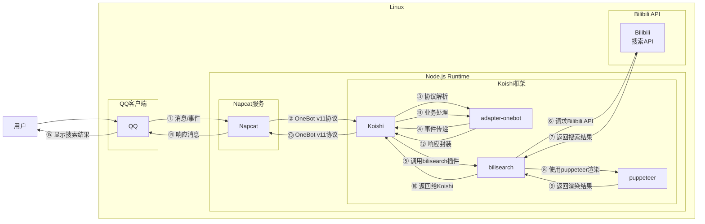

# b站搜索

## 概述
[](https://koishi.chat) [](https://www.npmjs.com/package/koishi-plugin-bilisearch) [](https://github.com/axlmly/koishi-plugin-bilisearch)
**指令名称**: b站搜索

**功能描述**: 在Bilibili平台进行多类型内容搜索，支持视频、用户、专栏等多种搜索类型

**插件名称**: bilisearch

## 架构图



## 使用方法

### 基本语法

```
b站搜索 <内容> [类型] [排序]
```

### 参数说明

| 参数 | 类型 | 必填 | 说明 | 示例 |
|------|------|------|------|------|
| 内容 | 文本 | 是 | 要搜索的关键词 | 麦麦 |
| 类型 | 文本 | 否 | 搜索内容类型，默认为综合 | 用户 |
| 排序 | 文本 | 否 | 搜索结果排序方式 | 粉丝由高到低 |

### 搜索类型说明

| 类型 | 说明 | 支持的排序选项 |
|------|------|----------------|
| **综合** | 跨类型综合搜索 | 最多播放、最多点击、最多评论、最多弹幕、最多收藏、最新发布 |
| **视频** | 搜索视频内容 | 最多播放、最新发布、最多弹幕、最多收藏 |
| **番剧** | 搜索番剧内容 | 默认排序 |
| **影视** | 搜索影视内容 | 默认排序 |
| **直播** | 搜索直播内容 | 最新开播、主播、直播间、直播间最新开播 |
| **专栏** | 搜索专栏文章 | 最新发布、最多点击、最多喜欢、最多评论 |
| **用户** | 搜索用户账号 | 粉丝由高到低、粉丝由低到高、等级由高到低、等级由低到高 |

## 使用示例

### 基本搜索

#### 搜索 `麦麦` 相关内容
<chat-panel>
<chat-message nickname="用户" type="user">b站搜索 麦麦</chat-message>
<chat-message nickname="bot" type="bot">
[图片：麦麦综合搜索结果]
</chat-message>
</chat-panel>

### 指定类型搜索

#### 搜索 `麦麦` 用户
<chat-panel>
<chat-message nickname="用户" type="user">b站搜索 麦麦 用户</chat-message>
<chat-message nickname="bot" type="bot">
[图片：麦麦用户搜索结果]
</chat-message>
</chat-panel>

### 指定排序方式

#### 搜索 `麦麦` 用户并按粉丝数排序
<chat-panel>
<chat-message nickname="用户" type="user">b站搜索 麦麦 用户 粉丝由高到低</chat-message>
<chat-message nickname="bot" type="bot">
[图片：麦麦用户按粉丝数排序结果]
</chat-message>
</chat-panel>

#### 搜索 `麦麦` 视频并按播放量排序
<chat-panel>
<chat-message nickname="用户" type="user">b站搜索 麦麦 视频 最多播放</chat-message>
<chat-message nickname="bot" type="bot">
[图片：麦麦视频按播放量排序结果]
</chat-message>
</chat-panel>

## 技术特性

### 支持的搜索类型
- **综合搜索**: 跨类型综合结果
- **视频搜索**: 视频内容搜索
- **用户搜索**: UP主和用户搜索
- **专栏搜索**: 文章内容搜索
- **直播搜索**: 直播内容搜索
- **番剧搜索**: 番剧内容搜索
- **影视搜索**: 影视内容搜索

### 搜索特性
- **实时搜索**: 基于Bilibili官方API，结果实时更新
- **多维度排序**: 支持按播放量、粉丝数、发布时间等多种排序方式
- **结果可视化**: 搜索结果以图片形式呈现，便于查看

### 错误处理
- **关键词为空**: 当用户未输入搜索关键词时提示
- **网络错误**: 当API请求失败时提示
- **无结果**: 当搜索无结果时返回友好提示

## 注意事项

1. **网络要求**: 需要稳定的网络连接来访问Bilibili API
2. **结果时效性**: 搜索结果基于Bilibili平台实时数据
3. **图片大小**: 搜索结果图片会自动优化以适应消息大小限制
4. **API限制**: 受Bilibili API调用频率限制

::: tip
b站搜索功能基于Bilibili官方API实现，能够准确获取最新的搜索结果，支持多种内容类型和排序方式。
:::
