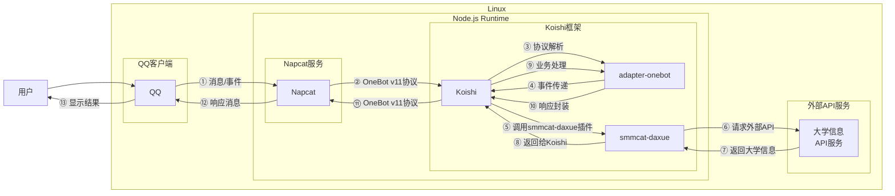

# 大学查询

## 概述

**指令名称**: 学校查询

**功能描述**: 查询大学基本信息，包括成立时间、占地面积、学校地址和简介

**插件名称**: smmcat-daxue

## 架构图



## 使用方法

### 基本语法

```
学校查询 <query>
```

### 参数说明

| 参数 | 类型 | 必填 | 说明 | 示例 |
|------|------|------|------|------|
| query | 文本 | 是 | 要查询的大学名称 | 清华大学 |

## 使用示例

### 基本查询

#### 查询 `清华大学` 信息
<chat-panel>
<chat-message nickname="用户" type="user">学校查询 清华大学</chat-message>
<chat-message nickname="bot" type="bot">

找到如下学校信息：
【清华大学】
[成立时间] 1911年
[占地面积] 6632亩
[学校地址] 北京市海淀区清华园1号
[学校信息] 清华大学建校时间为1911年，占地面积6632亩，隶属于教育部，地址为北京市海淀区清华园1号，学校有44个国家重点学科，13个重点实验室，60个博士学科，65个硕士专业学科，属于985,211,双一流,强基计划学校。
</chat-message>
</chat-panel>

#### 查询 `北京大学` 信息
<chat-panel>
<chat-message nickname="用户" type="user">学校查询 北京大学</chat-message>
<chat-message nickname="bot" type="bot">

找到如下学校信息：
【北京大学】
[成立时间] 1898年
[占地面积] 7000亩
[学校地址] 北京市海淀区颐和园路5号
[学校信息] 北京大学建校时间为1898年，占地面积7000亩，隶属于教育部，地址为北京市海淀区颐和园路5号，学校有54个国家重点学科，47个重点实验室，49个博士学科，50个硕士专业学科，属于985,211,双一流,强基计划学校。
</chat-message>
</chat-panel>

### 查询不存在的大学

#### 查询不存在的大学
<chat-panel>
<chat-message nickname="用户" type="user">学校查询 魔法学院</chat-message>
<chat-message nickname="bot" type="bot">
没有找到对应的大学信息
</chat-message>
</chat-panel>

## 技术特性

### 数据来源
- **API服务**: 基于第三方大学信息API
- **数据范围**: 覆盖中国主要高等院校
- **信息类型**: 基本信息、历史沿革、地理位置

### 查询逻辑
- **精确匹配**: 基于大学名称进行精确查询
- **中文支持**: 支持中文大学名称查询
- **错误处理**: 当查询无结果时返回友好提示

### 返回信息
- **成立时间**: 学校的创办年份
- **占地面积**: 校园总面积
- **学校地址**: 详细地理位置
- **学校信息**: 学校简介和特色

### 错误处理
- **空输入**: 当用户未输入任何内容时提示
- **无结果**: 当查询无结果时返回友好提示
- **网络错误**: 当API请求失败时提示

## 注意事项

1. **数据准确性**: 结果来源于第三方API，可能存在信息更新不及时的情况
2. **网络依赖**: 需要稳定的网络连接来访问API服务
3. **查询范围**: 主要支持中国大陆地区的高等院校
4. **信息完整性**: 不同学校的信息完整度可能有所差异

::: tip
大学查询功能基于第三方API实现，能够查询中国主要高等院校的基本信息，帮助用户了解学校概况。
:::
