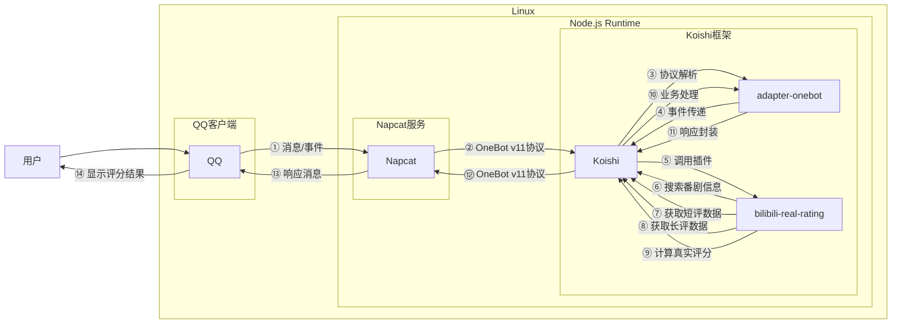

# B站真实评分计算

## 概述
[](https://koishi.chat) [](https://www.npmjs.com/package/koishi-plugin-bilibili-real-rating)
**指令名称**: bili.rating

**功能描述**: 获取B站番剧评论并计算真实评分

**插件名称**: bilibili-real-rating

## 架构图



## 使用方法

### 基本语法

```
bili.rating <name:text>
打分 <name:text>
b站评分 <name:text>
```

### 参数说明

| 参数 | 类型 | 必填 | 说明 | 示例 |
|------|------|------|------|------|
| name | 文本 | 是 | 要查询的B站番剧名称或ID | 咒术回战 |

## 使用示例

### 基本查询

#### 查询 `咒术回战` 评分
<chat-panel>
<chat-message nickname="用户" type="user">bili.rating 咒术回战</chat-message>
<chat-message nickname="bot" type="bot">
正在搜索番剧信息，本次最大时间限制为 240 秒
</chat-message>
<chat-message nickname="bot" type="bot">

======= 详细统计结果 =======
当前时间：11/16/2025, 7:44:39 PM
番剧名称：咒术回战 第二季
\----------------------------
短评统计：
• 平均分：8.4
• 已收集样本：780 条
• 官方标称总数：3429 条
\----------------------------
长评统计：
• 平均分：8.3
• 已收集样本：80 条
• 官方标称总数：82 条
\----------------------------
综合统计：
• 总平均分：8.4
• 总已收集样本：860 条
\----------------------------
官方数据：
• 官方评分：9.4
• 官方样本：5601 条
\==============================
</chat-message>
</chat-panel>

### 使用自定义指令

#### 使用 `打分` 指令

<chat-panel>
<chat-message nickname="用户" type="user">打分 有兽焉</chat-message>
<chat-message nickname="bot" type="bot">
正在搜索番剧信息，本次最大时间限制为 240 秒
</chat-message>
<chat-message nickname="bot" type="bot">

======= 详细统计结果 =======
当前时间：11/16/2025, 7:54:25 PM
番剧名称：有兽焉
\----------------------------
短评统计：
• 平均分：9.9
• 已收集样本：800 条
• 官方标称总数：2477 条
\----------------------------
长评统计：
• 平均分：9.1
• 已收集样本：37 条
• 官方标称总数：37 条
\----------------------------
综合统计：
• 总平均分：9.9
• 总已收集样本：837 条
\----------------------------
官方数据：
• 官方评分：9.6
• 官方样本：3651 条
\==============================
</chat-message>
</chat-panel>

#### 使用 `b站评分` 指令

<chat-panel>
<chat-message nickname="用户" type="user">b站评分 奇诺之旅</chat-message>
<chat-message nickname="bot" type="bot">

======= 详细统计结果 =======
当前时间：11/16/2025, 7:52:15 PM
番剧名称：奇诺之旅（2017）
\----------------------------
短评统计：
• 平均分：9.8
• 已收集样本：820 条
• 官方标称总数：2814 条
\----------------------------
长评统计：
• 平均分：9.6
• 已收集样本：59 条
• 官方标称总数：59 条
\----------------------------
综合统计：
• 总平均分：9.8
• 总已收集样本：879 条
\----------------------------
官方数据：
• 官方评分：9.8
• 官方样本：8425 条
\==============================
</chat-message>
</chat-panel>

## 技术特性

### 数据来源
- **B站API接口**: 通过B站官方API获取番剧信息和评论数据
- **评论类型**: 同时收集短评和长评，确保数据全面性
- **数据验证**: 对收集的数据进行有效性验证和去重处理

### 查询逻辑
1. **番剧搜索**: 根据用户输入的番剧名称搜索对应的B站番剧
2. **ID获取**: 获取番剧的唯一标识符用于后续数据收集
3. **评论收集**: 并行收集短评和长评数据
4. **评分计算**: 基于收集的评论数据计算加权平均分

### 错误处理
- **搜索失败**: 当番剧名称无法匹配时提供友好的错误提示
- **网络超时**: 内置重试机制处理网络请求失败
- **数据异常**: 对异常数据进行过滤和清理

## 注意事项

1. **网络要求**: 需要稳定的网络连接来访问B站API
2. **时间限制**: 单次查询最大时间限制为240秒
3. **数据限制**: 可能无法获取全部评论数据，结果仅供参考
4. **API限制**: 受B站API限制，频繁查询可能触发风控

## 配置参数

插件支持以下配置选项：

| 配置项 | 类型 | 默认值 | 说明 |
|--------|------|--------|------|
| shortLimit | number | 1000 | 短评获取数量限制，达到此数量后停止获取 |
| shortPercentage | number | 100 | 短评获取百分比限制，达到总数的此百分比后停止获取 |
| longLimit | number | 1000 | 长评获取数量限制，达到此数量后停止获取 |
| longPercentage | number | 100 | 长评获取百分比限制，达到总数的此百分比后停止获取 |
| timeLimit | number | 240 | 总评分获取时间限制（秒），超过此时间后停止获取 |
| shortTimeLimit | number | 120 | 短评获取时间限制（秒），超过此时间后停止获取短评 |
| longTimeLimit | number | 120 | 长评获取时间限制（秒），超过此时间后停止获取长评 |
| retryLimit | number | 5 | API请求失败重试次数 |
| banWaitTime | number | 6000 | 触发风控后等待时间（毫秒） |
| requestDelay | number | 1000 | 请求间隔时间（毫秒） |
| customCommands | string[] | ["打分", "b站评分"] | 自定义触发指令 |

::: tip
B站真实评分计算功能基于B站官方API实现，能够获取番剧的短评和长评数据，通过统计分析计算真实评分。由于API限制，可能无法获取全部评论数据，结果仅供参考。
:::
