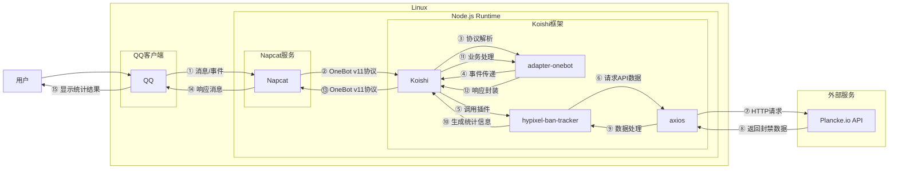

# Hypixel封禁统计

## 概述

**指令名称**: hypixel

**别名**: hpbans

**功能描述**: 查询Hypixel服务器的封禁统计数据，包括Watchdog反作弊系统和客服封禁的统计信息

**插件名称**: hypixel-ban-tracker

## 架构图



## 使用方法

### 基本语法

```
hypixel
hpbans
```

### 参数说明

该指令无需额外参数，直接调用即可获取最新的封禁统计数据。

## 使用示例

### 查询封禁统计

<chat-panel>
<chat-message nickname="用户" type="user">hypixel</chat-message>
<chat-message nickname="bot" type="bot">

🕒 更新时间: 2025-11-16 23:35:15
🛡️ Watchdog封禁统计:
▸ 最近1分钟: 0次
▸ 最近24小时: 0次
▸ 总计: 10040701次
👮 客服封禁统计:
▸ 最近1分钟: 0次
▸ 最近24小时: 0次
▸ 总计: 5272330次
📜 最近封禁记录:
[🐕] 23:35:15 封禁 10040701 名玩家
[👮] 23:35:15 封禁 5272330 名玩家
</chat-message>
</chat-panel>

### 使用别名查询

<chat-panel>
<chat-message nickname="用户" type="user">hpbans</chat-message>
<chat-message nickname="bot" type="bot">

🕒 更新时间: 2025-11-16 23:35:15
🛡️ Watchdog封禁统计:
▸ 最近1分钟: 0次
▸ 最近24小时: 0次
▸ 总计: 10040701次
👮 客服封禁统计:
▸ 最近1分钟: 0次
▸ 最近24小时: 0次
▸ 总计: 5272330次
📜 最近封禁记录:
[🐕] 23:35:15 封禁 10040701 名玩家
[👮] 23:35:15 封禁 5272330 名玩家
</chat-message>
</chat-panel>

## 技术特性

### 数据来源

- **API接口**: 使用Plancke.io提供的Hypixel封禁统计API
- **数据更新**: 实时获取最新的封禁数据
- **缓存机制**: 内置数据缓存，避免频繁请求API

### 统计维度

- **Watchdog封禁**: Hypixel反作弊系统的自动封禁
- **客服封禁**: 人工客服处理的封禁
- **时间范围**: 
  - 最近1分钟
  - 最近24小时
  - 总计封禁数量

### 数据展示

- **实时更新**: 显示数据更新时间
- **历史记录**: 保存最近的封禁记录
- **图标标识**: 使用🐕和👮图标区分封禁类型

## 配置参数

插件支持以下配置选项：

| 配置项 | 类型 | 默认值 | 说明 |
|--------|------|--------|------|
| apiUrl | string | https://api.plancke.io/hypixel/v1/punishmentStats | Hypixel封禁统计API地址 |
| cacheDuration | number | 30000 | 数据缓存时间(毫秒) |
| maxRecords | number | 100 | 最大记录保存数量 |

## 注意事项

1. **数据延迟**: API数据可能存在一定的延迟，不是完全实时的
2. **网络要求**: 需要能够访问Plancke.io API的网络环境
3. **缓存机制**: 为避免频繁请求API，数据会缓存一段时间
4. **数据估算**: 24小时数据在跨天时会进行估算处理

::: tip
Hypixel是全球最大的Minecraft服务器之一，Watchdog是其反作弊系统，能够自动检测和封禁使用作弊软件的玩家。该插件可以帮助玩家了解服务器的安全状况。
:::
