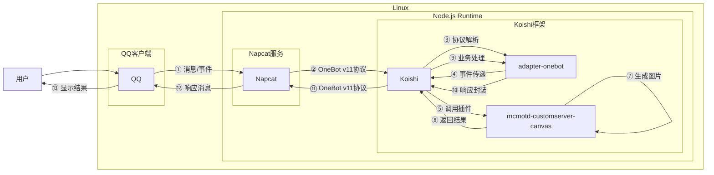
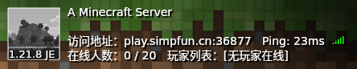

# MC服务器查询

## 概述
[](https://koishi.chat) [](https://www.npmjs.com/package/koishi-plugin-mcmotd-customserver-canvas)
**指令名称**: MBS/MJS

**功能描述**: 查询Minecraft Java版和基岩版服务器信息

**插件名称**: mcmotd-customserver-canvas

## 架构图



## 使用方法

### 基本语法

```
MBS <地址(可带端口)> [端口(选填)]
MJS <地址(可带端口)> [端口(选填)]
motdbe <地址(可带端口)> [端口(选填)]
motdje <地址(可带端口)> [端口(选填)]
```

### 参数说明

| 参数 | 类型 | 必填 | 说明 | 示例 |
|------|------|------|------|------|
| 地址 | 文本 | 是 | 要查询的服务器地址 | localhost |
| 端口 | 数字 | 否 | 服务器端口号 | 25565 |

## 使用示例

### 查询基岩版服务器

#### 查询 `基岩版` 服务器
<chat-panel>
<chat-message nickname="用户" type="user">MBS </chat-message>
<chat-message nickname="bot" type="bot">

</chat-message>
</chat-panel>

#### 查询 `指定端口` 的 `基岩版` 服务器
<chat-panel>
<chat-message nickname="用户" type="user">MBS  19132</chat-message>
<chat-message nickname="bot" type="bot">

</chat-message>
</chat-panel>

### 查询 `Java版` 服务器

#### 查询 `Java版` 服务器
<chat-panel>
<chat-message nickname="用户" type="user">MJS mc233.cn</chat-message>
<chat-message nickname="bot" type="bot">


</chat-message>
</chat-panel>

#### 查询 `指定端口` 的 `Java` 版服务器
<chat-panel>
<chat-message nickname="用户" type="user">MJS play.simpfun.cn 36877</chat-message>
<chat-message nickname="bot" type="bot">


</chat-message>
</chat-panel>

## 技术特性

### 支持的版本
- **Java Edition**: Java版
- **Bedrock Edition**: 基岩版

### 自动处理
- **地址解析**: 自动解析带有端口的地址
- **默认端口**: 
  - Java版默认端口: 25565
  - 基岩版默认端口: 19132
- **超时处理**: 可配置的查询超时时间
- **图片生成**: 自动生成美观的服务器信息图片

### 展示信息
- 服务器favicon图标
- 服务器版本信息
- 在线玩家数量
- 服务器描述信息
- 延迟(Ping)信息
- 玩家列表(Java版)

## 注意事项

1. **权限要求**: 需要权限等级1以上才能使用查询命令
2. **插件依赖**: 需要canvas和database插件支持
3. **配置要求**: 需要在配置中启用对应功能开关
4. **字体设置**: 首次使用需配置默认字体
5. **网络连接**: 需要能访问目标服务器的网络环境

## 配置参数

插件支持丰富的配置选项：

### 基础配置
| 配置项 | 类型 | 默认值 | 说明 |
|--------|------|--------|------|
| defaultFont | string | - | 默认字体 |
| enableWhiteList | boolean | false | 是否启用白名单功能 |

### Java版查询配置
| 配置项 | 类型 | 默认值 | 说明 |
|--------|------|--------|------|
| enabledMotdJe | boolean | false | 是否启用MJS指令 |
| initJeDomainOrIp | string | - | Java版初始地址 |
| initJePort | number | 25565 | Java版初始端口 |
| initJeTimeOut | number | 750 | Java版查询超时时间(ms) |
| isShowJeVersion | boolean | true | 是否显示版本信息 |
| isShowPlayerList | boolean | false | 是否显示玩家列表 |
| isGenuineServer | boolean | false | 是否验证正版服务器 |

### 基岩版查询配置
| 配置项 | 类型 | 默认值 | 说明 |
|--------|------|--------|------|
| enabledMotdBe | boolean | false | 是否启用MBS指令 |
| initBeDomainOrIp | string | - | 基岩版初始地址 |
| initBePort | number | 19132 | 基岩版初始端口 |
| initBeTimeOut | number | 750 | 基岩版查询超时时间(ms) |
| isShowBeVersion | boolean | true | 是否显示版本信息 |

### 服务器轮询配置
| 配置项 | 类型 | 默认值 | 说明 |
|--------|------|--------|------|
| enabledMotdServerPolling | boolean | false | 是否启用服务器轮询查询 |
| initServerPollingTime | number | 60 | 服务器轮询时间(s) |
| enabledMotdHeartBeat | boolean | false | 是否启用机器人保活 |
| initHeartBeatTime | number | 5 | 保活消息间隔次数 |

::: tip
MC服务器查询插件可以同时支持Java版和基岩版Minecraft服务器查询，并提供美观的信息展示图片。
:::