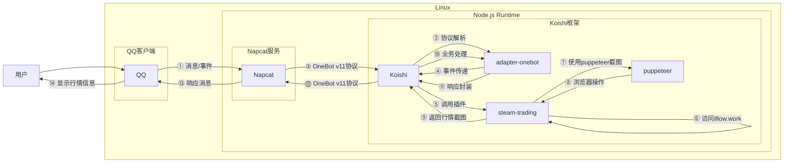

# Steam挂刀行情

## 概述
[](https://koishi.chat) [](https://www.npmjs.com/package/koishi-plugin-steam-trading) [](https://github.com/initialencounter/mykoishi)
**指令名称**: trad

**功能描述**: 查询Steam挂刀行情，获取不同交易平台的最优交易比例和价格信息

**插件名称**: steam-trading

**数据来源**: [iflow.work](https://www.iflow.work)

## 架构图



## 使用方法

### 基本语法

```
trad <平台>
trad.行情分析 [url]
```

### 参数说明

| 参数 | 类型 | 必填 | 说明 | 示例 |
|------|------|------|------|------|
| 平台 | 文本 | 是 | 交易平台名称 | buff, igxe, c5, uuyp |
| url | 文本 | 否 | 自定义分析页面URL | https://www.iflow.work/analysis |

### 选项说明

| 选项 | 简写 | 参数 | 说明 | 示例 |
|------|------|------|------|------|
| game | -g | string | 游戏筛选 | dota2, csgo, dota2-csgo, csgo-dota2 |
| order | -o | string | 排序依据 | buy, safe_buy, sell |

## 使用示例

### 查询Buff平台行情

<chat-panel>
<chat-message nickname="用户" type="user">trad buff</chat-message>
<chat-message nickname="bot" type="bot">
正在加载中，请稍等片刻~
[图片：Buff平台挂刀行情截图]
</chat-message>
</chat-panel>

### 查询IGXE平台CSGO行情

<chat-panel>
<chat-message nickname="用户" type="user">trad igxe -g csgo</chat-message>
<chat-message nickname="bot" type="bot">
正在加载中，请稍等片刻~
[图片：IGXE平台CSGO挂刀行情截图]
</chat-message>
</chat-panel>

### 查询最优求购比例

<chat-panel>
<chat-message nickname="用户" type="user">trad buff -o buy</chat-message>
<chat-message nickname="bot" type="bot">
正在加载中，请稍等片刻~
[图片：Buff平台最优求购比例截图]
</chat-message>
</chat-panel>

### 自定义行情分析

<chat-panel>
<chat-message nickname="用户" type="user">trad.行情分析 https://www.iflow.work/analysis</chat-message>
<chat-message nickname="bot" type="bot">
正在加载中，请稍等片刻~
[图片：自定义分析页面截图]
</chat-message>
</chat-panel>

## 平台说明

| 平台 | 名称 | 说明 |
|------|------|------|
| buff | Buff交易平台 | 国内最大的Steam饰品交易平台 |
| igxe | IGXE交易平台 | 老牌Steam饰品交易平台 |
| c5 | C5Game交易平台 | 综合性游戏交易平台 |
| uuyp | UUYP交易平台 | 新兴游戏交易平台 |

## 排序依据

| 排序方式 | 说明 |
|----------|------|
| buy | 最优求购比例 - 显示当前最优的求购价格 |
| safe_buy | 稳定求购比例 - 显示相对稳定的求购价格 |
| sell | 最优寄售比例 - 显示当前最优的寄售价格 |

## 游戏筛选

| 游戏类型 | 说明 |
|----------|------|
| dota2 | 仅显示Dota2相关饰品 |
| csgo | 仅显示CSGO相关饰品 |
| dota2-csgo | 显示Dota2和CSGO所有饰品 |
| csgo-dota2 | 显示CSGO和Dota2所有饰品 |

## 技术特性

### 网页截图
- **完整页面截图**: 自动截取整个行情页面
- **智能裁剪**: 自动裁剪图片，只保留关键信息区域
- **图片优化**: 自动处理图片格式和大小

### 加载处理
- **超时控制**: 
  - 加载超时: 10秒
  - 空闲超时: 30秒
- **状态提示**: 加载过程中实时反馈状态

### 错误处理
- **无法打开页面**: 当页面无法加载时提示
- **截图失败**: 当截图过程中出现错误时提示
- **平台无效**: 当指定平台不存在时使用默认平台

## 配置参数

插件支持以下配置选项：

| 配置项 | 类型 | 默认值 | 说明 |
|--------|------|--------|------|
| text_len | number | 15 | 显示条目数量 |
| buff | boolean | true | 启用Buff平台 |
| igxe | boolean | true | 启用IGXE平台 |
| c5 | boolean | false | 启用C5Game平台 |
| uuyp | boolean | false | 启用UUYP平台 |
| game | string | csgo-dota2 | 游戏筛选 |
| order | string | safe_buy | 排序依据 |
| min_price | number | 1.0 | 最低价格 |
| max_price | number | 5000.0 | 最高价格 |
| min_volume | number | 2 | 最低成交量 |
| buy | boolean | false | 最优求购比例 |
| safe_buy | boolean | true | 稳定求购比例 |
| sell | boolean | true | 寄售比例 |
| loadTimeout | number | 10秒 | 页面加载超时时间 |
| idleTimeout | number | 30秒 | 页面空闲超时时间 |

## 注意事项

1. **网络要求**: 需要稳定的网络连接来访问iflow.work网站
2. **平台可用性**: 部分平台可能因地区或网络问题无法访问
3. **数据延迟**: 行情数据可能存在一定的延迟，仅供参考
4. **免责声明**: 对于部署者行为及所产生的任何纠纷，Koishi及steam-trading插件概不负责

::: tip
"挂刀"是Steam社区中的术语，指通过第三方交易平台进行Steam饰品交易以获取更优惠的汇率。此功能可以帮助用户快速了解各平台的实时交易行情。
:::
