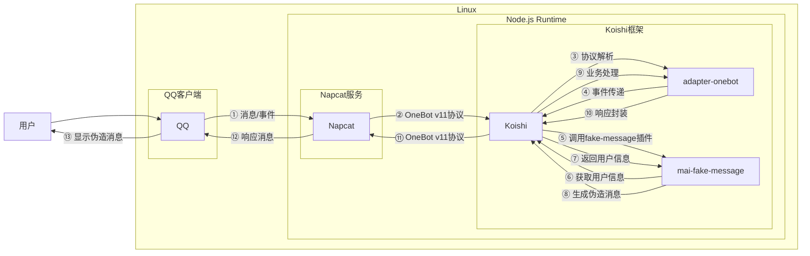

# 伪造消息

## 概述

**功能描述**: 伪造任意用户的消息，形成合并转发消息，用于恶搞群友或好友

**插件名称**: mai-fake-message

## 架构图



## 使用方法

### 基本语法

```
[QQ号]说[内容]|[QQ号]说[内容]
```

### 参数说明

| 参数 | 类型 | 必填 | 说明 | 示例 |
|------|------|------|------|------|
| QQ号 | 数字 | 是 | 要伪造消息的用户QQ号 | 2237886846 |
| 内容 | 文本 | 是 | 要伪造的消息内容 | 你好 |

### 分隔符说明

| 分隔符 | 作用 | 默认值 | 说明 |
|--------|------|--------|------|
| `|` | 用户分隔符 | `|` | 用于分隔不同用户的消息 |
| 空格 | 消息分隔符 | 空格 | 用于分隔同一用户的多条消息 |

## 使用示例

### 伪造单个用户消息

#### 伪造用户2237886846发送消息
<chat-panel>
<chat-message nickname="用户" type="user">2237886846说你好</chat-message>
<chat-message nickname="bot" type="bot">
正在伪造消息……
</chat-message>
<chat-message nickname="bot" type="bot">
<MergeForward :messages="[
{ nickname: '麦麦', type: 'user', content: '你好' },
{ nickname: 'bot', type: 'bot', content: '⚠️ 伪造消息警告 ⚠️\n时间: 2025/11/16 19:33:16\n此消息为伪造消息，请勿轻信！\n实际发送者: 2237886846' }
]" />
</chat-message>
</chat-panel>

### 伪造多个用户消息

#### 伪造多个用户对话
<chat-panel>
<chat-message nickname="用户" type="user">2237886846说你好|3929982192说早上好</chat-message>
<chat-message nickname="bot" type="bot">
正在伪造消息……
</chat-message>
<chat-message nickname="bot" type="bot">
<MergeForward :messages="[
{ nickname: '麦麦', type: 'user', content: '你好' },
{ nickname: 'bot', type: 'bot', content: '早上好' },
{ nickname: 'bot', type: 'bot', content: '⚠️ 伪造消息警告 ⚠️\n时间: 2025/11/16 19:33:16\n此消息为伪造消息，请勿轻信！\n实际发送者: 2237886846' }
]" />
</chat-message>
</chat-panel>

### 伪造同一用户多条消息

#### 伪造用户发送多条消息
<chat-panel>
<chat-message nickname="用户" type="user">2237886846说你好 早上好 今天天气不错</chat-message>
<chat-message nickname="bot" type="bot">
正在伪造消息……
</chat-message>
<chat-message nickname="bot" type="bot">
<MergeForward :messages="[
{ nickname: '麦麦', type: 'user', content: '你好' },
{ nickname: '麦麦', type: 'user', content: '早上好' },
{ nickname: '麦麦', type: 'user', content: '今天天气不错' },
{ nickname: 'bot', type: 'bot', content: '⚠️ 伪造消息警告 ⚠️\n时间: 2025/11/16 19:33:16\n此消息为伪造消息，请勿轻信！\n实际发送者: 2237886846' }
]" />
</chat-message>
</chat-panel>

### 复杂场景示例

#### 伪造多人对话场景
<chat-panel>
<chat-message nickname="用户" type="user">2237886846说大家好 我是新来的|3929982192说欢迎欢迎|10001说新人爆照</chat-message>
<chat-message nickname="bot" type="bot">
正在伪造消息……
</chat-message>
<chat-message nickname="bot" type="bot">
<MergeForward :messages="[
{ nickname: '麦麦', type: 'user', content: '大家好' },
{ nickname: '麦麦', type: 'user', content: '我是新来的' },
{ nickname: 'bot', type: 'bot', content: '欢迎欢迎' },
{ nickname: '马化腾', type: '马化腾', content: '新人爆照' },
{ nickname: 'bot', type: 'bot', content: '⚠️ 伪造消息警告 ⚠️\n时间: 2025/11/16 19:33:16\n此消息为伪造消息，请勿轻信！\n实际发送者: 2237886846' }
]" />
</chat-message>
</chat-panel>

## 技术特性

### 消息处理
- **自动识别**: 自动识别符合格式的伪造消息请求
- **用户信息获取**: 自动获取目标用户的昵称信息
- **合并转发**: 使用合并转发消息格式发送伪造消息
- **降级处理**: 合并转发失败时自动降级为逐条发送

### 安全特性
- **水印警告**: 默认在伪造消息中添加警告信息，包含时间戳和实际发送者
- **用户验证**: 验证目标用户是否存在
- **错误处理**: 完善的错误处理和用户提示

### 格式支持
- **QQ号格式**: 支持6-10位数字的QQ号
- **内容格式**: 支持任意文本内容
- **分隔符**: 支持自定义用户和消息分隔符

## 配置参数

插件支持以下配置选项：

| 配置项 | 类型 | 默认值 | 说明 |
|--------|------|--------|------|
| userSplit | string | `|` | 用户消息分隔符 |
| messageSplit | string | 空格 | 同一用户多条消息分隔符 |
| blockedUsers | string[] | [] | 被屏蔽的QQ号列表 |

## 注意事项

1. **用户真实性**: 伪造消息的QQ号必须是真实存在的用户
2. **权限限制**: 无法伪造被屏蔽用户的消息
3. **消息格式**: 必须严格按照指定格式发送
4. **水印功能**: 默认开启水印警告，无法关闭
5. **网络依赖**: 需要稳定的网络连接来获取用户信息

::: tip
伪造消息功能主要用于娱乐目的，请勿用于恶意用途。所有伪造消息都会自动添加警告信息，提醒接收者注意消息真实性。
:::
