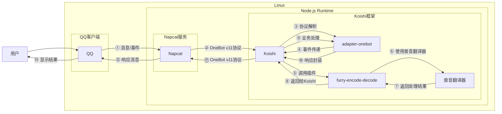

# 啊呜加密

## 概述

**指令名称**: `furry-encode` `furry-decode`

**功能描述**: 兽音加密/解密文本，基于兽音译者的JS实现

**插件名称**: furry-encode-decode

## 架构图



## 使用方法

### 基本语法

```
furry-encode <text>
furry-decode <text>
```

### 别名

- **加密**: `兽音译者` `兽音加密`
- **解密**: `兽音解密`

### 参数说明

| 参数 | 类型 | 必填 | 说明 | 示例 |
|------|------|------|------|------|
| text | 文本 | 是 | 要加密或解密的文本内容 | 你好世界 |

## 使用示例

### 文本加密

#### 加密普通文本
<chat-panel>
<chat-message nickname="用户" type="user">furry-encode 你好世界</chat-message>
<chat-message nickname="bot" type="bot">加密成功！

呜嗷呜嗷嗷嗷啊嗷嗷\~啊呜\~啊\~呜呜嗷\~嗷呜\~啊\~嗷呜嗷\~嗷啊嗷啊啊\~啊
</chat-message>
</chat-panel>

### 文本解密

#### 解密兽音文本
<chat-panel>
<chat-message nickname="用户" type="user">furry-decode 呜嗷呜嗷嗷嗷啊嗷嗷\~啊呜\~啊\~呜呜嗷\~嗷呜\~啊\~嗷呜嗷\~嗷啊嗷啊啊\~啊</chat-message>
<chat-message nickname="bot" type="bot">
解密成功！

你好世界
</chat-message>
</chat-panel>

## 技术特性

### 加密算法
- **兽音编码**: 基于兽音译者的JS实现
- **字符映射**: 将普通文本转换为兽音字符序列
- **可逆加密**: 支持双向转换，可加密也可解密

### 处理逻辑
- **文本验证**: 检查输入文本是否为空
- **编码转换**: 使用兽音翻译器进行编码/解码
- **结果返回**: 返回处理后的文本结果

### 错误处理
- **空输入**: 当用户未输入任何内容时提示
- **处理失败**: 当加密/解密过程中出现错误时提示
- **网络错误**: 当处理过程中出现异常时提示

## 注意事项

1. **不可套娃**: 不支持对已加密的文本再次加密
2. **文本长度**: 长文本加密后会产生大量兽音字符
3. **字符限制**: 仅支持可打印字符的加密
4. **兼容性**: 加密结果可能在某些平台显示异常

## 配置参数

插件为无配置插件，使用默认设置。

::: tip
兽音加密功能基于兽音译者的JS实现，能够将普通文本转换为有趣的兽音加密文本，适合用于娱乐和简单的信息隐藏。
:::
