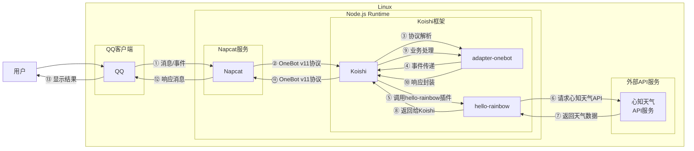

# 天气查询

## 概述
[](https://koishi.chat) [](https://www.npmjs.com/package/koishi-plugin-hello-rainbow)  [](https://github.com/LingLambda/koishi-plugin-hello-rainbow)
**指令名称**: 天气

**功能描述**: 获取今日或最近天气，基于心知天气API

**插件名称**: hello-rainbow

## 架构图



## 使用方法

### 基本语法

```
天气 <city> [day]
weather <city> [day]
```

### 参数说明

| 参数 | 类型 | 必填 | 说明 | 示例 |
|------|------|------|------|------|
| city | 文本 | 是 | 要查询天气的城市名称 | 北京 |
| day | 数字 | 否 | 要查询最近多少天的天气，默认3天 | 5 |

### 选项说明

| 选项 | 简写 | 参数 | 说明 |
|------|------|------|------|
| -h | -h | 无 | 显示帮助信息 |

## 使用示例

### 基本查询

#### 查询 `北京` 天气（默认最近3天）
<chat-panel>
<chat-message nickname="用户" type="user">天气 北京</chat-message>
<chat-message nickname="bot" type="bot">
2025-10-21（今天）
    天气：晴 转 多云
    温度：2 - 13 ℃
    湿度：33 %
    北风2级

2025-10-22
    天气：多云 转 小雨
    温度：2 - 10 ℃
    湿度：42 %
    北风2级

2025-10-23
    天气：多云
    温度：3 - 12 ℃
    湿度：55 %
    北风1级
</chat-message>
</chat-panel>

#### 查询 `北京` `最近5天` 天气
<chat-panel>
<chat-message nickname="用户" type="user">天气 北京 5</chat-message>
<chat-message nickname="bot" type="bot">
2025-10-21（今天）
    天气：晴 转 多云
    温度：2 - 13 ℃
    湿度：33 %
    北风2级

2025-10-22
    天气：多云 转 小雨
    温度：2 - 10 ℃
    湿度：42 %
    北风2级

2025-10-23
    天气：多云
    温度：3 - 12 ℃
    湿度：55 %
    北风1级

2025-10-24
    天气：晴
    温度：4 - 15 ℃
    湿度：40 %
    南风1级

2025-10-25
    天气：多云
    温度：5 - 16 ℃
    湿度：45 %
    南风2级
</chat-message>
</chat-panel>

### 查询区级天气

#### 查询 `北京/朝阳` 天气
<chat-panel>
<chat-message nickname="用户" type="user">天气 北京/朝阳</chat-message>
<chat-message nickname="bot" type="bot">
2025-10-21（今天）
    天气：晴 转 多云
    温度：3 - 14 ℃
    湿度：35 %
    北风2级

2025-10-22
    天气：多云 转 小雨
    温度：3 - 11 ℃
    湿度：44 %
    北风2级

2025-10-23
    天气：多云
    温度：4 - 13 ℃
    湿度：58 %
    北风1级
</chat-message>
</chat-panel>

### 错误处理示例

#### 查询不存在的城市
<chat-panel>
<chat-message nickname="用户" type="user">天气 不存在的城市</chat-message>
<chat-message nickname="bot" type="bot">
未找到城市：不存在的城市 区级请用 北京/朝阳 写法
</chat-message>
</chat-panel>

#### 查询非法天数
<chat-panel>
<chat-message nickname="用户" type="user">天气 北京 0</chat-message>
<chat-message nickname="bot" type="bot">
0 并非合法天数
</chat-message>
</chat-panel>

## 技术特性

### 数据来源
- **API服务**: 基于心知天气API
- **数据更新**: 实时天气数据，每日更新

### 查询逻辑
- **城市匹配**: 支持城市名称和区级查询（使用/分隔）
- **天数控制**: 支持查询1-31天的天气数据
- **智能处理**: 自动处理城市名称中的"市"、"区"等后缀

### 错误处理
- **城市未找到**: 当查询的城市不存在时提示
- **非法天数**: 当天数不是正整数时提示
- **API错误**: 当API请求失败时返回相应错误信息
- **付费限制**: 免费用户只能获取最近3天的信息

## 配置参数

插件支持以下配置选项：

| 配置项 | 类型 | 默认值 | 说明 |
|--------|------|--------|------|
| baseurl | string | https://api.seniverse.com/v3 | API基础路径 |
| privateKey | string | 空 | API私钥（必须配置） |
| publicKey | string | 空 | API公钥（公钥加密时需要） |
| encodeType | string | 私钥 | 加密类型：公钥/私钥 |
| defaultDay | number | 3 | 默认获取最近多少天的天气 |

## 注意事项

1. **API密钥**: 使用前需要注册心知天气API并配置密钥
2. **免费限制**: 免费用户只能获取最近3天的天气信息
3. **城市格式**: 区级查询使用"城市/区"格式，如"北京/朝阳"
4. **网络依赖**: 需要稳定的网络连接来访问API服务
5. **数据准确性**: 天气数据来源于心知天气，可能存在延迟

::: tip
天气查询功能基于心知天气API实现，能够提供准确的天气预报和实时天气信息。建议使用公钥加密方式以获得更好的安全性。
:::
