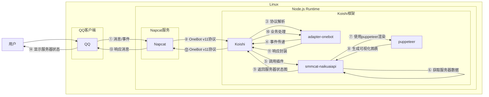

# 奶块服务器查询

## 概述

[](https://koishi.chat) [](https://www.npmjs.com/package/koishi-plugin-smmcat-naikuaiapi) [](https://qm.qq.com/cgi-bin/qm/qr?authKey=Yjnj2%2BAkbHNYLq%2BwD1ral1WpQENTWPFLd%2ForvCuz%2BI5kZdzR2ZXhoqztzbLVWm7Z&k=43TPCNxj4F-Q8tTOks02iyl78YCE_UW3&noverify=0)
**指令名称**: 服务器查询

**功能描述**: 查询奶块游戏服务器状态，显示各服务器在线人数和运行状态

**插件名称**: smmcat-naikuaiapi

## 架构图



## 使用方法

### 基本语法

```
服务器查询
```

### 参数说明

| 参数 | 类型 | 必填 | 说明 | 示例 |
|------|------|------|------|------|
| 无参数 | - | - | 直接查询所有服务器状态 | 奶块/服务器查询 |

## 使用示例

### 查询服务器状态

<chat-panel>
<chat-message nickname="用户" type="user">奶块/服务器查询</chat-message>
<chat-message nickname="bot" type="bot">


</chat-message>
</chat-panel>

## 技术特性

### 数据来源
- **API接口**: 通过虎牙next平台获取服务器列表数据
- **数据代理**: 使用transfer-service进行跨域请求处理
- **实时更新**: 每次查询都会获取最新的服务器状态

### 可视化展示
- **进度条显示**: 使用非线性缩放算法显示服务器负载情况
- **状态标识**: 清晰标注服务器运行状态（运行中/维护中）
- **在线人数**: 显示精确的在线人数统计
- **响应式设计**: 适配不同屏幕尺寸的显示效果

### 数据处理
- **异常值过滤**: 自动过滤无效的在线人数数据
- **数值限制**: 限制最大显示在线人数为100,000
- **非线性缩放**: 使用指数函数进行数据可视化优化

## 错误处理

### 网络错误
- **API不可达**: 当服务器数据接口无法访问时提示
- **数据解析失败**: 当返回数据格式异常时提示

### 渲染错误
- **模板加载失败**: 当HTML模板文件无法读取时提示
- **截图生成失败**: 当puppeteer渲染过程中出现错误时提示

## 配置参数

插件支持以下配置选项：

| 配置项 | 类型 | 默认值 | 说明 |
|--------|------|--------|------|
| 无配置项 | - | - | 当前版本插件无需额外配置 |

## 注意事项

1. **数据延迟**: 服务器状态数据可能存在一定的延迟
2. **网络依赖**: 需要稳定的网络连接来获取服务器数据
3. **API限制**: 依赖第三方API服务，可能受服务稳定性影响
4. **显示限制**: 单次查询最多显示100,000在线人数

::: tip
奶块服务器查询功能能够实时监控游戏服务器状态，帮助玩家了解各服务器的负载情况和运行状态，方便选择合适的服务器进行游戏。
:::
