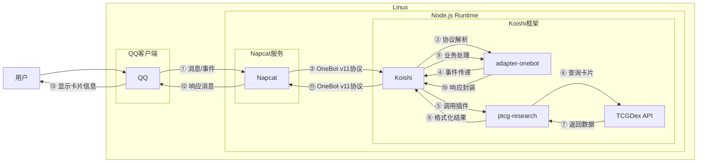
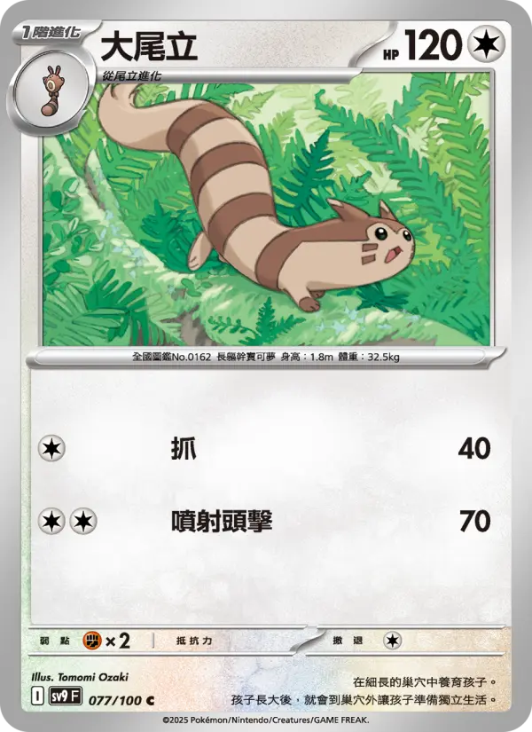

# 宝可梦集换式卡片查询

## 概述

**指令名称**: ptcg

**功能描述**: 查询宝可梦集换式卡片游戏(PTCG)的卡片信息，包括宝可梦卡、训练师卡和能量卡

**插件名称**: ptcg-research

## 架构图



## 使用方法

### 基本语法

```
ptcg [-s 系列] [-l 语言] <名称或ID>
```

### 参数说明

| 参数 | 类型 | 必填 | 说明 | 示例 |
|------|------|------|------|------|
| 名称或ID | 文本 | 是 | 卡片名称或ID | 大尾立 / swsh3-136 |
| 系列 | 文本 | 否 | 指定卡片系列 | swsh3 |
| 语言 | 文本 | 否 | 查询语言 | zh-tw / zh-cn / en / ja |

### 选项说明

| 选项 | 简写 | 参数 | 说明 | 示例 |
|------|------|------|------|------|
| serie | -s | string | 指定卡片系列 | swsh3 |
| lang | -l | string | 指定查询语言 | zh-tw |

## 使用示例

### 名称查询

<chat-panel>
<chat-message nickname="用户" type="user">ptcg 大尾立</chat-message>
<chat-message nickname="bot" type="bot">

查询到大尾立的全部结果：
1. 大尾立 [SV9-077]
2. 大尾立 [SC2b-105]
3. 大尾立 [SC2D-118]
第 1 页 / 共 1 页
请at并发送数字选择卡片, 或at并发送"跳页 页码"切换页面
</chat-message>
<chat-message nickname="用户" type="user">1</chat-message>
<chat-message nickname="bot" type="bot">


大尾立
HP：120  屬性：[無]
階段：Stage1
•抓  [無]
40  
•噴射頭擊  [無][無]
70  
弱點：[鬥] ×2   撤退：1
卡標: I  稀有度: Common
所屬系列: 對戰搭檔 (SV9)
ID: SV9-077
</chat-message>
</chat-panel>

### ID精确查询

<chat-panel>
<chat-message nickname="用户" type="user">ptcg SV9-077</chat-message>
<chat-message nickname="bot" type="bot">


大尾立
HP：120  屬性：[無]
階段：Stage1
•抓  [無]
40  
•噴射頭擊  [無][無]
70  
弱點：[鬥] ×2   撤退：1
卡標: I  稀有度: Common
所屬系列: 對戰搭檔 (SV9)
ID: SV9-077
</chat-message>
</chat-panel>

### 指定系列查询

<chat-panel>
<chat-message nickname="用户" type="user">ptcg -s SV9 大尾立</chat-message>
<chat-message nickname="bot" type="bot">


大尾立
HP：120  屬性：[無]
階段：Stage1
•抓  [無]
40  
•噴射頭擊  [無][無]
70  
弱點：[鬥] ×2   撤退：1
卡標: I  稀有度: Common
所屬系列: 對戰搭檔 (SV9)
ID: SV9-077
</chat-message>
</chat-panel>

### 多结果分页查询

<chat-panel>
<chat-message nickname="用户" type="user">ptcg 皮卡丘</chat-message>
<chat-message nickname="bot" type="bot">

查询到皮卡丘的全部结果：
1. 皮卡丘V [SN-001]
2. 皮卡丘 [SV-P-001]
3. 皮卡丘V [SDP-001]
4. 皮卡丘 [S8a-001]
5. 皮卡丘ex [SVC-001]
6. 皮卡丘 [S10a-014]
7. 皮卡丘 [SV2D-017]
8. 皮卡丘V [SH-019]
9. 皮卡丘V [S8a-020]
10. 衝浪皮卡丘V [S8a-021]
第 1 页 / 共 5 页
请at并发送数字选择卡片, 或at并发送"跳页 页码"切换页面
</chat-message>
</chat-panel>

## 卡片类型说明

### 宝可梦卡
- **HP**: 生命值
- **属性**: 卡片属性（无、草、水、火、斗、超、恶、钢、妖、电、龙）
- **阶段**: 进化阶段（基础、1、2）
- **特性**: 宝可梦的特殊能力
- **招式**: 攻击招式的名称、属性和效果
- **弱点**: 受到特定属性攻击时的伤害倍率
- **抵抗力**: 对特定属性攻击的伤害减免
- **撤退**: 撤退所需的能量数量

### 训练师卡
- **类型**: 训练师卡的类型（物品、支援者、竞技场等）
- **效果**: 卡片的效果描述

### 能量卡
- **类型**: 能量类型
- **效果**: 特殊能量卡的效果

## 技术特性

### 查询功能
- **模糊查询**: 支持卡片名称的模糊匹配
- **精确查询**: 支持卡片ID的精确查询
- **系列筛选**: 支持按卡片系列筛选结果
- **多语言支持**: 支持中文繁体、中文简体、英文、日文

### 名称映射
- **简繁转换**: 自动处理简体中文和繁体中文的转换
- **自定义映射**: 支持自定义名称映射规则
- **智能回退**: 当查询失败时自动尝试其他语言版本

### 分页系统
- **结果分页**: 当查询结果过多时自动分页显示
- **交互选择**: 支持通过数字选择具体卡片
- **页面跳转**: 支持跳转到指定页面

## 名称映射管理

### 管理指令
```
rptfg <操作> [参数]
```

### 操作说明

| 操作 | 参数 | 说明 | 示例 |
|------|------|------|------|
| add | 源名称:目标名称 | 添加名称映射 | rptfg add 乌栗:烏栗 |
| delete | 源名称:目标名称 | 删除名称映射 | rptfg delete 乌栗:烏栗 |
| reload | 无 | 重新加载映射配置 | rptfg reload |
| list | 无 | 列出所有映射规则 | rptfg list |

## 错误处理

### 查询错误
- **未找到卡片**: 当没有匹配的卡片时提示
- **网络错误**: 当API请求失败时提示重试
- **超时错误**: 当查询超时时提示稍后重试

### 输入错误
- **缺少参数**: 当未提供查询内容时显示帮助信息
- **无效操作**: 当名称映射操作无效时提示

## 配置参数

插件支持以下配置选项：

| 配置项 | 类型 | 默认值 | 说明 |
|--------|------|--------|------|
| itemsPerPage | number | 10 | 每页显示的结果数量 |
| dataPath | string | "./ptcg-data" | 数据存储路径 |
| requestConcurrency | number | 3 | 最大并发请求数 |
| retryCount | number | 2 | 请求重试次数 |
| sessionTimeout | number | 60000 | 会话超时时间（毫秒） |
| enableReplace | boolean | true | 是否启用名称映射功能 |
| replaceConfigPath | string | "./ptcg.json" | 名称映射配置文件路径 |

## 注意事项

1. **数据来源**: 卡片数据来源于TCGDex API，可能存在更新延迟
2. **网络要求**: 需要稳定的网络连接来访问API服务
3. **图片加载**: 卡片图片可能因网络问题无法正常显示
4. **语言支持**: 不同语言的卡片数据完整度可能不同
5. **名称差异**: 不同语言版本的卡片名称可能存在差异

::: tip
宝可梦集换式卡片游戏(PTCG)是一款基于宝可梦系列的集换式卡牌游戏，玩家通过收集和组合不同的卡片来构建卡组，与其他玩家进行对战。
:::
