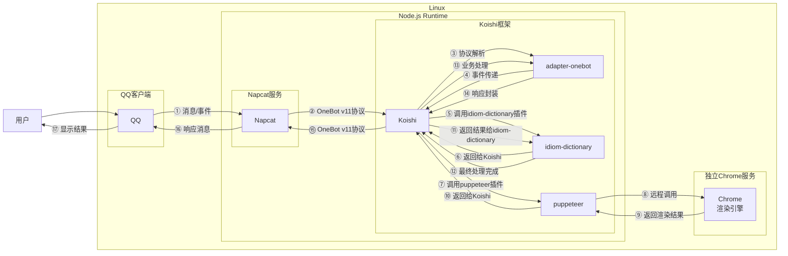
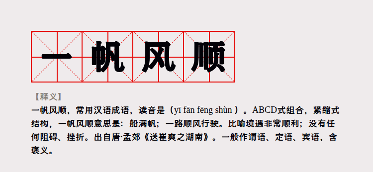
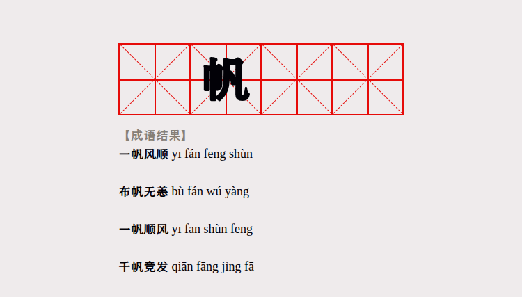
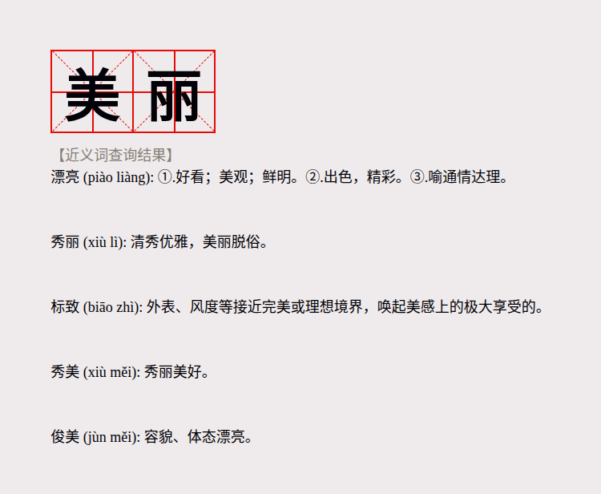

# 成语查询

## 概述

**指令名称**: 成语查询

**功能描述**: 查询成语含义、出处、用法和示例，支持精确查询和模糊匹配

**插件名称**: idiom-dictionary

## 架构图



## 使用方法

### 基本语法

```
成语查询 <成语>
近义词查询 <词语>
反义词查询 <词语>
```

### 参数说明

| 参数 | 类型 | 必填 | 说明 | 示例 |
|------|------|------|------|------|
| 成语 | 文本 | 是 | 要查询的成语，支持使用?进行模糊匹配 | 一帆风顺 |
| 词语 | 文本 | 是 | 要查询近义词或反义词的词语 | 美丽 |

## 使用示例

### 成语精确查询

#### 查询成语 `一帆风顺`
<chat-panel>
<chat-message nickname="用户" type="user">成语查询 一帆风顺</chat-message>
<chat-message nickname="bot" type="bot">


</chat-message>
</chat-panel>

### 成语模糊查询

#### 模糊查询 `?帆??`
<chat-panel>
<chat-message nickname="用户" type="user">成语查询 ?帆??</chat-message>
<chat-message nickname="bot" type="bot">


</chat-message>
</chat-panel>

### 近义词查询

#### 查询词语 `美丽` 的近义词
<chat-panel>
<chat-message nickname="用户" type="user">近义词查询 美丽</chat-message>
<chat-message nickname="bot" type="bot">


</chat-message>
</chat-panel>

### 反义词查询

#### 查询词语 `美丽` 的反义词
<chat-panel>
<chat-message nickname="用户" type="user">反义词查询 美丽</chat-message>
<chat-message nickname="bot" type="bot">


</chat-message>
</chat-panel>

## 技术特性

### 支持的查询类型
- **精确查询**: 直接查询完整成语的详细释义
- **模糊查询**: 使用?作为通配符进行位置匹配查询
- **近义词查询**: 查询词语的近义词及解释
- **反义词查询**: 查询词语的反义词及解释

### 输出模式
- **文本模式**: 默认输出纯文本结果
- **图片模式**: 启用puppeteer服务后可输出渲染图片

### 自动处理
- **问号处理**: 自动将?和？统一处理为通配符
- **长度验证**: 自动验证成语是否为四字成语
- **结果限制**: 可配置最大返回结果数量

## 配置参数

插件支持以下配置选项：

| 配置项 | 类型 | 默认值 | 说明 |
|--------|------|--------|------|
| Maximumidiom | number | 10 | 返回成语的最大数量限制 |
| MaximumnearSynonyms | number | 5 | 返回近义词/反义词的最大数量限制 |
| imagifyoutput | boolean | false | 图片输出模式（需要puppeteer服务） |
| consoleinfo | boolean | false | 日志调试模式 |

## 注意事项

1. **成语长度**: 成语查询仅支持四字成语，未知字可用?代替
2. **模糊查询**: 近义词和反义词查询不支持模糊查询
3. **网络要求**: 需要网络连接访问汉语国学网
4. **图片模式**: 图片输出需要安装并配置puppeteer服务
5. **查询限制**: 模糊查询结果数量受Maximumidiom配置限制

## 错误处理

- **输入不完整**: 当输入为空或包含问号时提示
- **未找到结果**: 当查询无匹配结果时提示
- **查询失败**: 当网络或服务异常时提示
- **长度错误**: 当输入不是四字成语时提示

::: tip
成语查询插件基于[汉语国学网](https://www.hanyuguoxue.com)的权威数据，提供准确的成语释义、出处和用法说明。支持模糊查询功能，可以帮助用户在不记得完整成语时进行查找。
:::
