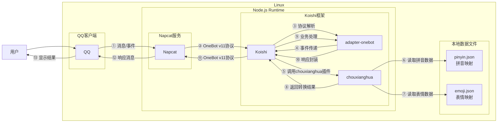

# 抽象话转换

## 概述

[](https://koishi.chat) [](https://www.npmjs.com/package/koishi-plugin-chouxianghua) [](https://github.com/koishi-shangxue-plugins/koishi-shangxue-apps/tree/main/plugins/chouxianghua)
**指令名称**: `抽象话` `还原抽象话`

**功能描述**: 将中文转换为emoji抽象话，或将抽象话还原为拼音

**插件名称**: chouxianghua

## 架构图



## 使用方法

### 基本语法

```
抽象话 <text:text>
还原抽象话 <text:text>
```

### 参数说明

| 参数 | 类型 | 必填 | 说明 | 示例 |
|------|------|------|------|------|
| text | 文本 | 是 | 要转换或还原的内容 | 需要被抽象的话语 |

## 使用示例

### 转换为抽象话

#### 将普通文本转换为抽象话
<chat-panel>
<chat-message nickname="用户" type="user">抽象话 需要被抽象的话语</chat-message>
<chat-message nickname="bot" type="bot">
‍⏭💊被🤡🐘💦🌸语
</chat-message>
</chat-panel>

#### 将中文句子转换为抽象话
<chat-panel>
<chat-message nickname="用户" type="user">抽象话 真的太抽象啦</chat-message>
<chat-message nickname="bot" type="bot">
💉💦太🤡🐘🌶！
</chat-message>
</chat-panel>

### 还原抽象话

#### 将抽象话还原为拼音
<chat-panel>
<chat-message nickname="用户" type="user">还原抽象话 ‍⏭💊被🤡🐘💦🌸语</chat-message>
<chat-message nickname="bot" type="bot">
‍-⏭-yao-被-chou-xiang-di/shui-hua-语
</chat-message>
</chat-panel>

#### 将复杂抽象话还原为拼音
<chat-panel>
<chat-message nickname="用户" type="user">还原抽象话 💉💦太🤡🐘🌶！</chat-message>
<chat-message nickname="bot" type="bot">
zhen-di/shui-太-chou-xiang-na/la-！
</chat-message>
</chat-panel>

### 错误处理

#### 空输入处理
<chat-panel>
<chat-message nickname="用户" type="user">抽象话</chat-message>
<chat-message nickname="bot" type="bot">
请输入需要转换的内容。
</chat-message>
</chat-panel>

#### 还原空输入处理
<chat-panel>
<chat-message nickname="用户" type="user">还原抽象话</chat-message>
<chat-message nickname="bot" type="bot">
请输入需要还原的抽象话。
</chat-message>
</chat-panel>

## 技术特性

### 转换逻辑
- **拼音映射**: 基于pinyin.json文件将中文字符转换为拼音
- **表情映射**: 基于emoji.json文件将拼音转换为对应的emoji表情
- **字符保留**: 无法映射的字符保持原样输出

### 还原逻辑
- **表情识别**: 识别emoji表情对应的拼音
- **多音字处理**: 支持一个emoji对应多个拼音的情况
- **拼音分隔**: 使用连字符分隔各个拼音

### 数据源
- **拼音数据**: 包含中文字符到拼音的映射关系
- **表情数据**: 包含拼音到emoji表情的映射关系

### 错误处理
- **空输入检测**: 检测用户是否输入了内容
- **字符保留**: 无法处理的字符保持原样
- **多音字支持**: 支持一个emoji对应多个拼音的情况

## 配置参数

插件支持以下配置选项：

| 配置项 | 类型 | 默认值 | 说明 |
|--------|------|--------|------|
| commandname | string | 抽象话 | 抽象话转换命令名称 |
| commandname2 | string | 还原抽象话 | 还原抽象话命令名称 |
| loggerinfo | boolean | true | 日志调试模式 |

## 注意事项

1. **字符覆盖**: 插件主要支持常用中文字符的转换，特殊字符可能无法正确转换
2. **表情识别**: 还原功能依赖于emoji表情的识别，某些复杂表情可能无法正确还原
3. **多音字**: 中文多音字可能无法准确还原为原始拼音
4. **数据更新**: 拼音和表情映射数据固定，不支持动态更新

::: tip
抽象话转换功能基于本地拼音和表情映射数据实现，能够将中文转换为有趣的emoji抽象话，或将抽象话还原为拼音形式，适合娱乐和趣味交流使用。
:::
