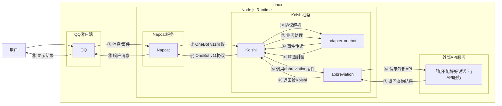

# 拼音缩写查询

## 概述

**指令名称**: abbr

**功能描述**: 中文缩写词搜索，基于「能不能好好说话？」API

**插件名称**: abbreviation

## 架构图



## 使用方法

### 基本语法

```
abbr <text>
```

### 参数说明

| 参数 | 类型 | 必填 | 说明 | 示例 |
|------|------|------|------|------|
| text | 文本 | 是 | 要查询的拼音缩写 | myt |

## 使用示例

### 基本查询

#### 查询 `myt` 拼音缩写
<chat-panel>
<chat-message nickname="用户" type="user">abbr myt</chat-message>
<chat-message nickname="bot" type="bot">
myt：没有头, 麦芽糖, 米羽糖
</chat-message>
</chat-panel>

#### 查询 `yyds` 拼音缩写
<chat-panel>
<chat-message nickname="用户" type="user">abbr yyds</chat-message>
<chat-message nickname="bot" type="bot">
yyds：永远滴神, 永远的神, 永远单身
</chat-message>
</chat-panel>

#### 查询 `xswl` 拼音缩写
<chat-panel>
<chat-message nickname="用户" type="user">abbr xswl</chat-message>
<chat-message nickname="bot" type="bot">
xswl：笑死我了, 想死我了, 想死我了
</chat-message>
</chat-panel>

### 查询不存在的缩写

#### 查询不存在的缩写
<chat-panel>
<chat-message nickname="用户" type="user">abbr abcdefg</chat-message>
<chat-message nickname="bot" type="bot">
未找到对应的缩写。
</chat-message>
</chat-panel>

## 技术特性

### 数据来源
- **API服务**: 基于「能不能好好说话？」(nbnhhsh) API
- **数据更新**: 实时查询，数据源持续更新

### 查询逻辑
- **精确匹配**: 优先返回已确认的翻译结果
- **输入建议**: 如果没有确认翻译，返回用户输入建议
- **多结果支持**: 支持返回多个可能的含义

### 错误处理
- **空输入**: 当用户未输入任何内容时提示
- **无结果**: 当查询无结果时返回友好提示
- **网络错误**: 当API请求失败时提示

## 配置参数

插件支持以下配置选项：

| 配置项 | 类型 | 默认值 | 说明 |
|--------|------|--------|------|
| endpoint | string | https://lab.magiconch.com/api/nbnhhsh/guess | API服务地址 |

## 注意事项

1. **数据准确性**: 结果来源于用户提交的数据，可能存在不准确的情况
2. **网络依赖**: 需要稳定的网络连接来访问API服务
3. **实时性**: 查询结果为实时数据，可能包含最新的网络用语
4. **多义性**: 同一缩写可能有多个不同的含义

::: tip
拼音缩写查询功能基于「能不能好好说话？」API实现，能够查询最新的网络用语和流行缩写词。
:::
