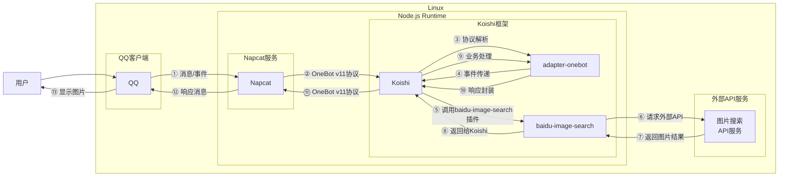

# 搜图

## 概述
[](https://koishi.chat) [](https://www.npmjs.com/package/koishi-plugin-baidu-image-search) [](https://github.com/koishi-shangxue-plugins/koishi-shangxue-apps/tree/main/plugins/baidu-image-search)
**指令名称**: [平台]搜图

**功能描述**: 根据文字搜索一张图片，支持多个搜索平台

**插件名称**: baidu-image-search

## 架构图



## 使用方法

### 基本语法

```
[平台]搜图 <keyword>
```

### 参数说明

| 参数 | 类型 | 必填 | 说明 | 示例 |
|------|------|------|------|------|
| keyword | 文本 | 是 | 要搜索的关键词 | 麦芽糖 |

### 支持平台

| 类型 | 指令名称 | 说明 |
|---------|---------|------|
| **百度** | 百度搜图 | 使用百度图片搜索 |
| **搜狗** | 搜狗搜图 | 使用搜狗图片搜索 |

## 使用示例

### 百度搜图

#### 百度搜图 `麦芽糖`
<chat-panel>
<chat-message nickname="用户" type="user">百度搜图 麦芽糖</chat-message>
<chat-message nickname="bot" type="bot">


</chat-message>
</chat-panel>

### 搜狗搜图

#### 搜狗搜图 `麦芽糖`
<chat-panel>
<chat-message nickname="用户" type="user">搜狗搜图 麦芽糖</chat-message>
<chat-message nickname="bot" type="bot">


</chat-message>
</chat-panel>

## 技术特性

### 搜索能力
- **多平台支持**: 支持百度、搜狗搜索平台
- **自动切换**: 具备自动切换至备用搜索接口的能力，确保在主要接口不可用时的稳定性
- **快速响应**: 提供快速的图片搜索体验

### 图片处理
- **单张返回**: 每次搜索返回一张相关图片
- **质量保证**: 返回高质量的搜索结果图片
- **格式支持**: 支持常见的图片格式

### 错误处理
- **网络异常**: 当API请求失败时提示
- **无结果**: 当搜索无结果时返回友好提示
- **参数缺失**: 当用户未输入关键词时提示

## 配置参数

插件支持以下配置选项：

| 配置项 | 类型 | 默认值 | 说明 |
|--------|------|--------|------|
| API端点 | string | 自动选择 | 图片搜索API端点 |

## 注意事项

1. **网络依赖**: 需要稳定的网络连接来访问图片搜索API
2. **结果随机**: 每次搜索返回的图片可能不同
3. **内容限制**: 搜索结果受各平台内容政策限制
4. **图片质量**: 返回的图片质量可能因搜索平台而异

::: tip
搜图功能基于多个图片搜索API实现，能够快速找到与关键词相关的图片，满足日常图片搜索需求。
:::
