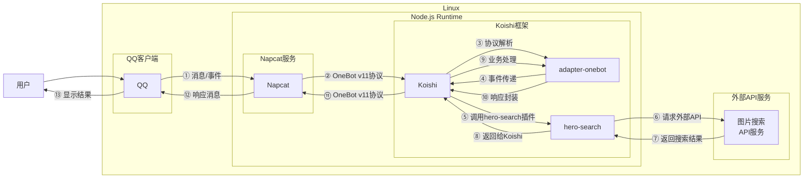

# 搜图来源

## 概述

**指令名称**: 搜图

**功能描述**: 根据图片搜索来源信息，识别图片出处和相关信息

**插件名称**: hero-search

## 架构图



## 使用方法

### 基本语法

```
搜图
```

### 参数说明

| 参数 | 类型 | 必填 | 说明 | 示例 |
|------|------|------|------|------|
| 图片 | 图片 | 是 | 要搜索来源的图片 | [图片](./搜图来源_示范.jpg) |

## 使用示例

### 基本搜索

#### 搜索图片来源
<chat-panel>
<chat-message nickname="用户" type="user">
搜图


</chat-message>
<chat-message nickname="bot" type="bot">
<MergeForward :messages="[
{ nickname: 'bot', type: 'bot', content: '[图片] 链接：https://e621.net/post/show/5609746 \n 作者：未知 \n 网站：e621 \n 相似度：88.5% \n 索引：29' }
]" />
</chat-message>
</chat-panel>

## 技术特性

### 搜索能力
- **相似度匹配**: 提供相似度评分，帮助判断匹配准确性
- **多结果返回**: 可能返回多个可能的匹配结果

### 信息提取
- **来源链接**: 提供图片的原始链接
- **作者信息**: 识别图片作者（如果可获取）
- **网站来源**: 标明图片来源网站
- **相似度**: 显示匹配的相似度百分比

### 错误处理
- **图片格式**: 支持常见图片格式
- **网络异常**: 当API请求失败时提示
- **无结果**: 当搜索无结果时返回友好提示
- **图片过大**: 当图片超过限制大小时提示

## 配置参数

插件支持以下配置选项：

| 配置项 | 类型 | 默认值 | 说明 |
|--------|------|--------|------|
| API端点 | string | 自动选择 | 图片搜索API端点 |

## 注意事项

1. **准确性限制**: 搜索结果可能不准确，仅供参考
2. **网络依赖**: 需要稳定的网络连接来访问图片搜索API
3. **图片质量**: 图片质量影响搜索结果的准确性
4. **版权问题**: 搜索结果可能涉及版权内容，请谨慎使用
5. **内容限制**: 某些图片可能无法找到来源信息

::: warning
搜图来源功能基于外部图片搜索API实现，搜索结果仅供参考，可能存在不准确的情况。
:::
