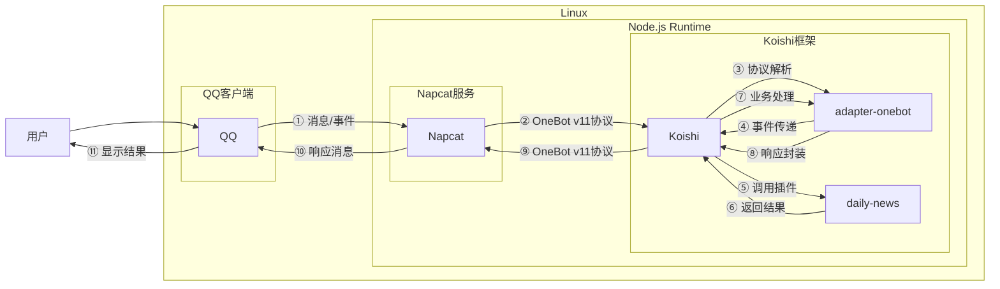

# 新闻

## 概述
[](https://koishi.chat) [](https://www.npmjs.com/package/@asuna-bot/koishi-plugin-daily-news) [](https://github.com/koishi-shangxue-plugins/koishi-shangxue-apps/tree/main/plugins/daily-news)
**指令名称**: 获取新闻

**功能描述**: 新闻

**插件名称**: daily-news

## 架构图



## 使用方法

### 基本语法

```
新闻
```

### 使用示例

#### 获取新闻
<chat-panel>
<chat-message nickname="用户" type="user">新闻</chat-message>
<chat-message nickname="bot" type="bot">


</chat-message>
</chat-panel>
