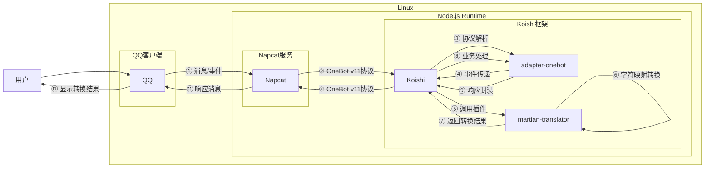

# 火星文转换

## 概述

**指令名称**: `火星文` `反火星文`

**功能描述**: 将简体中文和火星文互相转换

**插件名称**: martian-translator

## 架构图



## 使用方法

### 基本语法

```
火星文 <文本>
反火星文 <文本>
```

### 参数说明

| 参数 | 类型 | 必填 | 说明 | 示例 |
|------|------|------|------|------|
| 文本 | 文本 | 是 | 要转换的文本内容 | 你好啊 |

## 使用示例

### 简体中文转火星文

#### 转换"你好啊"为火星文
<chat-panel>
<chat-message nickname="用户" type="user">火星文 你好啊</chat-message>
<chat-message nickname="bot" type="bot">
沵恏娿
</chat-message>
</chat-panel>

#### 转换"今天天气不错"为火星文
<chat-panel>
<chat-message nickname="用户" type="user">火星文 今天天气不错</chat-message>
<chat-message nickname="bot" type="bot">
妗兲兲気芣諎
</chat-message>
</chat-panel>

### 火星文转简体中文

#### 转换"沵恏娿"为简体中文
<chat-panel>
<chat-message nickname="用户" type="user">反火星文 沵恏娿</chat-message>
<chat-message nickname="bot" type="bot">
你好啊
</chat-message>
</chat-panel>

#### 转换"妗兲兲気芣諎"为简体中文
<chat-panel>
<chat-message nickname="用户" type="user">反火星文 妗兲兲気芣諎</chat-message>
<chat-message nickname="bot" type="bot">
今天天气不错
</chat-message>
</chat-panel>

## 技术特性

### 转换原理

- **字符映射**: 基于预定义的字符映射表进行转换
- **双向转换**: 支持简体中文到火星文的转换，也支持火星文到简体中文的反向转换
- **容错处理**: 对于无法识别的字符保持原样输出

### 支持的字符范围

- **简体中文**: 支持常用汉字字符转换
- **火星文**: 支持常见的火星文字符变体
- **特殊字符**: 标点符号、数字、英文字母等保持原样

### 转换算法

1. **正向转换**: 简体中文 → 火星文
   - 遍历输入文本的每个字符
   - 在简体中文字符表中查找对应位置
   - 返回火星文字符表中对应位置的字符
   - 如果找不到对应字符，保持原样

2. **反向转换**: 火星文 → 简体中文
   - 遍历输入文本的每个字符
   - 在火星文字符表中查找对应位置
   - 返回简体中文字符表中对应位置的字符
   - 如果找不到对应字符，保持原样

## 注意事项

1. **字符覆盖**: 转换表覆盖常用汉字，但可能不包含所有生僻字
2. **转换精度**: 对于复杂的火星文变体，转换可能不完全准确
3. **性能考虑**: 转换过程为线性时间复杂度，适合处理常规长度的文本
4. **字符保持**: 非汉字字符（数字、字母、标点）在转换过程中保持不变

## 配置参数

本插件为轻量级工具，无需额外配置参数。

::: tip
火星文转换功能基于字符映射表实现，能够快速准确地进行简体中文和火星文之间的双向转换。该功能简单实用，适合日常娱乐和文字转换需求。
:::
