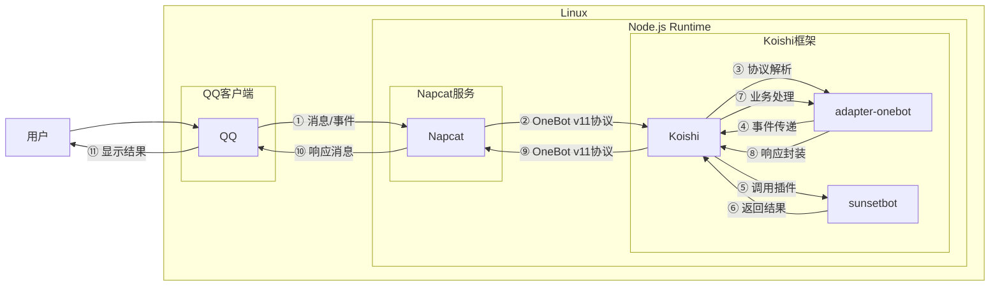

# 火烧云预报

## 概述

**指令名称**: hsy

**功能描述**: 查询和订阅城市朝霞(日出)和晚霞(日落)预报

**插件名称**: sunsetbot

## 架构图




## 使用方法

### 基本语法

```
hsy.query [城市名]  # 查询指定城市的火烧云预报，不指定城市则使用默认城市
hsy.sub <城市名>   # 订阅指定城市的自动预报
hsy.unsub <城市名> # 取消订阅指定城市的自动预报
hsy.list          # 查看已订阅的城市列表
```

### 参数说明

| 参数 | 类型 | 必填 | 说明 | 示例 |
|------|------|------|------|------|
| 城市名 | 文本 | 否 | 要查询/订阅的城市名称 | 重庆 |

## 使用示例

### 查询火烧云预报

<chat-panel>
<chat-message nickname="用户" type="user">hsy.query 重庆</chat-message>
<chat-message nickname="bot" type="bot">

🌄 火烧云预报 - 重庆 🌅
═════════════════
今日朝霞
  • GFS: 0.0（不烧）
  • EC: 0.0（不烧）

今日晚霞
  • GFS: 0.0（不烧）
  • EC: 0.0（不烧）

明日朝霞
  • GFS: 0.0（不烧）
  • EC: 0.0（不烧）

明日晚霞
  • GFS: 0.007（微烧）
  • EC: 0.0（不烧）

═════════════════
</chat-message>
</chat-panel>

### 订阅城市预报

<chat-panel>
<chat-message nickname="用户" type="user">hsy.sub 重庆</chat-message>
<chat-message nickname="bot" type="bot">已订阅重庆的自动预报，将在当前频道推送。</chat-message>
</chat-panel>

## 技术特性

- **预报模型**: 使用GFS和EC两种气象模型
- **预报内容**: 提供朝霞(rise)和晚霞(set)预报
- **预报时段**: 当日和次日预报
- **自动推送**: 每3小时自动推送订阅城市的最新预报

## 注意事项

1. **城市名称**: 只支持中文、字母、数字和空格
2. **预报准确性**: 预报结果仅供参考，实际天气可能有所不同
3. **订阅限制**: 每个用户在每个频道最多可订阅5个城市
4. **推送时间**: 每日6:00、9:00、12:00、15:00、18:00、21:00自动推送

## 配置参数

插件支持以下配置选项：

| 配置项 | 类型 | 默认值 | 说明 |
|--------|------|--------|------|
| apiUrl | string | https://sunsetbot.top/ | API地址 |
| defaultCity | string | 重庆 | 默认查询城市 |
