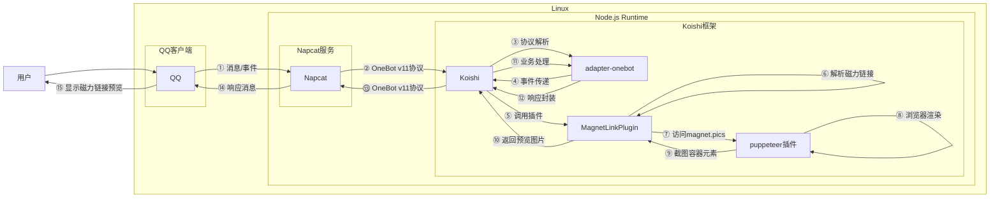

# 磁力链接截图
[](https://koishi.chat) [](https://www.npmjs.com/package/koishi-plugin-magnet-preview) 
## 概述

**指令名称**: magnet

**功能描述**: 获取磁力链接的预览截图，显示种子文件的基本信息

**插件名称**: magnet-preview

## 架构图



## 使用方法

### 基本语法

```
magnet <磁力链接>
```

### 参数说明

| 参数 | 类型 | 必填 | 说明 | 示例 |
|------|------|------|------|------|
| 磁力链接 | 文本 | 是 | 标准的磁力链接 | magnet:?xt=urn:btih:xxxxxxxxxxxx |

### 使用示例

#### 获取磁力链接预览

<chat-panel>
<chat-message nickname="用户" type="user">magnet magnet:?xt=urn:btih:xxxxxxxxxxxx</chat-message>
<chat-message nickname="bot" type="bot">
正在获取截图...
</chat-message>
<chat-message nickname="bot" type="bot">
[图片：磁力链接预览截图]
</chat-message>
</chat-panel>

#### 交互式输入

如果直接输入 `magnet` 指令而不带参数，机器人会提示输入磁力链接：

<chat-panel>
<chat-message nickname="用户" type="user">magnet</chat-message>
<chat-message nickname="bot" type="bot">请输入磁力链接！</chat-message>
<chat-message nickname="用户" type="user">magnet:?xt=urn:btih:xxxxxxxxxxxx</chat-message>
<chat-message nickname="bot" type="bot">
正在获取截图...
</chat-message>
<chat-message nickname="bot" type="bot">
[图片：磁力链接预览截图]
</chat-message>
</chat-panel>

## 技术特性

### 磁力链接解析

- **哈希提取**: 自动从磁力链接中提取BTIH哈希值
- **格式验证**: 使用正则表达式验证磁力链接格式
- **错误处理**: 对无效格式的链接提供友好的错误提示

### 网页截图机制

- **目标网站**: 使用 `https://beta.magnet.pics/m/{hash}` 获取预览信息
- **自定义UA**: 设置Chrome浏览器用户代理避免被拦截
- **元素定位**: 精确截图 `.thumb-container` 容器元素
- **透明背景**: 使用 `omitBackground: true` 生成透明背景图片

### 用户体验优化

- **进度提示**: 显示"正在获取截图..."状态信息
- **自动清理**: 截图完成后自动删除进度提示消息
- **错误反馈**: 对无法获取信息的情况提供明确提示

## 支持的磁力链接格式

插件支持标准的磁力链接格式：

```
magnet:?xt=urn:btih:[哈希值]
```

其中 `[哈希值]` 可以是：
- 40字符的SHA1哈希（十六进制）
- 32字符的Base32编码哈希

## 故障排除

### 常见问题

1. **"无效的磁力链接格式！"**
   - 检查链接是否以 `magnet:?xt=urn:btih:` 开头
   - 确认链接格式正确，没有多余的空格或字符

2. **"无法获取链接信息或未找到截图！"**
   - 目标网站可能暂时不可用
   - 该磁力链接在magnet.pics网站中没有对应的预览信息
   - 网络连接问题导致无法访问目标网站

3. **截图显示空白**
   - 目标网站的预览容器元素可能已更新
   - 网站可能有反爬虫机制

### 性能优化

- **页面管理**: 及时关闭浏览器页面避免内存泄漏
- **网络优化**: 设置合适的等待时间确保页面完全加载
- **资源清理**: 正确处理图片缓冲区避免内存占用

## 技术实现细节

### 核心算法

```javascript
// 从磁力链接提取哈希值
const hash = magnetLink.split(':')[3].split('&')[0];

// 构建预览URL
const url = `https://beta.magnet.pics/m/${hash}`;

// 截图特定容器元素
const thumbContainer = await page.$('.thumb-container');
const imageBuffer = await thumbContainer.screenshot({ omitBackground: true });
```

### 依赖要求

- **Koishi框架**: ^4.12.2
- **Puppeteer插件**: ^3.8.3
- **Node.js**: 支持现代JavaScript特性

::: tip
磁力链接预览功能基于magnet.pics网站提供的信息，能够显示种子的基本信息、文件列表、文件大小等关键信息，帮助用户快速了解种子内容。
:::
