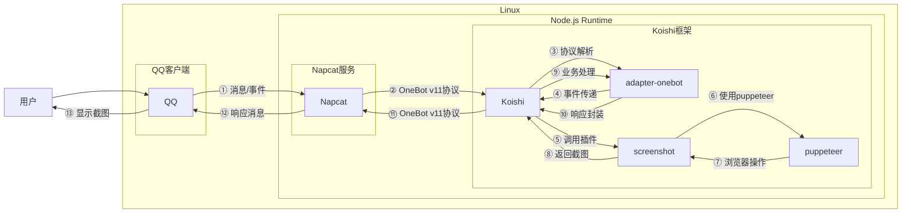

# 网页截图

## 概述
[](https://koishi.chat) [](https://www.npmjs.com/package/koishi-plugin-screenshot)  [](https://github.com/koishijs/koishi-plugin-puppeteer)
**指令名称**: shot

**功能描述**: 截取网页内容并返回图片

**插件名称**: screenshot

## 架构图



## 使用方法

### 基本语法

```
shot <url> [selector]
screenshot <url> [selector]
```

### 参数说明

| 参数 | 类型 | 必填 | 说明 | 示例 |
|------|------|------|------|------|
| url | 文本 | 是 | 要截图的网页地址 | https://www.baidu.com |
| selector | 文本 | 否 | CSS选择器，指定要截图的特定元素 | .main-content |

### 选项说明

| 选项 | 简写 | 参数 | 说明 |
|------|------|------|------|
| full | -f | 无 | 对整个可滚动区域截图 |
| viewport | -v | string | 指定视口大小，格式：宽度x高度 | 1920x1080 |

## 使用示例

### 基本截图

#### 截图 [`百度`](https://www.baidu.com) 首页
<chat-panel>
<chat-message nickname="用户" type="user">shot https://www.baidu.com</chat-message>
<chat-message nickname="bot" type="bot">


</chat-message>
</chat-panel>

### 使用选项

#### 全页面截图
<chat-panel>
<chat-message nickname="用户" type="user">shot https://www.bilibili.com -f</chat-message>
<chat-message nickname="bot" type="bot">


</chat-message>
</chat-panel>

#### 指定视口大小
<chat-panel>
<chat-message nickname="用户" type="user">shot https://www.taobao.com -v 1280x720</chat-message>
<chat-message nickname="bot" type="bot">


</chat-message>
</chat-panel>

## 技术特性

### 支持的协议
- HTTP
- HTTPS

### 自动处理
- **协议补全**: 如果URL没有协议前缀，自动添加`http://`
- **超时处理**: 
  - 加载超时: 5秒
  - 空闲超时: 30秒
- **图片优化**: 自动压缩超过1MB的图片

### 错误处理
- **无法打开页面**: 当页面无法加载时提示
- **元素未找到**: 当指定选择器对应的元素不存在时提示
- **截图失败**: 当截图过程中出现错误时提示

## 注意事项

1. **网络要求**: 需要稳定的网络连接来访问目标网站
2. **网站限制**: 某些网站可能有反爬虫机制，可能无法正常截图
3. **加载时间**: 复杂页面可能需要较长时间加载
4. **图片大小**: 大尺寸截图会自动压缩以符合消息大小限制

## 配置参数

插件支持以下配置选项：

| 配置项 | 类型 | 默认值 | 说明 |
|--------|------|--------|------|
| protocols | string[] | ['http', 'https'] | 允许的协议列表 |
| maxSize | number | 1MB | 单张图片最大尺寸 |
| loadTimeout | number | 5秒 | 页面加载超时时间 |
| idleTimeout | number | 30秒 | 页面空闲超时时间 |

::: tip
网页截图功能基于puppeteer-core实现，能够准确渲染现代网页内容，包括JavaScript动态生成的内容。
:::
