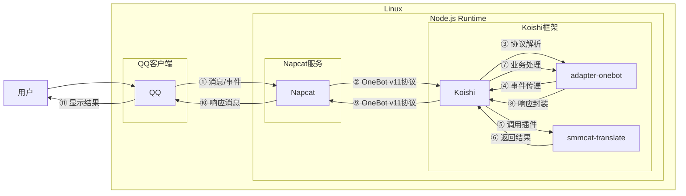

# 翻译

## 概述

**指令名称**: 翻译

**功能描述**: 多语言翻译功能，支持110种语言双向翻译

**插件名称**: smmcat-translate

## 架构图




## 使用方法

### 基本语法

```
翻译 <文本>
```

### 参数说明

| 参数 | 类型 | 必填 | 说明 | 示例 |
|------|------|------|------|------|
| 文本 | 文本 | 否 | 要翻译的文本 | 麦芽糖 |

### 使用示例

#### 翻译 `麦芽糖`
<chat-panel>
<chat-message nickname="用户" type="user">翻译 麦芽糖</chat-message>
<chat-message nickname="bot" type="bot">
翻译的结果：

maltose

[中文] => [英语]
</chat-message>
</chat-panel>

#### 翻译 `maltose`
<chat-panel>
<chat-message nickname="用户" type="user">翻译 maltose</chat-message>
<chat-message nickname="bot" type="bot">
翻译的结果：

麦芽糖

[英语] => [中文]
</chat-message>
</chat-panel>

#### 翻译长文本
<chat-panel>
<chat-message nickname="用户" type="user">翻译 Artificial intelligence is transforming the way we live and work, bringing unprecedented opportunities and challenges to our society.</chat-message>
<chat-message nickname="bot" type="bot">
翻译的结果：

人工智能正在改变我们的生活和工作方式，给我们的社会带来了前所未有的机遇和挑战。

[英语] => [中文]
</chat-message>
</chat-panel>

#### 翻译日语文本
<chat-panel>
<chat-message nickname="用户" type="user">翻译 こんにちは、世界</chat-message>
<chat-message nickname="bot" type="bot">
翻译的结果：

你好，世界

[日语] => [中文]
</chat-message>
</chat-panel>

#### 翻译文言文
<chat-panel>
<chat-message nickname="用户" type="user">翻译 学而时习之，不亦说乎</chat-message>
<chat-message nickname="bot" type="bot">
翻译的结果：

Learn and practice from time to time, isn't it pleasant?

[文言文] => [英语]
</chat-message>
</chat-panel>

### 翻译方向对照表
| 源语言 | 目标语言 | 源语言 | 目标语言 | 源语言 | 目标语言 |
|:---|:---|:---|:---|:---|:---|
| 德 | 俄 | 俄 | 德 | 法 | 德 |
| 德 | 法 | 俄 | 法 | 法 | 俄 |
| 德 | 繁 | 俄 | 繁 | 法 | 繁 |
| 德 | 韩 | 俄 | 韩 | 法 | 韩 |
| 德 | 葡 | 俄 | 葡 | 法 | 葡 |
| 德 | 日 | 俄 | 日 | 法 | 日 |
| 德 | 泰 | 俄 | 泰 | 法 | 泰 |
| 德 | 言 | 俄 | 言 | 法 | 言 |
| 德 | 英 | 俄 | 英 | 法 | 英 |
| 德 | 粤 | 俄 | 粤 | 法 | 粤 |
| 德 | 中 | 俄 | 中 | 法 | 中 |
| **源语言** | **目标语言** | **源语言** | **目标语言** | **源语言** | **目标语言** |
| 繁 | 德 | 韩 | 德 | 葡 | 德 |
| 繁 | 俄 | 韩 | 俄 | 葡 | 俄 |
| 繁 | 法 | 韩 | 法 | 葡 | 法 |
| 繁 | 韩 | 韩 | 繁 | 葡 | 繁 |
| 繁 | 葡 | 韩 | 葡 | 葡 | 韩 |
| 繁 | 日 | 韩 | 日 | 葡 | 日 |
| 繁 | 泰 | 韩 | 泰 | 葡 | 泰 |
| 繁 | 言 | 韩 | 言 | 葡 | 言 |
| 繁 | 英 | 韩 | 英 | 葡 | 英 |
| 繁 | 粤 | 韩 | 粤 | 葡 | 粤 |
| 繁 | 中 | 韩 | 中 | 葡 | 中 |
| **源语言** | **目标语言** | **源语言** | **目标语言** | **源语言** | **目标语言** |
| 日 | 德 | 泰 | 德 | 言 | 德 |
| 日 | 俄 | 泰 | 俄 | 言 | 俄 |
| 日 | 法 | 泰 | 法 | 言 | 法 |
| 日 | 繁 | 泰 | 繁 | 言 | 繁 |
| 日 | 韩 | 泰 | 韩 | 言 | 韩 |
| 日 | 葡 | 泰 | 葡 | 言 | 葡 |
| 日 | 泰 | 泰 | 日 | 言 | 日 |
| 日 | 言 | 泰 | 言 | 言 | 泰 |
| 日 | 英 | 泰 | 英 | 言 | 英 |
| 日 | 粤 | 泰 | 粤 | 言 | 粤 |
| 日 | 中 | 泰 | 中 | 言 | 中 |
| **源语言** | **目标语言** | **源语言** | **目标语言** | **源语言** | **目标语言** |
| 英 | 德 | 粤 | 德 | 中 | 德 |
| 英 | 俄 | 粤 | 俄 | 中 | 俄 |
| 英 | 法 | 粤 | 法 | 中 | 法 |
| 英 | 繁 | 粤 | 繁 | 中 | 繁 |
| 英 | 韩 | 粤 | 韩 | 中 | 韩 |
| 英 | 葡 | 粤 | 葡 | 中 | 葡 |
| 英 | 日 | 粤 | 日 | 中 | 日 |
| 英 | 泰 | 粤 | 泰 | 中 | 泰 |
| 英 | 言 | 粤 | 言 | 中 | 言 |
| 英 | 粤 | 粤 | 英 | 中 | 英 |
| 英 | 中 | 粤 | 中 | 中 | 粤 |
::: tip
- "繁" 指繁体中文
- "言" 指文言文
- 表格展示了所有110种双向翻译组合
:::

## 配置说明

### 插件配置

在使用翻译功能前，需要在Koishi配置文件中添加百度翻译API的配置：

```typescript
// koishi.config.ts
export default {
  plugins: {
    'smmcat-translate': {
      appId: 'your-baidu-app-id',      // 百度翻译API App ID
      secretKey: 'your-baidu-secret'   // 百度翻译API密钥
    }
  }
}
```

### 获取API密钥

1. 访问[百度翻译开放平台](https://api.fanyi.baidu.com/)
2. 注册账号并创建应用
3. 获取App ID和Secret Key
4. 在插件配置中填写相应信息

## 使用限制

### 频率限制
- 免费版：每月200万字符翻译额度
- 标准版：每月1000万字符翻译额度
- 高级版：每月1亿字符翻译额度

### 字符限制
- 单次请求最大长度：6000字节
- 建议单次翻译文本不超过5000字符

### 语言支持
- 支持110种语言双向翻译
- 包括主流语言、方言和文言文
- 支持自动语言检测

## 错误处理

### 常见错误信息

| 错误代码 | 说明 | 解决方法 |
|---------|------|----------|
| 52001 | 请求超时 | 检查网络连接，稍后重试 |
| 52002 | 系统错误 | 服务端问题，稍后重试 |
| 52003 | 未授权用户 | 检查API密钥配置是否正确 |
| 54000 | 必填参数为空 | 检查翻译文本是否为空 |
| 54001 | 签名错误 | 检查API密钥和签名算法 |
| 54003 | 访问频率受限 | 降低请求频率 |
| 54004 | 账户余额不足 | 充值或等待下月重置 |
| 54005 | 长query请求频繁 | 减少长文本翻译频率 |
| 58000 | 客户端IP非法 | 检查IP白名单设置 |
| 58001 | 译文语言方向不支持 | 检查语言对是否支持 |

### 使用建议

1. **批量翻译**：对于长文本，建议分段翻译
2. **语言检测**：插件会自动检测源语言，无需手动指定
3. **缓存机制**：相同文本的翻译结果会被缓存，提高响应速度
4. **错误重试**：遇到网络错误时，插件会自动重试

## 高级功能

### 自定义翻译方向

虽然插件支持自动语言检测，但也可以通过特定格式强制指定翻译方向：

```
翻译 <源语言>-<目标语言> <文本>
```

示例：
```
翻译 中-英 你好世界
翻译 英-日 hello world
```

### 多语言混合翻译

插件支持在单次请求中翻译包含多种语言的混合文本，自动识别并分别翻译。

## 性能优化

- **响应时间**：通常在1-3秒内完成翻译
- **并发处理**：支持多用户同时使用
- **内存管理**：自动清理缓存，避免内存泄漏

## 实际应用场景

### 学习交流
- **语言学习**：快速查询单词和短语的翻译
- **文档阅读**：翻译外文技术文档和论文
- **跨文化交流**：在群聊中帮助不同语言用户沟通

### 工作场景
- **代码注释**：翻译代码中的英文注释
- **技术文档**：翻译API文档和开发手册
- **邮件沟通**：翻译商务邮件内容

### 日常使用
- **旅游准备**：翻译目的地语言的关键短语
- **购物海淘**：翻译商品描述和用户评价
- **新闻阅读**：翻译外文新闻和资讯

## 常见问题解答

### Q: 翻译结果不准确怎么办？
A: 翻译质量受多种因素影响，包括：
- 文本的复杂程度和语境
- 语言对的专业性
- 翻译模型的训练数据

建议：
- 简化句子结构
- 避免使用过于专业的术语
- 分段翻译长文本

### Q: 如何提高翻译速度？
A: 
- 确保网络连接稳定
- 避免在高峰期大量使用
- 使用缓存功能（相同文本会缓存结果）

### Q: 支持哪些特殊语言？
A: 除了主流语言外，还支持：
- 文言文（古汉语）
- 粤语
- 繁体中文
- 多种方言和少数民族语言

### Q: 翻译服务是否收费？
A: 百度翻译API提供免费额度，超出后需要付费。具体费用请参考百度翻译开放平台的定价策略。

### Q: 如何检查翻译插件是否正常工作？
A: 可以尝试翻译简单的测试文本，如"hello"或"你好"，如果返回正确结果说明插件运行正常。

## 最佳实践

1. **分段翻译**：对于长文档，分段翻译可以获得更好的结果
2. **上下文保持**：尽量保持原文的上下文信息
3. **术语统一**：对于专业术语，建议建立术语表
4. **质量检查**：重要翻译建议人工校对
5. **合理使用**：遵守API使用限制，避免滥用

::: warning 注意事项
- 请勿使用翻译功能进行违法或不当内容的翻译
- 重要文档建议进行人工校对
- 遵守百度翻译API的使用条款和限制
:::
