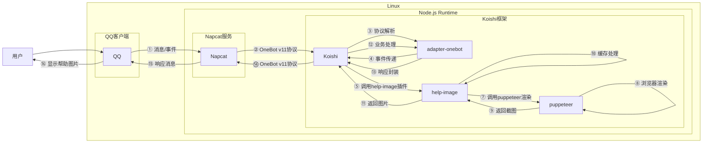
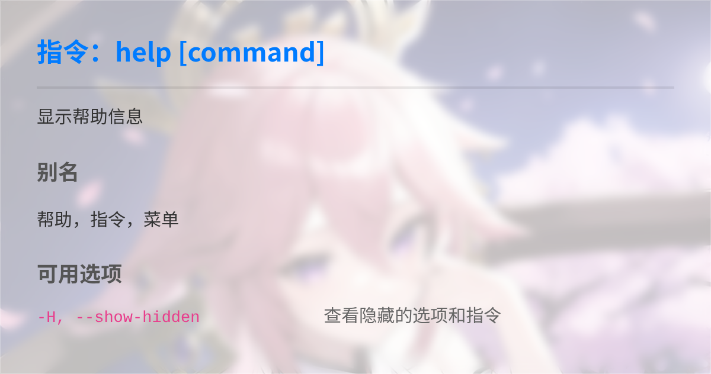

# 获取帮助

## 概述

**指令名称**: `帮助`  `help`

**功能描述**: 以图片形式展示帮助信息，包括指令列表和具体指令的详细用法

**插件名称**: help-image

## 架构图




## 使用方法

### 基本语法

```
帮助 [指令]
```

### 参数说明

| 参数 | 类型 | 必填 | 说明 | 示例 |
|------|------|------|------|------|
| 指令 | 文本 | 否 | 获取指令的具体用法 | 帮助 |

### 使用示例

#### 获取指令列表
::: warning
部分指令不会出现在该列表中，具体参考[功能列表](/features)为准
:::
<chat-panel>
<chat-message nickname="用户" type="user">帮助</chat-message>
<chat-message nickname="bot" type="bot">
<span style="color: #575c63ff;">图片过长已隐藏</span>
</chat-message>
</chat-panel>

#### 获取指定指令 `帮助` 信息 
::: warning
部分指令不支持获取帮助，具体的使用方法请查看文档
:::
<chat-panel>
<chat-message nickname="用户" type="user">帮助 帮助</chat-message>
<chat-message nickname="bot" type="bot">


</chat-message>
</chat-panel>

::: info
您还可以使用 -h 参数获取该指令的帮助
:::

#### 使用参数 `-h` 获取指定指令 `帮助` 信息

<chat-panel>
<chat-message nickname="用户" type="user">帮助 -h</chat-message>
<chat-message nickname="bot" type="bot">


</chat-message>
</chat-panel>

## 技术特性

### 智能缓存机制
- **文件缓存**: 生成的帮助图片会缓存在 `data/help-image/cache/` 目录中
- **内容比对**: 通过比较HTML内容判断是否需要重新生成图片
- **后台更新**: 缓存命中时，会在后台异步更新缓存文件
- **调试日志**: 支持通过配置项开启缓存操作的调试日志

### HTML渲染引擎
- **毛玻璃效果**: 使用CSS backdrop-filter实现现代化毛玻璃背景
- **响应式设计**: 自适应不同屏幕尺寸和设备
- **中文字体**: 集成Noto Sans SC字体，确保中文显示效果
- **代码高亮**: 专门的代码块样式，提高可读性

### 权限系统集成
- **权限过滤**: 自动过滤用户无权访问的指令
- **权限提示**: 在帮助信息中显示指令的最低权限等级
- **动态内容**: 根据用户权限动态生成帮助内容

## 配置选项

help-image插件支持以下配置参数：

| 配置项 | 类型 | 默认值 | 说明 |
|--------|------|--------|------|
| `shortcut` | boolean | `true` | 是否启用快捷调用（直接输入"帮助"） |
| `options` | boolean | `true` | 是否为每个指令添加 `-h, --help` 选项 |
| `debug` | boolean | `false` | 是否在控制台输出调试日志（缓存命中情况） |
| `style.width` | number | `600` | 图片宽度（像素） |
| `style.cardColor` | string | `#ffffff` | 卡片背景颜色（毛玻璃底色） |
| `style.primaryColor` | string | `#007bff` | 主标题和重点部分颜色 |
| `style.textColor` | string | `#333333` | 主要文字颜色 |
| `style.codeColor` | string | `#e83e8c` | 代码块颜色 |
| `style.customCSS` | string | `""` | 自定义CSS样式 |

## 高级用法

### 显示隐藏选项
使用 `-H` 参数可以显示被隐藏的选项和指令：

<chat-panel>
<chat-message nickname="用户" type="user">帮助 -H</chat-message>
<chat-message nickname="bot" type="bot">
<span style="color: #575c63ff;">图片过长已隐藏</span>
</chat-message>
</chat-panel>

## 故障排除

### 常见问题

1. **帮助图片显示异常**
   - 检查puppeteer插件是否正确安装
   - 确认系统有足够的可用内存
   - 查看控制台错误日志

2. **缓存问题**
   - 删除 `data/help-image/cache/` 目录强制重新生成
   - 启用debug模式查看缓存操作日志

3. **权限问题**
   - 确认用户有访问相应指令的权限
   - 检查权限配置是否正确

### 性能优化

- **缓存策略**: 首次生成后，后续请求会直接使用缓存图片
- **异步更新**: 缓存命中时在后台异步更新，不阻塞用户响应
- **内存管理**: 及时关闭浏览器页面，避免内存泄漏
