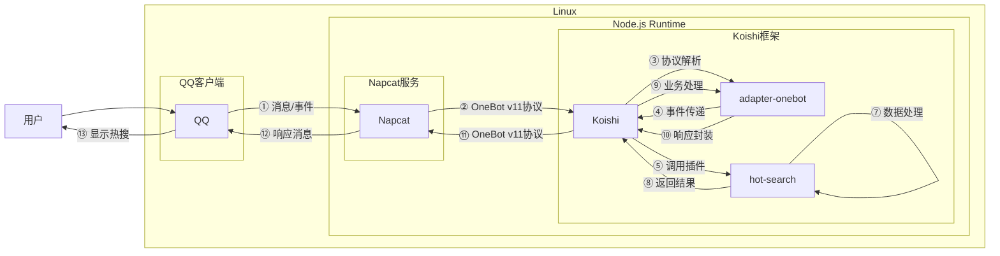

# 获取热搜

## 概述
[](https://koishi.chat) [](https://www.npmjs.com/package/koishi-plugin-hot-search) [](https://github.com/lisk809/koishi-plugin-hot-search)
**指令名称**: hotof.[平台]

**功能描述**: 获取各平台热搜，支持自定义显示数量

**插件名称**: hot-search

## 架构图



## 使用方法

### 基本语法

```
hotof.[平台] [-n <数量>]
```

### 参数说明

| 参数 | 类型 | 必填 | 说明 | 示例 |
|------|------|------|------|------|
| 平台 | 文本 | 是 | 要获取热搜的平台 | bili |
| -n | 数字 | 否 | 显示的热搜数量，默认10条 | -n 5 |

### 支持平台
| 平台 | 指令名称 | 说明 |
|------|----------|------|
| **bilibili** | hotof.bili | B站热搜榜 |
| **抖音** | hotof.douyin | 抖音热点榜和实时上升热点 |
| **知乎** | hotof.zhihu | 知乎热搜榜 |

## 使用示例

### 获取 `b站` 热搜

<chat-panel>
<chat-message nickname="用户" type="user">hotof.bili</chat-message>
<chat-message nickname="bot" type="bot">

=1= [热]拆解TES外战背后的问题
=2= [新]海贼王伊姆与戴维一族的约定
=3= [无]黄金还有投资机会吗
=4= [新]AI还原福建舰电磁弹射全过程
=5= [热]解读冯小刚电影芳华
=6= [无]TES发文告别S赛
=7= [无]马思纯 重获新生
=8= [新]2025年金摇杆大奖投票开启
=9= [无]片仔癀业绩爆雷意味着什么
=10= [无]第三人称逃离鸭科夫
</chat-message>
</chat-panel>

### 获取 `抖音` 热搜

<chat-panel>
<chat-message nickname="用户" type="user">hotof.douyin</chat-message>
<chat-message nickname="bot" type="bot">

■热点榜■
=1= 金永南逝世(1205.10w, 视频3)
=2= 馆长帮赖清德寻根(1157.78w, 视频3)
=3= APEC中国年即将开启(1146.51w, 视频5)
=4= 中国空间站可以吃烧烤了(1141.55w, 视频6)
=5= 队友炸鱼全红婵表情亮了(1064.20w, 视频3)
=6= 鬼灭之刃无限城篇定档(1036.27w, 视频3)
=7= 把装修的坑全踩了一遍(908.49w, 视频2)
=8= 月亮月亮你别笑我(898.53w, 视频10)
=9= 儿时的公益广告照进现实(897.14w, 视频1)
=10= 沉浸式感受永子制作过程(878.68w, 视频1)
■实时上升热点■
+ 长春亚泰降级后致歉(视频1)
+ 山河枕这一幕梦回杨门女将(视频3)
+ 关晓彤玫瑰礼花变装(视频1)
+ 刘芮麟新手奶爸的一天(视频1)
+ LPL的S15结束了(视频5)
</chat-message>
</chat-panel>

### 获取 `知乎` 热搜

<chat-panel>
<chat-message nickname="用户" type="user">hotof.zhihu</chat-message>
<chat-message nickname="bot" type="bot">

知乎热搜🔥
+ 湖人vs热火
+ 哪句话让你突然沉默了很久
+ TES对战T1
+ 有哪些非常冷门且令人意外的知识
+ 常年独居的人靠什么抵抗孤独
+ 灰熊vs湖人
+ 有什么尴尬到爆的经历
+ 不鸡娃的结果是什么
+ 你心目中排名第一的饮料是什么
+ 钱可以成为一个人的底气吗
</chat-message>
</chat-panel>

### 自定义显示数量

<chat-panel>
<chat-message nickname="用户" type="user">hotof.bili -n 5</chat-message>
<chat-message nickname="bot" type="bot">

=1= [热]拆解TES外战背后的问题
=2= [新]海贼王伊姆与戴维一族的约定
=3= [无]黄金还有投资机会吗
=4= [新]AI还原福建舰电磁弹射全过程
=5= [热]解读冯小刚电影芳华
</chat-message>
</chat-panel>

## 技术特性

### 数据来源

- **B站**: 官方API接口，获取实时热搜榜
- **抖音**: 官方API接口，获取热点榜和实时上升热点
- **知乎**: 官方API接口，获取热搜话题

### 功能特点

- **实时更新**: 直接从平台API获取最新热搜数据
- **自定义数量**: 支持通过-n参数指定显示的热搜数量
- **图片支持**: 抖音热搜支持显示相关图片
- **分类显示**: 抖音热搜分为热点榜和实时上升热点

### 数据格式

- **B站**: 显示排名、热度标签和关键词
- **抖音**: 显示排名、热度值、视频数量和图片
- **知乎**: 显示热搜话题列表

## 注意事项

1. **网络要求**: 需要稳定的网络连接来访问各平台API
2. **API限制**: 各平台API可能有访问频率限制
3. **数据时效**: 热搜数据实时变化，结果可能随时间变化
4. **图片加载**: 抖音热搜图片需要网络加载，可能影响响应速度

## 配置参数

插件支持以下配置选项：

| 配置项 | 类型 | 默认值 | 说明 |
|--------|------|--------|------|
| command | string | "hotof" | 指令前缀字段 |
| endpoints | object | 各平台API地址 | 平台获取热搜的API地址 |
| isUseImage | boolean | true | 是否使用图片消息 |

::: tip
获取热搜功能基于各平台官方API实现，能够准确获取实时热搜数据。支持B站、抖音、知乎三大主流平台的热搜查询，满足日常娱乐和信息获取需求。
:::
