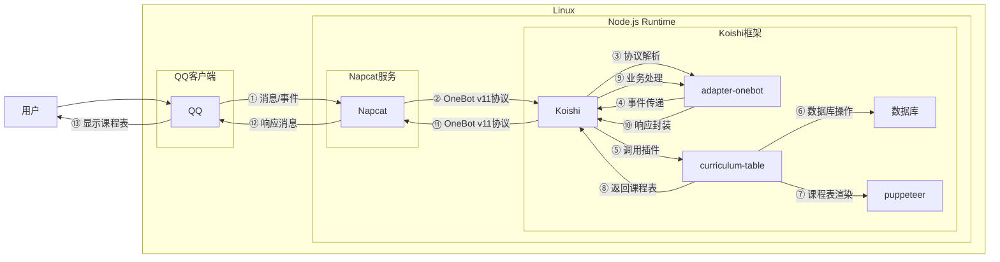
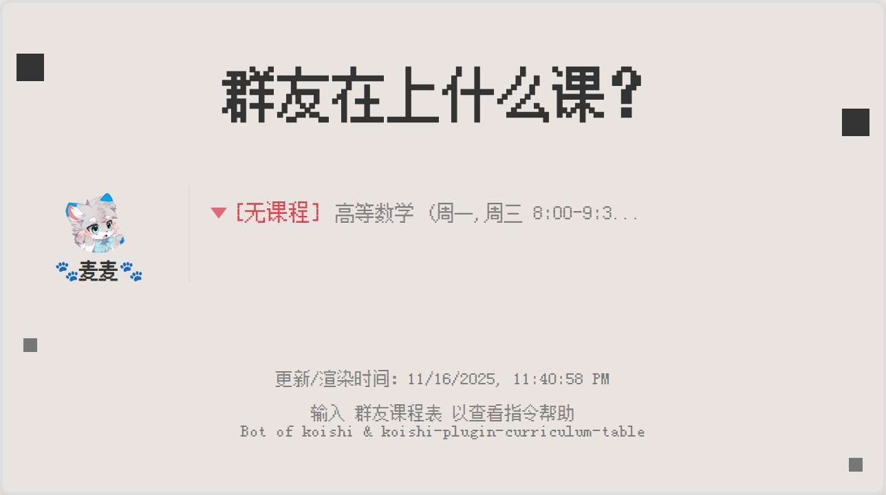

# 课程表

## 概述
[](https://koishi.chat) [](https://www.npmjs.com/package/koishi-plugin-curriculum-table) [](https://github.com/koishi-shangxue-plugins/koishi-shangxue-apps/tree/main/plugins/curriculum-table)
**指令名称**: 群友课表

**功能描述**: 管理群组课程表，支持手动添加课程、WakeUp课程表导入、课程表图片渲染和定时推送功能

**插件名称**: curriculum-table

## 架构图



## 使用方法

### 基本语法

```
群友课表.操作 [参数]
```

### 指令说明

| 指令 | 功能 | 语法 | 参数说明 |
|------|------|------|------|
| 添加课程 | 手动添加课程 | `群友课表.添加 <星期几> <课程名称> <上课时间-下课时间>` | 星期几：支持"周一"、"周二"..."周日"，也支持"周一周三"格式<br>课程名称：课程的名称<br>上课时间-下课时间：24小时制，如"8:00-9:30" |
| WakeUp导入 | 从WakeUp课程表导入 | `群友课表.wakeup <WakeUp分享文本>` | WakeUp分享文本：从WakeUp课程表应用中复制的分享文本（包含分享口令） |
| 查看课程表 | 查看当前课程表 | `群友课表.看看 [日期]` | 日期：可选，支持数字（0=今天，1=明天，-1=昨天）或"今天"、"明天"、"昨天"等 |
| 移除课程 | 移除已添加课程 | `群友课表.移除` | 无参数，会列出课程供选择移除 |
| 课程去重 | 自动移除重复课程 | `群友课表.去重` | 无参数，自动检测并移除重复课程 |

### 可选参数

| 参数 | 简写 | 说明 | 示例 |
|------|------|------|------|
| userid | -i | 指定用户ID (QQ号) | `-i 114514` |
| username | -n | 指定用户的名称 | `-n 上学大人` |

## 使用示例

### 手动添加课程

#### 添加单节课程
<chat-panel>
<chat-message nickname="用户" type="user">群友课表.添加 周一周三 高等数学 8:00-9:30</chat-message>
<chat-message nickname="bot" type="bot">
已为 用户 添加课程：高等数学 周一,周三 8:00-9:30
</chat-message>
</chat-panel>

#### 添加多节课程（指定用户）
<chat-panel>
<chat-message nickname="用户" type="user">群友课表.添加 周四周五 9:55-12:15 大学英语 -i 114514 -n 上学大人</chat-message>
<chat-message nickname="bot" type="bot">
已为 上学大人 添加课程：大学英语 周四,周五 9:55-12:15
</chat-message>
</chat-panel>

### WakeUp课程表导入

#### 导入WakeUp课程表
<chat-panel>
<chat-message nickname="用户" type="user">群友课表.wakeup 这是来自「WakeUp课程表」的课表分享......分享口令为「PaJ_8Kj_zeelspJs2HBL1」</chat-message>
<chat-message nickname="bot" type="bot">
已成功导入来自WakeUp的课程表，共导入 8 门课程：
课程名称：高等数学， 周一， 8:00-9:30
课程名称：大学英语， 周二， 10:00-11:30
...
</chat-message>
</chat-panel>

### 查看课程表

#### 查看今日课程表
<chat-panel>
<chat-message nickname="用户" type="user">群友课表.看看</chat-message>
<chat-message nickname="bot" type="bot">


</chat-message>
</chat-panel>

#### 查看明日课程表
<chat-panel>
<chat-message nickname="用户" type="user">群友课表.看看 1</chat-message>
<chat-message nickname="bot" type="bot">


</chat-message>
</chat-panel>

#### 查看昨天课程表
<chat-panel>
<chat-message nickname="用户" type="user">群友课表.看看 -1</chat-message>
<chat-message nickname="bot" type="bot">


</chat-message>
</chat-panel>

### 课程移除

#### 移除指定课程
<chat-panel>
<chat-message nickname="用户" type="user">群友课表.移除</chat-message>
<chat-message nickname="bot" type="bot">

你目前在本群的课程有：
1. 高等数学 周一,周三 8:00-9:30
请选择要移除的课程序号 (输入数字):
</chat-message>
<chat-message nickname="用户" type="user">1</chat-message>
<chat-message nickname="bot" type="bot">
已删除课程：高等数学 周一,周三 8:00-9:30
</chat-message>
</chat-panel>

### 课程去重

#### 自动移除重复课程
<chat-panel>
<chat-message nickname="用户" type="user">群友课表.去重</chat-message>
<chat-message nickname="bot" type="bot">
已成功移除 2 门重复的课程。
</chat-message>
</chat-panel>

## 技术特性

### 课程管理功能
- **手动添加**: 支持手动输入课程信息，智能参数识别
- **WakeUp导入**: 支持从WakeUp课程表平台导入，自动解析分享口令
- **课程去重**: 自动检测并避免重复课程
- **课程移除**: 交互式选择移除课程
- **多用户支持**: 支持为不同用户添加课程

### 课程表渲染
- **图片生成**: 使用Puppeteer生成美观的课程表图片
- **HTML模板**: 基于HTML模板渲染课程表，支持自定义字体
- **状态显示**: 实时显示课程状态（进行中、下一节、无课程）
- **时间计算**: 自动计算距离上课/下课时间

### 定时推送
- **配置驱动**: 通过插件配置设置定时推送
- **多群组支持**: 支持为不同群组设置不同的推送时间
- **智能过滤**: 只推送当前日期有效的课程

### 数据存储
- **数据库持久化**: 使用Koishi数据库存储课程数据
- **用户隔离**: 每个用户的课程表数据独立存储
- **课程有效期**: 支持设置课程的开始和结束日期

## 注意事项

1. **WakeUp导入**: 需要有效的WakeUp课程表分享文本（包含分享口令）
2. **时间格式**: 手动添加课程时使用24小时制时间格式（如"8:00-9:30"）
3. **星期格式**: 支持"周一"、"周二"..."周日"，也支持"周一周三"格式
4. **定时推送**: 需要开启cron服务并正确配置推送设置
5. **字体支持**: 需要安装方正像素12字体或配置自定义字体路径

## 配置参数

插件支持以下配置选项：

| 配置项 | 类型 | 默认值 | 说明 |
|--------|------|--------|------|
| command | string | "群友课表" | 父级指令名称 |
| command11 | string | "添加" | 添加课程的指令名称 |
| command12 | string | "移除" | 移除课程的指令名称 |
| command13 | string | "wakeup" | WakeUp导入的指令名称 |
| command14 | string | "去重" | 课程去重的指令名称 |
| command21 | string | "看看" | 查看课程表的指令名称 |
| waittimeout | number | 30 | 等待用户交互的超时时间（秒） |
| autocommand14 | boolean | true | 添加课程时自动执行课程去重 |
| cronPush | boolean | false | 是否开启自动推送功能（需要cron服务） |
| screenshotquality | number | 60 | 图片压缩质量（0-100%） |
| backgroundcolor | string | "rgba(234, 228, 225, 1)" | 课表背景颜色 |
| customFontPath | string | 字体路径 | 自定义字体文件路径 |
| footertext | string | "输入 群友课程表 以查看指令帮助..." | 页脚描述文字 |

::: tip
课程表插件提供了完整的课程管理解决方案，支持多种课程添加方式和灵活的定时推送功能，能够满足学生用户的日常课程管理需求。
:::
